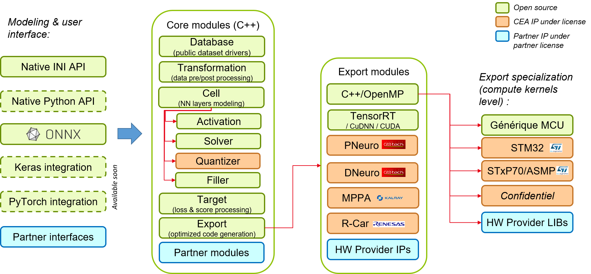
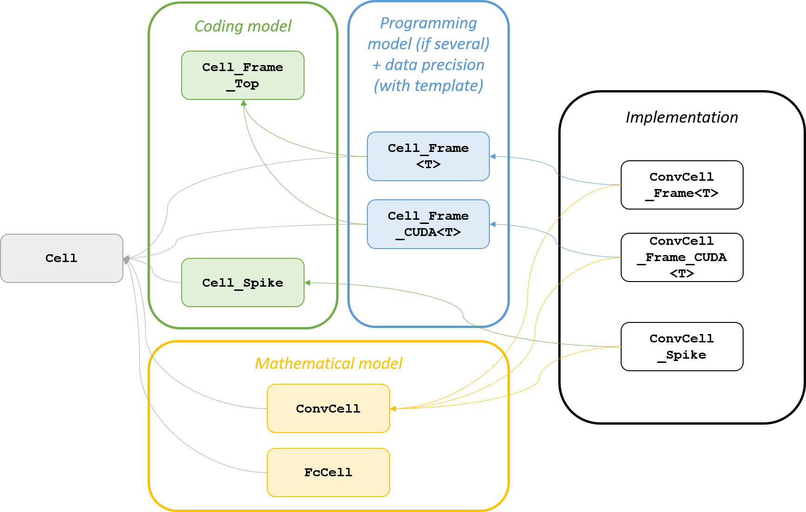
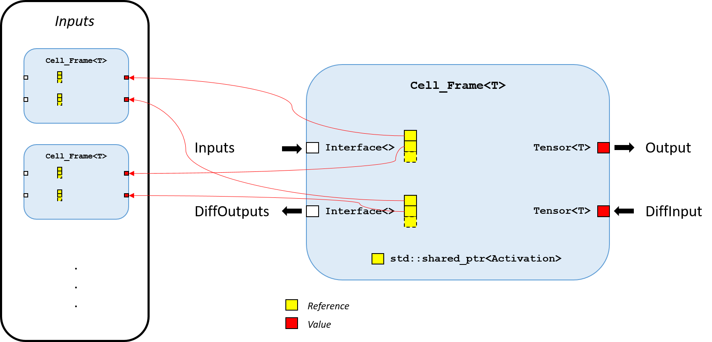
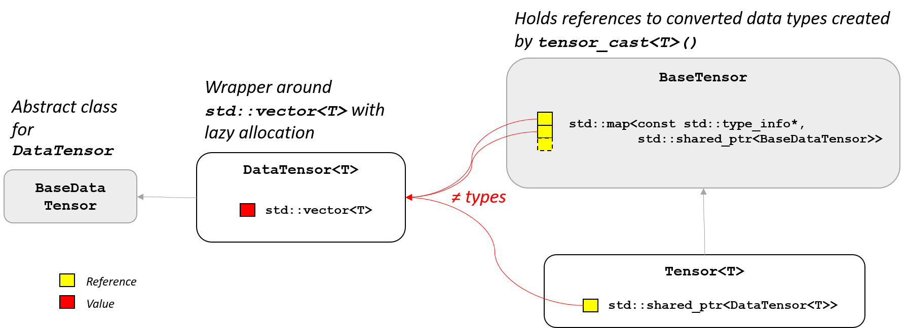

Introduction
============

Welcome to the developer documentation. N2D2 is primarily developed in C++11 and
CUDA (for the GPU computing kernels). The library used internally for images processing is
OpenCV.

N2D2 is structured in module families, each family being defined by a base class,
for example ``Database``, ``Cell``, ``Export``...
In this introduction, we will review the main N2D2 modules structure, which is
summarized in the figure below:

  Main N2D2 modules.

The ``Cell`` modules
--------------------

A ``Cell`` defines a layer / operator, constituting a base building block of a 
neural network (or more generally a compute graph), like a convolution, a 
pooling and so on.
The base ``Cell`` class is abstract and does not make any assumption on the
compute model, the data precision and even the coding of the data.

The class hierarchy for ``Cell`` is shown in the figure below. While it may
seem a bit complicated, it was designed this way to really separate different
notions:

- *Mathematical model*: the actual mathematical function performed by the ``Cell``,
  regardless of the algorithm used for its implementation. For example,
  ``ConvCell`` for a convolution, or ``FcCell`` for a fully connected layer 
  (or inner product);
- *Coding model*: the model used to code the data. ``Frame`` is for standard
  tensor-based deep learning and ``Spike`` is for neuromorphic spike coding;
- *Programming model*: the programming model that will be used for the 
  implementation, meaning either plain C++ (with OpenMP) for CPU or CUDA for
  GPU. Other programming model, like OpenCL, may be added in the future. When
  there is only one programming model, the class hierarchy can be simplified
  like for ``Cell_Spike``. The *Programming model* class can be templated to
  handle different data precision. For the ``Cell_Frame<T>`` and 
  ``Cell_Frame_CUDA<T>`` classes, ``half``, ``float`` and ``double`` precision
  are supported, but may not be implemented for every model (it is not mandatory
  to provide implementation for every possible precision);
- *Implementation*: the actual implementation of the *Mathematical model*, using
  the inherited *Coding model* and *Programming model*. The implementation
  may use different algorithm to obtain the same *Mathematical model*, like
  direct, GEMM or FFT algorithms for the convolution.

  ``Cell`` modules class hierarchy.

``Cell`` class
~~~~~~~~~~~~~~

The base ``Cell`` class only handles the topological information: the inputs
and outputs dimensions and virtual methods to connect the cells, among other.
The main methods are listed here:

.. doxygenclass:: N2D2::Cell
  :members: getName, getType, getInputsDims, getOutputsDims
  :members-only:

In order to create a computing graph, or neural network, cells can be connected
together thanks to the ``addInput`` method. An ``Cell`` can be connected to
another ``Cell`` or to a ``StimuliProvider``, which constitute an entry point
for the data. It is up to the implementation to allow or not multiple inputs.
The ``initialize`` virtual member initializes the state of the ``Cell`` in the
implementation (initialization may be different depending on the coding or 
programming model).

.. doxygenclass:: N2D2::Cell
  :members: addInput, initialize
  :members-only:

``Cell_Frame_Top`` class
~~~~~~~~~~~~~~~~~~~~~~~~

The ``Cell_Frame_Top`` is a purely abstract class, which does not inherit from 
the ``Cell`` class. It provides 
all the actual interface for a given *Coding model*. For the ``Frame`` coding
model, the input/output data is a Nd-tensor. This coding model is also 
"bi-directional", as it supports differentiation, thus its interface comprise
a forward data path and backward data path for the gradient. It is however not
mandatory for the implementation to handle the backward path, for non-differentiable
cells for example.

The main interfaces provided by ``Cell_Frame_Top`` are listed below:

.. doxygenclass:: N2D2::Cell_Frame_Top
  :members: propagate, backPropagate, update
  :members-only:

This class also handles the ``Activation`` and contains the shared pointer to
the ``Activation`` object to use.

.. doxygenclass:: N2D2::Cell_Frame_Top
  :members: getActivation, setActivation
  :members-only:

``Cell_Frame<T>`` class
~~~~~~~~~~~~~~~~~~~~~~~

The ``Cell_Frame<T>`` inherits from ``Cell`` and ``Cell_Frame_Top``. It contains
the output tensors and input tensor references.
``Cell_Frame<T>`` should not provide more members than ``Cell_Frame_Top`` already does.

  ``Cell_Frame<T>`` interface.

``ConvCell`` class
~~~~~~~~~~~~~~~~~~

The ``ConvCell`` class (or any other model) provides additional interfaces to
the base ``Cell`` class that it inherits, specific to the *Mathematical model*
it represents, regardless of the *Coding model*. For a convolution for example,
getter and setter members are provided for the weights, but also references to 
``Filler`` and ``Solver`` for the weights. Some facilities may be specific to
a particular coding model. The data structure (tensor) containing the weights
is however not defined in this class, but in the implementation 
(``ConvCell_Frame``), because it can depend on the programming model and data 
precision.

The main members (for ``ConvCell``) are:

.. doxygenclass:: N2D2::ConvCell
  :members: setWeightsFiller, setBiasFiller, setWeightsSolver, setBiasSolver, getWeight, getBias, setWeight, setBias
  :members-only:

``ConvCell_Frame<T>`` class
~~~~~~~~~~~~~~~~~~~~~~~~~~~

The ``ConvCell_Frame<T>`` is the final class implementing the convolution 
*Mathematical model* with the tensor-based ``Frame`` *Coding model* on standard
C++ for CPU *Programming model*. It is only an implementation class, which
therefore does not provide any new members.

The ``Tensor<T>`` class
-----------------------

The ``Tensor<T>`` class is the base data structure in N2D2, a Nd-tensor. In 
N2D2, a tensor has the following properties:

- Its data is guaranteed to be **continuous**. It therefore does not handle
  arbitrary strides without actual data reorganization. While this property
  may appear restricting, it is an assumed design choice to simplify the
  implementation of the many possible coding and programming models;
- It **holds a reference** to the data, meaning no data is actually copied in a
  tensor assignment and the new tensor will point to the same data. To perform
  an actual copy, the ``clone()`` method should be used;
- It is **explicitly typed**, meaning that the data type is part of the tensor
  type, as a template parameter. When the type does not need to be known or can
  be arbitrary, a reference to the ``BaseTensor`` base class should be used.
  Conversion from one tensor type (or from a ``BaseTensor`` reference) to another
  can be performed with the ``tensor_cast<T>()`` function;
- Down to **zero overhead** type conversion. Memory is only allocated once 
  for a given type conversion during the lifetime of the tensor.
  Type conversion can be made without any data copy-conversion,
  with the ``tensor_cast_nocopy<T>()`` function, when it is known that a previous
  conversion is still valid, thus incurring zero overhead.

The ``Tensor<T>`` implementation classes hierarchy is shown in the figure below.

  ``Tensor<T>`` implementation classes hierarchy.

