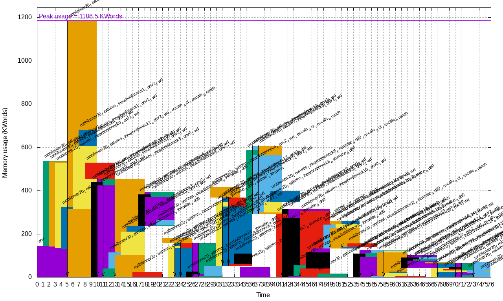

.. _export_cpp-label:

Export: C++
===========

Export type: ``CPP``
 C++ export using OpenMP.

::

    n2d2 MobileNet_ONNX.ini -seed 1 -w /dev/null -export CPP

Principle
---------

The C++ export is the reference N2D2 export, which implements all the export 
features available in N2D2, like post-training quantization or quantization
aware training.

Summary of the main features of a C++ export:

- Standalone C++11 compliant project;

  - No C++ exception (often disabled on embedded code);
  - No <stream> library (which is memory bloated).

- Fully templated compute kernels;
- Fully inlined compute kernels;
- No dynamic memory allocation;
- Memory alignment support;
- OpenMP parallelism.

Data order
  The input of a layer is ordered by Height-Width-Channels (HWC) and the weights
  of the kernel for a convolution by Output-Height-Width-Channels (OHWC). This order allows
  us to do read *kernel_width* × *nb_channels* inputs and weights sequentially in memory to do the
  necessary MACs.

Templated layer parameters
  The current export uses C++ templates heavily, most of the
  parameters of the layers are passed as template parameters. This allows the compiler to better
  optimize the code and make it easier to unroll the loops. It comes at the cost of a larger compiled
  binary.

Force inline
  Most of the methods are forced to be inlined. As previously this increases the binary
  size to provide a faster inference.

Loop boundaries
  The boundaries of the loops are fixed at compile time through the template
  parameters. If some steps in a loop must be skipped an if and continue are used inside the loop. It
  results in better results than having variable loop boundaries.

Graph optimizations
~~~~~~~~~~~~~~~~~~~

- Weights are equalized between layers when possible;
- ``BatchNorm`` is automatically fused with the preceding ``Conv`` or ``Fc`` when possible;
- ``Padding`` layers are fused with ``Conv`` when possible;
- ``Dropout`` layers are removed.

Memory optimizations
~~~~~~~~~~~~~~~~~~~~

In the C++ export, all the memory is allocated statically at compilation time.

The following memory optimization features are integrated in this export:

- **Strided buffers:** concatenation can be done directly in memory, no memory copy is needed;
- **Memory wrapping:** memory buffers are re-used when possible (memory wrapping or in-place).

For example, the memory mapping of each layer in a global memory space for
MobileNet v2 is shown below (generated automatically during an export):

In this example, the largest layer memory buffer overlaps with the memory
buffer of the preceding layer thanks to the ``OptimizeBufferMemory`` option
(see the next section).

Export parameters
~~~~~~~~~~~~~~~~~

Extra parameters can be passed during export using the 
``-export-parameters params.ini`` command line argument. The parameters must be 
saved in an INI-like file.

List of available parameters:

+-----------------------------------------------------------------+--------------------------------------------------------------------------------------------------------------------------+
| Argument [default value]                                        | Description                                                                                                              |
+=================================================================+==========================================================================================================================+
| ``IncludeInputInBuffer`` [1]                                    | If true (1), include the input buffer in the memory mapping                                                              |
+-----------------------------------------------------------------+--------------------------------------------------------------------------------------------------------------------------+
| ``OptimizeBufferMemory`` [1]                                    | If true (1), try to re-use memory spaces using wrapping and in-place                                                     |
+-----------------------------------------------------------------+--------------------------------------------------------------------------------------------------------------------------+
| ``OptimizeNoBranchConcat`` [1]                                  | If true (1), concatenation is done directly in memory when possible                                                      |
+-----------------------------------------------------------------+--------------------------------------------------------------------------------------------------------------------------+
| ``MemoryAlignment`` [1]                                         | Default memory alignment (in bytes)                                                                                      |
+-----------------------------------------------------------------+--------------------------------------------------------------------------------------------------------------------------+
| ``MemoryManagerStrategy`` [``OptimizeMaxLifetimeMaxSizeFirst``] | Optimization strategy for static memory allocation                                                                       |
+-----------------------------------------------------------------+--------------------------------------------------------------------------------------------------------------------------+

Example
-------

::

    n2d2 MobileNet_ONNX.ini -seed 1 -w /dev/null -export CPP -fuse -nbbits 8 -calib -1 -db-export 100 -test

This command generates a C++ project in the sub-directory ``export_CPP_int8``.
This project is ready to be compiled with a ``Makefile``.

.. Note::

    The ``Softmax`` layer is not supported by the C++ export and must be removed
    before export, as it is not compatible with low precision integer computing.

