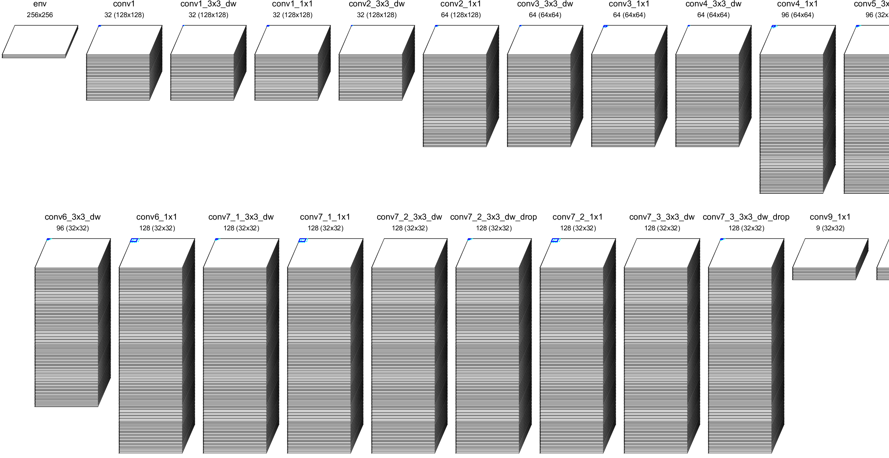
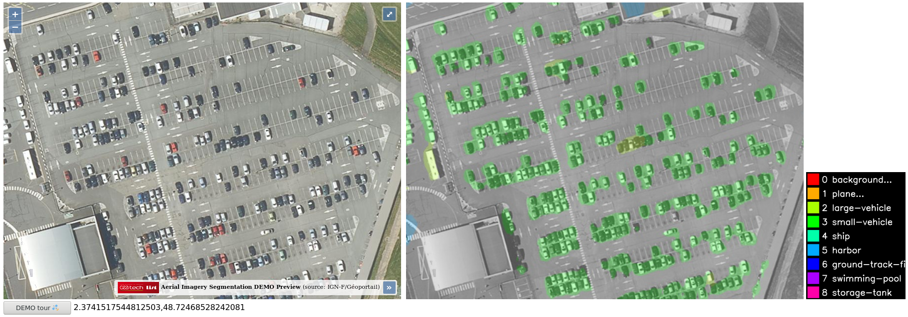
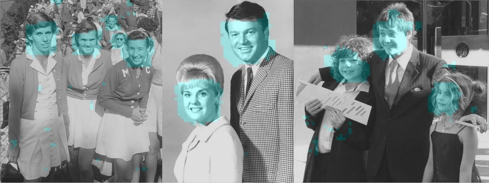

Export: DNeuro
==============

**N2D2-IP only: available upon request.**

.. role:: raw-html(raw)
   :format: html

.. |check|  unicode:: U+02713 .. CHECK MARK
.. |cross|  unicode:: U+02717 .. BALLOT X

.. |ccheck| replace:: :raw-html:`` |check| :raw-html:``
.. |ccross| replace:: :raw-html:`` |cross| :raw-html:``

Export type: ``DNeuro_V2``
 DNeuro RTL export for FPGA.

::

    n2d2 MobileNet_ONNX.ini -seed 1 -w /dev/null -export DNeuro_V2

Introduction
------------

DNeuro is a synthetizable dataflow architecture, optimized for deep
convolutional neural networks (CNN). It allows a fine grain allocation
control of the DSP and memory resources, for each layer in a network.
Globally, the FPGA resource usage can be maximized for a given network
topology in order to minimize its latency.

The main features of the DNeuro are:

- Data flow architecture requiring few memory (potentially **no DDR**);
- Very high use rate of the DSP per cycle (> 90%);
- Configurable precision (integers from 2 to 16 bits, typically 8 bits);
- Up to 4 MAC/DSP operations per cycle.

The DNeuro is composed of specialized computing blocs, corresponding to
specific type and configuration of layers (convolution, max pooling...),
that can be chained to form a full neural network. The bloc allocation
and chaining is done automatically with N2D2.

Interface
~~~~~~~~~

The DNeuro interface is extremely simple and behaves like a
pipeline/FIFO.

An example of the top-level DNeuro RTL entity is described below, for
one input channel and 3 output channels:

.. code:: vhdl

    -- Input size: 1*640*480
    -- Output size: 3*80*60
    entity network is
    generic (
        constant G_BATCH_SIZE: positive := 1;
        constant G_FIFO_DEPTH: positive := 1;
        constant G_DATA_LENGTH: positive := 8;
        constant G_ACC_S_LENGTH: positive := 18;
        constant G_NB_OUTPUTS_INST_N_1_ENV: positive  := 1;
        constant G_NB_OUTPUTS_MERG_N_1_ENV: positive  := 1
    );
    port (
        clk             : in std_logic;
        rstn            : in std_logic;
        i_data          : in std_logic_vector ((G_DATA_LENGTH*G_BATCH_SIZE)-1 downto 0);
        i_valid_data    : in std_logic;
        o_en            : out std_logic;
        o_data          : out std_logic_vector ((3*G_DATA_LENGTH*G_BATCH_SIZE)-1 downto 0);
        o_valid_data    : out std_logic;
        i_en            : in std_logic
    );
    end network;

Supported layers
~~~~~~~~~~~~~~~~

+-----------------------------------------------------------------+-----------+--------------------------------------------------------+
| Layer type                                                      | Support   | Comments                                               |
+=================================================================+===========+========================================================+
| Dropout                                                         | n.a.      | removed during export                                  |
+-----------------------------------------------------------------+-----------+--------------------------------------------------------+
| Fc                                                              | |ccheck|  | implemented with Conv during export                    |
+-----------------------------------------------------------------+-----------+--------------------------------------------------------+
| *InnerProduct* :math:`\rightarrow` see Fc                                                                                            |
+-----------------------------------------------------------------+-----------+--------------------------------------------------------+
| Transformation                                                  | |cross|   |                                                        |
+-----------------------------------------------------------------+-----------+--------------------------------------------------------+
| BatchNorm                                                       | n.a.      | merged with Conv during export with ``-fuse`` option   |
+-----------------------------------------------------------------+-----------+--------------------------------------------------------+
| Conv                                                            | |ccheck|  |                                                        |
+-----------------------------------------------------------------+-----------+--------------------------------------------------------+
| *Concat* :math:`\rightarrow` implicit for Conv/Deconv/Pool/Fc                                                                        |
+-----------------------------------------------------------------+-----------+--------------------------------------------------------+
| Deconv                                                          | |cross|   |                                                        |
+-----------------------------------------------------------------+-----------+--------------------------------------------------------+
| ElemWise                                                        | |ccheck|  | *Sum* operation only                                   |
+-----------------------------------------------------------------+-----------+--------------------------------------------------------+
| *EltWise* :math:`\rightarrow` see ElemWise                                                                                           |
+-----------------------------------------------------------------+-----------+--------------------------------------------------------+
| *Flatten* :math:`\rightarrow` implicit to Fc/Rbf                                                                                     |
+-----------------------------------------------------------------+-----------+--------------------------------------------------------+
| LRN                                                             | |cross|   |                                                        |
+-----------------------------------------------------------------+-----------+--------------------------------------------------------+
| *Maxout* :math:`\rightarrow` see Pool                                                                                                |
+-----------------------------------------------------------------+-----------+--------------------------------------------------------+
| Padding                                                         | |ccheck|  | merged with Conv/Pool during export                    |
+-----------------------------------------------------------------+-----------+--------------------------------------------------------+
| Pool                                                            | |ccheck|  | *Max* operation only                                   |
+-----------------------------------------------------------------+-----------+--------------------------------------------------------+
| Resize                                                          | |ccheck|  | *NearestNeighbor* mode only                            |
+-----------------------------------------------------------------+-----------+--------------------------------------------------------+
| Softmax                                                         | |cross|   |                                                        |
+-----------------------------------------------------------------+-----------+--------------------------------------------------------+
| *SortLabel* :math:`\rightarrow` see .Target\*                                                                                        |
+-----------------------------------------------------------------+-----------+--------------------------------------------------------+
| Unpool                                                          | |cross|   |                                                        |
+-----------------------------------------------------------------+-----------+--------------------------------------------------------+
| *Upscale* :math:`\rightarrow` see Resize                                                                                             |
+-----------------------------------------------------------------+-----------+--------------------------------------------------------+
| .Target\*                                                       | |ccheck|  | top-1 sorting                                          |
+-----------------------------------------------------------------+-----------+--------------------------------------------------------+

+---------------------------------------------+-----------+------------------------------------------------+
| Activation type                             | Support   | Specificities                                  |
+=============================================+===========+================================================+
| Linear                                      | |ccheck|  | saturated arithmetic                           |
+---------------------------------------------+-----------+------------------------------------------------+
| Logistic                                    | |ccheck|  | saturation approximation, configurable zero,   |
|                                             |           | up to two configurable thresholds              |
+---------------------------------------------+-----------+------------------------------------------------+
| *ReLU* :math:`\rightarrow` see Rectifier                                                                 |
+---------------------------------------------+-----------+------------------------------------------------+
| *bReLU* :math:`\rightarrow` see Rectifier                                                                |
+---------------------------------------------+-----------+------------------------------------------------+
| Rectifier                                   | |ccheck|  | saturated arithmetic (positive values)         |
+---------------------------------------------+-----------+------------------------------------------------+
| Saturation                                  | |ccheck|  |                                                |
+---------------------------------------------+-----------+------------------------------------------------+
| Softplus                                    | |cross|   |                                                |
+---------------------------------------------+-----------+------------------------------------------------+
| Tanh                                        | |cross|   |                                                |
+---------------------------------------------+-----------+------------------------------------------------+

Usage
-----

Simulation
~~~~~~~~~~

When a network is exported, test vectors are exported automatically too, if
the ``-db-export`` command line option value is > 0 (by default, the full test
set is exported). All the test vectors are exported for the C++ emulator, while
only the first image is pre-loaded as a test vector for the RTL simulation in
the ``RTL/NETWORK/TB/network_tb.vhd`` file. This testbench is configured with a
clock frequency of 100MHz (regardless of the ``EstimationFrequency`` export
parameter). The testbench reads 3 times the same (first) image and outputs the
results in the ``out_file/out.txt`` file, located in ``RTL/NETWORK/simu/VsimTOOL``
for ModelSim.

::

    cd RTL/NETWORK/simu
    make vsim

C++ emulation
~~~~~~~~~~~~~

The DNeuro export comes with a C++ bit-accurate emulator.

By default, the provided emulator will use the same parameters as the ones 
defined in the export. For testing purposes it is possible to change the 
accumulation size by defining the ``ACC_NB_BITS`` variable.

::

    cd EMULATOR
    CXXFLAGS="-DACC_NB_BITS=18" make
    ./dneuro_v2_emulator

When running the emulator, all the exported images are evaluated by default, and
a global score is computed from individual images good or bad classifications.
It is possible to evaluate a single image with the following command line
argument:

::

    ./dneuro_v2_emulator -stimulus stimuli/env00.ppm

The ``stimuli/env00.ppm`` is an already pre-processed image automatically 
exported by N2D2 and ready to be feed at the input of the neural network. The
emulator generates for each network's layer an output file 
*layer_name_output.txt* containing the output tensor values of the layer, as
expected for the DNeuro IP.

Export parameters
~~~~~~~~~~~~~~~~~

Extra parameters can be passed during export using the 
``-export-parameters params.ini`` command line argument. The parameters must be 
saved in an INI-like file.

List of general available parameters:

+-----------------------------------------------------------------+--------------------------------------------------------------------------------------------------------------------------+
| Argument [default value]                                        | Description                                                                                                              |
+=================================================================+==========================================================================================================================+
| ``NbDSPs``                                                      | Set the maximum number of DSPs that the network can use on the FPGA                                                      |
+-----------------------------------------------------------------+--------------------------------------------------------------------------------------------------------------------------+
| ``NbMemoryBytes``                                               | Set the maximum memory, in bytes, that the network can use on the FPGA                                                   |
+-----------------------------------------------------------------+--------------------------------------------------------------------------------------------------------------------------+
| ``Network`` [network]                                           | Name of the top-level HDL entity                                                                                         |
+-----------------------------------------------------------------+--------------------------------------------------------------------------------------------------------------------------+
| ``EstimationFrequency`` [200]                                   | Frequency used for the FPS estimation given by the export                                                                |
+-----------------------------------------------------------------+--------------------------------------------------------------------------------------------------------------------------+
| ``AccumulationNbBits`` [2.DATA_LENGTH+4]                        | Number of bits to use for the accumulation                                                                               |
+-----------------------------------------------------------------+--------------------------------------------------------------------------------------------------------------------------+

Output map class conversion to RGB settings:

+-----------------------------------------------------------------+--------------------------------------------------------------------------------------------------------------------------+
| Argument [default value]                                        | Description                                                                                                              |
+=================================================================+==========================================================================================================================+
| ``OutputMapToRGB`` [0]                                          | If true (1), add an extra layer at the end of the network that converts the output of the network to an RGB output       |
+-----------------------------------------------------------------+--------------------------------------------------------------------------------------------------------------------------+
| ``OutputMapToRGBBackgroundClass`` []                            | When ``OutputMapToRGB`` is 1, set the class that is used for background objects. The overlay color for this class will   |
|                                                                 | be transparent                                                                                                           |
+-----------------------------------------------------------------+--------------------------------------------------------------------------------------------------------------------------+
| ``OutputMapToRGBColorMasks`` []                                 | When ``OutputMapToRGB`` is 1, list of colors to use for the classes                                                      |
+-----------------------------------------------------------------+--------------------------------------------------------------------------------------------------------------------------+
| ``OutputMapToRGBBinaryThresholdUpper`` [0]                      | Upper threshold for binary outputs                                                                                       |
+-----------------------------------------------------------------+--------------------------------------------------------------------------------------------------------------------------+
| ``OutputMapToRGBBinaryThresholdLower`` [0]                      | Lower threshold for binary outputs                                                                                       |
+-----------------------------------------------------------------+--------------------------------------------------------------------------------------------------------------------------+

Internal per layer settings (for debug purpose only!):

+-----------------------------------------------------------------+--------------------------------------------------------------------------------------------------------------------------+
| Argument [default value]                                        | Description                                                                                                              |
+=================================================================+==========================================================================================================================+
| ``RTLType`` []                                                  | Specific name of the RTL library module to use for this layer                                                            |
+-----------------------------------------------------------------+--------------------------------------------------------------------------------------------------------------------------+
| ``NbChannelsInstantiation`` []                                  | Specific number of channels to instantiate                                                                               |
+-----------------------------------------------------------------+--------------------------------------------------------------------------------------------------------------------------+
| ``NbOutputsInstantiation`` []                                   | Specific number of outputs to instantiate                                                                                |
+-----------------------------------------------------------------+--------------------------------------------------------------------------------------------------------------------------+
| ``KernelHeightInstantiation`` []                                | Specific number of kernel height to instantiate                                                                          |
+-----------------------------------------------------------------+--------------------------------------------------------------------------------------------------------------------------+
| ``KernelWidthInstantiation`` []                                 | Specific number of kernel width to instantiate                                                                           |
+-----------------------------------------------------------------+--------------------------------------------------------------------------------------------------------------------------+

FPGA compatibility tables
~~~~~~~~~~~~~~~~~~~~~~~~~

.. |ok| replace:: :math:`\bullet`
.. |ult| replace:: :raw-html:`` • :raw-html:``
.. |mem| replace:: :raw-html:`` • :raw-html:``
.. |equ| replace:: :raw-html:`` • :raw-html:``
.. |alt| replace:: :raw-html:`` ◦ :raw-html:``

Legend:
 | |ok| should be OK for the standard 224x224 input, but depends on the resolution;
 | |ult| should be OK for the standard 224x224 input using also the UltraRAM, but depends on the resolution (Xilinx FPGA only);
 | |mem| M20K memory may be insufficient depending on the resolution;
 | |equ| there is a better equivalent neural network (see on the same column);
 | |alt| using an alternative neural network is possible with a small accuracy loss.

Arria 10
 Neural networks compatibility table with DNeuro, in terms of memory requirement.

+-----------------------+-------------+-------------+-------------------+-------------------+-------------+-------------+-------------------+-------------------+-------------------+
| **Arria 10**          | **GX/SX**   | **GX/SX**   | **GX/SX**         | **GX/SX**         | **GX/SX**   | **GX/SX**   | **GX/SX**         | **GX**            | **GX**            |
|                       +-------------+-------------+-------------------+-------------------+-------------+-------------+-------------------+-------------------+-------------------+
|                       | **160**     | **220**     | **270**           | **320**           | **480**     | **570**     | **660**           | **900**           | **1150**          |
+-----------------------+-------------+-------------+-------------------+-------------------+-------------+-------------+-------------------+-------------------+-------------------+
| **M20K (MB)**         | 1.12        | 1.37        | 1.87              | 2.12              | 3.5         | 4.37        | 5.25              | 5.87              | 6.62              |
+-----------------------+-------------+-------------+-------------------+-------------------+-------------+-------------+-------------------+-------------------+-------------------+
| **DSP**               | 156         | 191         | 830               | 985               | 1,368       | 1,523       | 1,688             | 1,518             | 1,518             |
+-----------------------+-------------+-------------+-------------------+-------------------+-------------+-------------+-------------------+-------------------+-------------------+
| **Mult. (MAC/c.)**    | 312         | 382         | 1,660             | 1,970             | 2,736       | 3,046       | 3,376             | 3,036             | 3,036             |
+=======================+=============+=============+===================+===================+=============+=============+===================+===================+===================+
| MobileNet_v1_0.25     | |ok|        | |ok|        | |ok|              | |ok|              | |ok|        | |ok|        | |ok|              | |ok|              | |ok|              |
+-----------------------+-------------+-------------+-------------------+-------------------+-------------+-------------+-------------------+-------------------+-------------------+
| MobileNet_v1_0.5      |             |             | |mem|             | |mem|             | |ok|        | |ok|        | |ok|              | |ok|              | |ok|              |
+-----------------------+-------------+-------------+-------------------+-------------------+-------------+-------------+-------------------+-------------------+-------------------+
| MobileNet_v1_0.75     |             |             |                   |                   | |mem|       | |mem|       | |ok|              | |ok|              | |ok|              |
+-----------------------+-------------+-------------+-------------------+-------------------+-------------+-------------+-------------------+-------------------+-------------------+
| MobileNet_v1_1.0      |             |             |                   |                   |             |             | |mem|             | |mem|             | |mem|             |
+-----------------------+-------------+-------------+-------------------+-------------------+-------------+-------------+-------------------+-------------------+-------------------+
| SqueezeNet_v1.0       |             |             | |equ|   |mem|     | |equ|   |mem|     | |ok|        | |ok|        | |ok|              | |ok|              | |ok|              |
+-----------------------+-------------+-------------+-------------------+-------------------+-------------+-------------+-------------------+-------------------+-------------------+
| SqueezeNet_v1.1       |             |             | |equ|   |mem|     | |equ|   |mem|     | |ok|        | |ok|        | |ok|              | |ok|              | |ok|              |
+-----------------------+-------------+-------------+-------------------+-------------------+-------------+-------------+-------------------+-------------------+-------------------+
| MobileNet_v2_0.35     |             |             |                   | |mem|             | |ok|        | |ok|        | |ok|              | |ok|              | |ok|              |
+-----------------------+-------------+-------------+-------------------+-------------------+-------------+-------------+-------------------+-------------------+-------------------+
| MobileNet_v2_0.5      |             |             |                   |                   | |mem|       | |ok|        | |ok|              | |ok|              | |ok|              |
+-----------------------+-------------+-------------+-------------------+-------------------+-------------+-------------+-------------------+-------------------+-------------------+
| MobileNet_v2_0.75     |             |             |                   |                   | |mem|       | |mem|       | |ok|              | |ok|              | |ok|              |
+-----------------------+-------------+-------------+-------------------+-------------------+-------------+-------------+-------------------+-------------------+-------------------+
| MobileNet_v2_1.0      |             |             |                   |                   |             | |mem|       | |mem|             | |mem|             | |mem|             |
+-----------------------+-------------+-------------+-------------------+-------------------+-------------+-------------+-------------------+-------------------+-------------------+
| MobileNet_v2_1.3      |             |             |                   |                   |             |             |                   | |mem|             | |mem|             |
+-----------------------+-------------+-------------+-------------------+-------------------+-------------+-------------+-------------------+-------------------+-------------------+
| MobileNet_v2_1.4      |             |             |                   |                   |             |             |                   |                   | |mem|             |
+-----------------------+-------------+-------------+-------------------+-------------------+-------------+-------------+-------------------+-------------------+-------------------+
| AlexNet               |             |             | |equ|             | |equ|             | |equ|       | |equ|       | |equ|             | |equ|             | |equ|             |
+-----------------------+-------------+-------------+-------------------+-------------------+-------------+-------------+-------------------+-------------------+-------------------+
| VGG-16                |             |             |                   |                   |             | |equ|       | |equ|   |alt|     | |equ|   |alt|     | |equ|   |alt|     |
+-----------------------+-------------+-------------+-------------------+-------------------+-------------+-------------+-------------------+-------------------+-------------------+
| GoogLeNet             |             |             |                   |                   |             |             | |equ|             | |equ|             | |equ|             |
+-----------------------+-------------+-------------+-------------------+-------------------+-------------+-------------+-------------------+-------------------+-------------------+
| ResNet-18             |             |             |                   |                   |             |             | |equ|             | |equ|             | |equ|             |
+-----------------------+-------------+-------------+-------------------+-------------------+-------------+-------------+-------------------+-------------------+-------------------+
| ResNet-34             |             |             |                   |                   |             |             |                   | |equ|             | |equ|             |
+-----------------------+-------------+-------------+-------------------+-------------------+-------------+-------------+-------------------+-------------------+-------------------+
| ResNet-50             |             |             |                   |                   |             |             |                   |                   | |alt|             |
+-----------------------+-------------+-------------+-------------------+-------------------+-------------+-------------+-------------------+-------------------+-------------------+

Stratix 10
 Neural networks compatibility table with DNeuro, in terms of memory requirement.

+-----------------------+------------------+-------------------+-------------------+-------------------+-------------------+-------------------+-------------------+-------------------+
| **Stratix 10**        | **GX/SX**        | **GX/SX**         | **GX/SX**         | **GX/SX**         | **GX/SX**         | **GX/SX**         | **GX/SX**         | **GX/SX**         |
|                       +------------------+-------------------+-------------------+-------------------+-------------------+-------------------+-------------------+-------------------+
|                       | **400**          | **650**           | **850**           | **1100**          | **1650**          | **2100**          | **2500**          | **2800**          |
+-----------------------+------------------+-------------------+-------------------+-------------------+-------------------+-------------------+-------------------+-------------------+
| **M20K (MB)**         | 3.75             | 6.12              | 8.5               | 13.37             | 14.25             | 15.87             | 24.37             | 28.62             |
+-----------------------+------------------+-------------------+-------------------+-------------------+-------------------+-------------------+-------------------+-------------------+
| **DSP**               | 648              | 1,152             | 2,016             | 2,592             | 3,145             | 3,744             | 5,011             | 5,760             |
+-----------------------+------------------+-------------------+-------------------+-------------------+-------------------+-------------------+-------------------+-------------------+
| **Mult. (MAC/c.)**    | 1,296            | 2,304             | 4,032             | 5,184             | 6,290             | 7,488             | 10,022            | 11,520            |
+=======================+==================+===================+===================+===================+===================+===================+===================+===================+
| MobileNet_v1_0.25     | |ok|             | |ok|              | |ok|              | |ok|              | |ok|              | |ok|              | |ok|              | |ok|              |
+-----------------------+------------------+-------------------+-------------------+-------------------+-------------------+-------------------+-------------------+-------------------+
| MobileNet_v1_0.5      | |ok|             | |ok|              | |ok|              | |ok|              | |ok|              | |ok|              | |ok|              | |ok|              |
+-----------------------+------------------+-------------------+-------------------+-------------------+-------------------+-------------------+-------------------+-------------------+
| MobileNet_v1_0.75     | |mem|            | |ok|              | |ok|              | |ok|              | |ok|              | |ok|              | |ok|              | |ok|              |
+-----------------------+------------------+-------------------+-------------------+-------------------+-------------------+-------------------+-------------------+-------------------+
| MobileNet_v1_1.0      |                  | |mem|             | |ok|              | |ok|              | |ok|              | |ok|              | |ok|              | |ok|              |
+-----------------------+------------------+-------------------+-------------------+-------------------+-------------------+-------------------+-------------------+-------------------+
| SqueezeNet_v1.0       | |equ|   |ok|     | |ok|              | |ok|              | |ok|              | |ok|              | |ok|              | |ok|              | |ok|              |
+-----------------------+------------------+-------------------+-------------------+-------------------+-------------------+-------------------+-------------------+-------------------+
| SqueezeNet_v1.1       | |equ|   |ok|     | |ok|              | |ok|              | |ok|              | |ok|              | |ok|              | |ok|              | |ok|              |
+-----------------------+------------------+-------------------+-------------------+-------------------+-------------------+-------------------+-------------------+-------------------+
| MobileNet_v2_0.35     | |ok|             | |ok|              | |ok|              | |ok|              | |ok|              | |ok|              | |ok|              | |ok|              |
+-----------------------+------------------+-------------------+-------------------+-------------------+-------------------+-------------------+-------------------+-------------------+
| MobileNet_v2_0.5      | |mem|            | |ok|              | |ok|              | |ok|              | |ok|              | |ok|              | |ok|              | |ok|              |
+-----------------------+------------------+-------------------+-------------------+-------------------+-------------------+-------------------+-------------------+-------------------+
| MobileNet_v2_0.75     | |mem|            | |ok|              | |ok|              | |ok|              | |ok|              | |ok|              | |ok|              | |ok|              |
+-----------------------+------------------+-------------------+-------------------+-------------------+-------------------+-------------------+-------------------+-------------------+
| MobileNet_v2_1.0      |                  | |mem|             | |ok|              | |ok|              | |ok|              | |ok|              | |ok|              | |ok|              |
+-----------------------+------------------+-------------------+-------------------+-------------------+-------------------+-------------------+-------------------+-------------------+
| MobileNet_v2_1.3      |                  |                   | |mem|             | |ok|              | |ok|              | |ok|              | |ok|              | |ok|              |
+-----------------------+------------------+-------------------+-------------------+-------------------+-------------------+-------------------+-------------------+-------------------+
| MobileNet_v2_1.4      |                  |                   | |mem|             | |ok|              | |ok|              | |ok|              | |ok|              | |ok|              |
+-----------------------+------------------+-------------------+-------------------+-------------------+-------------------+-------------------+-------------------+-------------------+
| AlexNet               | |equ|            | |equ|             | |equ|             | |equ|             | |equ|             | |equ|             | |equ|             | |equ|             |
+-----------------------+------------------+-------------------+-------------------+-------------------+-------------------+-------------------+-------------------+-------------------+
| VGG-16                |                  | |equ|   |alt|     | |equ|   |alt|     | |equ|   |alt|     | |equ|   |alt|     | |equ|   |alt|     | |equ|   |alt|     | |equ|   |alt|     |
+-----------------------+------------------+-------------------+-------------------+-------------------+-------------------+-------------------+-------------------+-------------------+
| GoogLeNet             |                  | |equ|             | |equ|             | |equ|   |mem|     | |ok|              | |ok|              | |ok|              | |ok|              |
+-----------------------+------------------+-------------------+-------------------+-------------------+-------------------+-------------------+-------------------+-------------------+
| ResNet-18             |                  | |equ|             | |equ|             | |equ|             | |equ|   |mem|     | |equ|   |mem|     | |ok|              | |ok|              |
+-----------------------+------------------+-------------------+-------------------+-------------------+-------------------+-------------------+-------------------+-------------------+
| ResNet-34             |                  |                   | |equ|             | |equ|             | |equ|             | |equ|             | |equ|             | |equ|   |mem|     |
+-----------------------+------------------+-------------------+-------------------+-------------------+-------------------+-------------------+-------------------+-------------------+
| ResNet-50             |                  |                   | |alt|             | |alt|             | |alt|             | |alt|             | |alt|             | |alt|             |
+-----------------------+------------------+-------------------+-------------------+-------------------+-------------------+-------------------+-------------------+-------------------+

Zynq UltraScale+
 Neural networks compatibility table with DNeuro, in terms of memory requirement.

+------------------------+-----------+-----------+---------------------------+-----------+-----------+-------------------+-------------------+-------------------+-------------------+-------------------+-------------------+
| **Zynq UltraScale+**   | **ZU2**   | **ZU3**   | **ZU4**                   | **ZU5**   | **ZU6**   | **ZU7**           | **ZU9**           | **ZU11**          | **ZU15**          | **ZU17**          | **ZU19**          |
|                        +-----------+-----------+---------------------------+-----------+-----------+-------------------+-------------------+-------------------+-------------------+-------------------+-------------------+
|                        | **EG**    | **EG**    | **EG**                    | **EG**    | **EG**    | **EG**            | **EG**            | **EG**            | **EG**            | **EG**            | **EG**            |
+------------------------+-----------+-----------+---------------------------+-----------+-----------+-------------------+-------------------+-------------------+-------------------+-------------------+-------------------+
| **BRAM (MB)**          | 0.66      | 0.95      | 0.56                      | 1.02      | 3.13      | 1.37              | 4.01              | 2.63              | 3.27              | 3.5               | 4.32              |
+------------------------+-----------+-----------+---------------------------+-----------+-----------+-------------------+-------------------+-------------------+-------------------+-------------------+-------------------+
| **UltraRAM (MB)**      |           |           | 1.68                      | 2.25      |           | 3.37              |                   | 2.81              | 3.93              | 3.58              | 4.5               |
+------------------------+-----------+-----------+---------------------------+-----------+-----------+-------------------+-------------------+-------------------+-------------------+-------------------+-------------------+
| **Total RAM (MB)**     | 0.66      | 0.95      | 2.24                      | 3.27      | 3.12      | 4.74              | 4.01              | 5.44              | 7.2               | 7.08              | 8.82              |
+------------------------+-----------+-----------+---------------------------+-----------+-----------+-------------------+-------------------+-------------------+-------------------+-------------------+-------------------+
| **DSP**                | 240       | 360       | 728                       | 1,248     | 1,973     | 1,728             | 2,520             | 2,928             | 3,528             | 1,590             | 1,968             |
+------------------------+-----------+-----------+---------------------------+-----------+-----------+-------------------+-------------------+-------------------+-------------------+-------------------+-------------------+
| **Mult. (MAC/c.)**     | 480       | 720       | 1,456                     | 2,496     | 3,946     | 3,456             | 5,040             | 5,856             | 7,056             | 3,180             | 3,936             |
+========================+===========+===========+===========================+===========+===========+===================+===================+===================+===================+===================+===================+
| MobileNet_v1_0.25      | |mem|     | |ok|      | |ult|                     | |ok|      | |ok|      | |ok|              | |ok|              | |ok|              | |ok|              | |ok|              | |ok|              |
+------------------------+-----------+-----------+---------------------------+-----------+-----------+-------------------+-------------------+-------------------+-------------------+-------------------+-------------------+
| MobileNet_v1_0.5       |           |           | |mem|                     | |ult|     | |ok|      | |ult|             | |ok|              | |ok|              | |ok|              | |ok|              | |ok|              |
+------------------------+-----------+-----------+---------------------------+-----------+-----------+-------------------+-------------------+-------------------+-------------------+-------------------+-------------------+
| MobileNet_v1_0.75      |           |           |                           | |mem|     | |mem|     | |mem|             | |mem|             | |ult|             | |ult|             | |ult|             | |ult|             |
+------------------------+-----------+-----------+---------------------------+-----------+-----------+-------------------+-------------------+-------------------+-------------------+-------------------+-------------------+
| MobileNet_v1_1.0       |           |           |                           |           |           | |mem|             |                   | |mem|             | |mem|             | |mem|             | |ult|             |
+------------------------+-----------+-----------+---------------------------+-----------+-----------+-------------------+-------------------+-------------------+-------------------+-------------------+-------------------+
| SqueezeNet_v1.0        |           |           | |equ|   |mem|   |ult|     | |ult|     | |ult|     | |ult|             | |ok|              | |ok|              | |ok|              | |ok|              | |ok|              |
+------------------------+-----------+-----------+---------------------------+-----------+-----------+-------------------+-------------------+-------------------+-------------------+-------------------+-------------------+
| SqueezeNet_v1.1        |           |           | |equ|   |mem|   |ult|     | |ult|     | |ult|     | |ult|             | |ok|              | |ok|              | |ok|              | |ok|              | |ok|              |
+------------------------+-----------+-----------+---------------------------+-----------+-----------+-------------------+-------------------+-------------------+-------------------+-------------------+-------------------+
| MobileNet_v2_0.35      |           |           | |mem|                     | |ult|     | |mem|     | |ult|             | |ok|              | |ult|             | |ok|              | |ok|              | |ok|              |
+------------------------+-----------+-----------+---------------------------+-----------+-----------+-------------------+-------------------+-------------------+-------------------+-------------------+-------------------+
| MobileNet_v2_0.5       |           |           |                           | |mem|     | |mem|     | |ult|             | |ok|              | |ult|             | |ult|             | |ult|             | |ok|              |
+------------------------+-----------+-----------+---------------------------+-----------+-----------+-------------------+-------------------+-------------------+-------------------+-------------------+-------------------+
| MobileNet_v2_0.75      |           |           |                           | |mem|     | |mem|     | |mem|             | |mem|             | |ult|             | |ult|             | |ult|             | |ult|             |
+------------------------+-----------+-----------+---------------------------+-----------+-----------+-------------------+-------------------+-------------------+-------------------+-------------------+-------------------+
| MobileNet_v2_1.0       |           |           |                           |           |           | |mem|             | |mem|             | |mem|             | |ult|             | |ult|             | |ult|             |
+------------------------+-----------+-----------+---------------------------+-----------+-----------+-------------------+-------------------+-------------------+-------------------+-------------------+-------------------+
| MobileNet_v2_1.3       |           |           |                           |           |           |                   |                   |                   | |mem|             | |mem|             | |mem|             |
+------------------------+-----------+-----------+---------------------------+-----------+-----------+-------------------+-------------------+-------------------+-------------------+-------------------+-------------------+
| MobileNet_v2_1.4       |           |           |                           |           |           |                   |                   |                   | |mem|             | |mem|             | |mem|             |
+------------------------+-----------+-----------+---------------------------+-----------+-----------+-------------------+-------------------+-------------------+-------------------+-------------------+-------------------+
| AlexNet                |           |           | |equ|                     | |equ|     | |equ|     | |equ|             | |equ|             | |equ|             | |equ|             | |equ|             | |equ|             |
+------------------------+-----------+-----------+---------------------------+-----------+-----------+-------------------+-------------------+-------------------+-------------------+-------------------+-------------------+
| VGG-16                 |           |           |                           |           |           | |equ|   |alt|     | |equ|   |alt|     | |equ|   |alt|     | |equ|   |alt|     | |equ|   |alt|     | |equ|   |alt|     |
+------------------------+-----------+-----------+---------------------------+-----------+-----------+-------------------+-------------------+-------------------+-------------------+-------------------+-------------------+
| GoogLeNet              |           |           |                           |           |           | |equ|             | |equ|             | |equ|             | |equ|             | |equ|             | |equ|             |
+------------------------+-----------+-----------+---------------------------+-----------+-----------+-------------------+-------------------+-------------------+-------------------+-------------------+-------------------+
| ResNet-18              |           |           |                           |           |           | |equ|             | |equ|             | |equ|             | |equ|             | |equ|             | |equ|             |
+------------------------+-----------+-----------+---------------------------+-----------+-----------+-------------------+-------------------+-------------------+-------------------+-------------------+-------------------+
| ResNet-34              |           |           |                           |           |           |                   |                   |                   | |equ|             | |equ|             | |equ|             |
+------------------------+-----------+-----------+---------------------------+-----------+-----------+-------------------+-------------------+-------------------+-------------------+-------------------+-------------------+
| ResNet-50              |           |           |                           |           |           |                   |                   |                   | |alt|             | |alt|             | |alt|             |
+------------------------+-----------+-----------+---------------------------+-----------+-----------+-------------------+-------------------+-------------------+-------------------+-------------------+-------------------+

Kintex UltraScale+
 Neural networks compatibility table with DNeuro, in terms of memory requirement.

+--------------------------+-------------------+------------+------------+-------------------+-------------------+-------------------+
| **Kintex UltraScale+**   | **KU3P**          | **KU5P**   | **KU9P**   | **KU11P**         | **KU13P**         | **KU15P**         |
+--------------------------+-------------------+------------+------------+-------------------+-------------------+-------------------+
| **BRAM (MB)**            | 1.58              | 2.11       | 4.01       | 2.63              | 3.27              | 4.32              |
+--------------------------+-------------------+------------+------------+-------------------+-------------------+-------------------+
| **UltraRAM (MB)**        | 1.68              | 2.25       |            | 2.81              | 3.93              | 4.5               |
+--------------------------+-------------------+------------+------------+-------------------+-------------------+-------------------+
| **Total RAM (MB)**       | 3.26              | 4.36       | 4.01       | 5.44              | 7.2               | 8.82              |
+--------------------------+-------------------+------------+------------+-------------------+-------------------+-------------------+
| **DSP**                  | 1,368             | 1,825      | 2,520      | 2,928             | 3,528             | 1,968             |
+--------------------------+-------------------+------------+------------+-------------------+-------------------+-------------------+
| **Mult. (MAC/c.)**       | 2,736             | 3,650      | 5,040      | 5,856             | 7,056             | 3,936             |
+==========================+===================+============+============+===================+===================+===================+
| MobileNet_v1_0.25        | |ok|              | |ok|       | |ok|       | |ok|              | |ok|              | |ok|              |
+--------------------------+-------------------+------------+------------+-------------------+-------------------+-------------------+
| MobileNet_v1_0.5         | |ult|             | |ult|      | |ok|       | |ok|              | |ok|              | |ok|              |
+--------------------------+-------------------+------------+------------+-------------------+-------------------+-------------------+
| MobileNet_v1_0.75        | |mem|             | |mem|      | |mem|      | |ult|             | |ult|             | |ult|             |
+--------------------------+-------------------+------------+------------+-------------------+-------------------+-------------------+
| MobileNet_v1_1.0         |                   |            |            | |mem|             | |mem|             | |ult|             |
+--------------------------+-------------------+------------+------------+-------------------+-------------------+-------------------+
| SqueezeNet_v1.0          | |equ|   |ult|     | |ult|      | |ok|       | |ok|              | |ok|              | |ok|              |
+--------------------------+-------------------+------------+------------+-------------------+-------------------+-------------------+
| SqueezeNet_v1.1          | |equ|   |ult|     | |ult|      | |ok|       | |ok|              | |ok|              | |ok|              |
+--------------------------+-------------------+------------+------------+-------------------+-------------------+-------------------+
| MobileNet_v2_0.35        | |mem|             | |ult|      | |ok|       | |ult|             | |ok|              | |ok|              |
+--------------------------+-------------------+------------+------------+-------------------+-------------------+-------------------+
| MobileNet_v2_0.5         | |mem|             | |ult|      | |ok|       | |ult|             | |ult|             | |ok|              |
+--------------------------+-------------------+------------+------------+-------------------+-------------------+-------------------+
| MobileNet_v2_0.75        | |mem|             | |mem|      | |mem|      | |ult|             | |ult|             | |ult|             |
+--------------------------+-------------------+------------+------------+-------------------+-------------------+-------------------+
| MobileNet_v2_1.0         |                   | |mem|      | |mem|      | |mem|             | |ult|             | |ult|             |
+--------------------------+-------------------+------------+------------+-------------------+-------------------+-------------------+
| MobileNet_v2_1.3         |                   |            |            |                   | |mem|             | |mem|             |
+--------------------------+-------------------+------------+------------+-------------------+-------------------+-------------------+
| MobileNet_v2_1.4         |                   |            |            |                   | |mem|             | |mem|             |
+--------------------------+-------------------+------------+------------+-------------------+-------------------+-------------------+
| AlexNet                  | |equ|             | |equ|      | |equ|      | |equ|             | |equ|             | |equ|             |
+--------------------------+-------------------+------------+------------+-------------------+-------------------+-------------------+
| VGG-16                   |                   | |equ|      | |equ|      | |equ|   |alt|     | |equ|   |alt|     | |equ|   |alt|     |
+--------------------------+-------------------+------------+------------+-------------------+-------------------+-------------------+
| GoogLeNet                |                   |            |            | |equ|             | |equ|             | |equ|             |
+--------------------------+-------------------+------------+------------+-------------------+-------------------+-------------------+
| ResNet-18                |                   |            |            | |equ|             | |equ|             | |equ|             |
+--------------------------+-------------------+------------+------------+-------------------+-------------------+-------------------+
| ResNet-34                |                   |            |            |                   | |equ|             | |equ|             |
+--------------------------+-------------------+------------+------------+-------------------+-------------------+-------------------+
| ResNet-50                |                   |            |            |                   | |alt|             | |alt|             |
+--------------------------+-------------------+------------+------------+-------------------+-------------------+-------------------+

Aerial Imagery Segmentation DEMO
--------------------------------

Specifications
~~~~~~~~~~~~~~

Specifications of the Aerial Imagery Segmentation DEMO:

+---------------------+---------------------------+--------------------------------+--------------------------------------+
| Feature             | DEMO                      | Max.                           | Description                          |
+=====================+===========================+================================+======================================+
| Input resolution    | VGA                       | 720p                           |                                      |
+---------------------+---------------------------+--------------------------------+--------------------------------------+
|                     | (640x480)                 | (1280x720)                     |                                      |
+---------------------+---------------------------+--------------------------------+--------------------------------------+
| Output resolution   | 80x60                     | 160x90                         | Native resolution before upscaling   |
+---------------------+---------------------------+--------------------------------+--------------------------------------+
| Precision           | INT8                      | INT8                           |                                      |
+---------------------+---------------------------+--------------------------------+--------------------------------------+
| Batch               | 1                         | 2                              |                                      |
+---------------------+---------------------------+--------------------------------+--------------------------------------+
| NN Complexity       | :math:`\sim`\ 1GMAC       | :math:`\sim`\ 2.5GMAC          |                                      |
+---------------------+---------------------------+--------------------------------+--------------------------------------+
| NN Parameters       | :math:`\sim`\ 100k                                         |                                      |
+---------------------+---------------------------+--------------------------------+--------------------------------------+
| Processing speed    | :math:`\sim`\ 150 FPS     | :math:`\sim`\ 120 FPS          |                                      |
+---------------------+---------------------------+--------------------------------+--------------------------------------+
| Objects detected    | 8                                                          | Transport assets:                    |
+---------------------+---------------------------+--------------------------------+--------------------------------------+
|                     |                           |                                | *aircraft*, *large vehicle*          |
+---------------------+---------------------------+--------------------------------+--------------------------------------+
|                     |                           |                                | *small vehicle*, *ship*              |
+---------------------+---------------------------+--------------------------------+--------------------------------------+
|                     |                           |                                | Ground assets:                       |
+---------------------+---------------------------+--------------------------------+--------------------------------------+
|                     |                           |                                | *harbor*, *sport field*              |
+---------------------+---------------------------+--------------------------------+--------------------------------------+
|                     |                           |                                | *swimming pool*, *storage tank*      |
+---------------------+---------------------------+--------------------------------+--------------------------------------+
| FPGA model          | Arria 10 SX 270                                            |                                      |
+---------------------+---------------------------+--------------------------------+--------------------------------------+
| FPGA DSP blocks     | 830                                                        | 2 MAC/DSP block with batch 2         |
+---------------------+---------------------------+--------------------------------+--------------------------------------+
| FPGA memory         | 2.17MB                    |                                |                                      |
+---------------------+---------------------------+--------------------------------+--------------------------------------+
| Mem. usage          | 1MB                       | ?                              |                                      |
+---------------------+---------------------------+--------------------------------+--------------------------------------+
| FPGA frequency      | 200 MHz                                                    |                                      |
+---------------------+---------------------------+--------------------------------+--------------------------------------+
| GMAC/s (th.)        | 166GMAC/s                 | 332GMAC/s                      |                                      |
+---------------------+---------------------------+--------------------------------+--------------------------------------+
| GMAC/s (real)       | :math:`\sim`\ 150GMAC/s   | :math:`\sim`\ 300GMAC/s        |                                      |
+---------------------+---------------------------+--------------------------------+--------------------------------------+
| MAC/DSP/cycle       | 0.9                       | 1.8                            | DSP usage efficiency                 |
+---------------------+---------------------------+--------------------------------+--------------------------------------+

   Neural network used for the application.

Application preview
~~~~~~~~~~~~~~~~~~~

The application preview is a web-based interface allowing to freely
navigate on a map and see the segmentation result in real time. Its main
characteristics are:

-  Web interface combining the open source *OpenLayers* map
   visualization API and data from either *IGN-F/Géoportail* or
   *Microsoft Bing Maps*;

-  The neural network is run on a server and the segmentation result is
   updated and displayed automatically at the right of the aerial view,
   in real time;

-  The same interface is run on the tablet computer with the aerial view
   map in full screen, to be send via to the DNeuro via the HDMI
   interface.

To generate the application preview, starting from the learned project
in N2D2, create a TensorRT export with the following commands:

::

    n2d2 MobileNet_DEMO.ini -export CPP_TensorRT -nbbits -32 -db-export 0
    cd export_CPP_TensorRT_float32
    make WRAPPER_PYTHON=2.7
    cp bin/n2d2_tensorRT_inference.so .
    python generate_model.py

Copy the files ``n2d2_tensorRT_inference.so`` and
``n2d2_tensorRT_model.dat`` in the web server location.

Start the Python web server:

::

    ./server.py

Open the application preview in a navigator:

::

    http://127.0.0.1:8888/

   Application preview in the navigator.

DNeuro generation
~~~~~~~~~~~~~~~~~

Generate the DNeuro project:

::

    n2d2 MobileNet_DEMO.ini -export DNeuro_V2 -fuse -w weights_normalized -db-export 10 -export-parameters MobileNet_DEMO_DNeuro.ini -calib -1 -calib-reload
    cd export_DNeuro_V2_int8

If you do not have a CUDA-capable NVidia GPU installed, you can use
instead of .

If the calibration was already done once, it is possible to reload the
calibration data with the ``-calib-reload`` option.

Description of the arguments:

+-------------------------------------------------------------------------------------------+------------------------------------------------------------------------------------------------------------------------------------------------------------------------------------------------------------+
| Argument                                                                                  | Description                                                                                                                                                                                                |
+===========================================================================================+============================================================================================================================================================================================================+
| ``MobileNet_DEMO.ini``                                                                    | INI model                                                                                                                                                                                                  |
+-------------------------------------------------------------------------------------------+------------------------------------------------------------------------------------------------------------------------------------------------------------------------------------------------------------+
| ``-export DNeuro_V2``                                                                     | Select the DNeuro export type                                                                                                                                                                              |
+-------------------------------------------------------------------------------------------+------------------------------------------------------------------------------------------------------------------------------------------------------------------------------------------------------------+
| ``-fuse``                                                                                 | Fuse BatchNorm with Conv automatically                                                                                                                                                                     |
+-------------------------------------------------------------------------------------------+------------------------------------------------------------------------------------------------------------------------------------------------------------------------------------------------------------+
| ``-w weights_normalized``                                                                 | Use normalized weights for the export (the ``weights_normalized`` folder is created after the test). This argument is absolutely necessary to avoid weights saturation when converting to 8 bit integers   |
+-------------------------------------------------------------------------------------------+------------------------------------------------------------------------------------------------------------------------------------------------------------------------------------------------------------+
| ``-db-export 10``                                                                         | Specifies the number of stimuli to export for the testbench                                                                                                                                                |
+-------------------------------------------------------------------------------------------+------------------------------------------------------------------------------------------------------------------------------------------------------------------------------------------------------------+
| ``-export-parameters MobileNet_DEMO_DNeuro.ini``                                          | DNeuro parameter file for the export (see section [sec:DNeuroParams])                                                                                                                                      |
+-------------------------------------------------------------------------------------------+------------------------------------------------------------------------------------------------------------------------------------------------------------------------------------------------------------+
| ``-calib -1``                                                                             | Use automatic calibration for the export. Use the full test dataset for the calibration (-1)                                                                                                               |
+-------------------------------------------------------------------------------------------+------------------------------------------------------------------------------------------------------------------------------------------------------------------------------------------------------------+
| ``-calib-reload``                                                                         | Reload previous calibration data, if it already exists                                                                                                                                                     |
+-------------------------------------------------------------------------------------------+------------------------------------------------------------------------------------------------------------------------------------------------------------------------------------------------------------+

Example of the output:

.. code-block:: console

    ...

    Generating DNeuro_V2 export to "export_DNeuro_V2_int8":
    -> Generating network
    Using automatic configuration for the network.
    -> Generating emulator network
    -> Generating cell conv1
    -> Generating cell conv1_3x3_dw
    -> Generating cell conv1_1x1
    -> Generating cell conv2_3x3_dw
    -> Generating cell conv2_1x1
    -> Generating cell conv3_3x3_dw
    -> Generating cell conv3_1x1
    -> Generating cell conv4_3x3_dw
    -> Generating cell conv4_1x1
    -> Generating cell conv5_3x3_dw
    -> Generating cell conv5_1x1
    -> Generating cell conv6_3x3_dw
    -> Generating cell conv6_1x1
    -> Generating cell conv7_1_3x3_dw
    -> Generating cell conv7_1_1x1
    -> Generating cell conv7_2_3x3_dw
    -> Generating cell conv7_2_1x1
    -> Generating cell conv7_3_3x3_dw
    -> Generating cell conv9_1x1
    -> Generating cell resize

    Estimated usage per layer:
    --conv1--

    ...

    --conv9_1x1--
    RTL type: CONV_Tn_Oy_CHy_K1_Sy_Pn
    Number of MACs: 5529600
    Number of affected DSPs: 6
    Number of MACs/DSPs: 921600
    Memory for weights (bytes): 1152
    Memory used for calculations (bytes): 1536

    --resize--
    RTL type: RESIZE_NEAREST_NEIGHBOUR
    Memory for weights (bytes): 0
    Memory used for calculations (bytes): 0

    Total number of MACs: 855187968
    Total number of used DSPs: 794
    Total memory required for weights: 74.72 KiB
    Total memory required for calculations: 937.50 KiB
    Total memory required: 1012.22 KiB

    Available DSPs on FPGA: 830
    Available memory on FPGA: 1953.12 KiB

    Estimated FPS at 200 Mhz: 162.76 FPS
    Slowest cell: conv7_2_1x1

    Done!

Run the network on the emulator:

::

    cd EMULATOR
    make

Face Detection DEMO
-------------------

This demo uses the open-source *AppFaceDetection* application that comes
with N2D2.

   Face detection DEMO preview on IMDB-WIKI images.

The generate the DNeuro, one must change the *IMDBWIKI.ini* file as
follows:

-  Uncomment the ``[database]`` section, in order to be able to perform
   a calibration on the dataset (the IMDB-WIKI dataset must be present);

-  Remove the ``[post.Transformation-*]`` sections, which are currently
   not exportable;

-  Remove the ``[fc3.gender]`` and ``[fc3.gender.Target]``, as only
   single-branch networks are currently supported;

-  Add a resize block after ``[fc3.face]`` and use it as target instead
   of ``[fc3.face.Target]`` in order to obtain an output of the same
   size as the input.

The end of the *IMDBWIKI.ini* file should look like:

.. code-block:: ini

    [fc3.face]
    ...

    [resize]
    Input=fc3.face
    Type=Resize
    NbOutputs=[fc3.face]NbOutputs
    Mode=NearestNeighbor
    OutputWidth=[sp]SizeX
    OutputHeight=[sp]SizeY
    ConfigSection=resize.config
    [resize.config]
    AlignCorners=1

    [resize.Target]
    LabelsMapping=IMDBWIKI_target_face.dat
    NoDisplayLabel=0

    [common.config]
    ...

The DNeuro project can now be generated (it is possible to re-use the
export parameter file from the Aerial Imagery Segmentation DEMO):

::

    n2d2 IMDBWIKI.ini -export DNeuro_V2 -fuse -w weights_normalized -db-export 10 -export-parameters MobileNet_DEMO_DNeuro.ini -calib -1 -calib-reload

Example of the output for the *IMDBWIKI.ini* network with 640x480 input
resolution and a 1,000 DSP maximum constraint:

.. code-block:: console

    Estimated usage per layer:
    --conv1.1--

    ...

    --fc3.face--
    RTL type: CONV_Tn_Oy_CHy_K1_Sy_Pn
    Number of MACs: 614400
    Number of affected DSPs: 1
    Number of MACs/DSPs: 614400
    Memory for weights (bytes): 128
    Memory used for calculations (bytes): 256

    --to_rgb--
    RTL type: VALUE_TO_RGB
    Memory for weights (bytes): 0
    Memory used for calculations (bytes): 0

    --resize--
    RTL type: RESIZE_NEAREST_NEIGHBOUR
    Memory for weights (bytes): 0
    Memory used for calculations (bytes): 0

    Total number of MACs: 10102864576
    Total number of used DSPs: 937
    Total memory required for weights: 404.30 KiB
    Total memory required for calculations: 1024.66 KiB
    Total memory required: 1428.95 KiB

    Available DSPs on FPGA: 1000
    Available memory on FPGA: 1953.12 KiB

    Estimated FPS at 200 Mhz: 18.17 FPS
    Slowest cell: conv2.2
