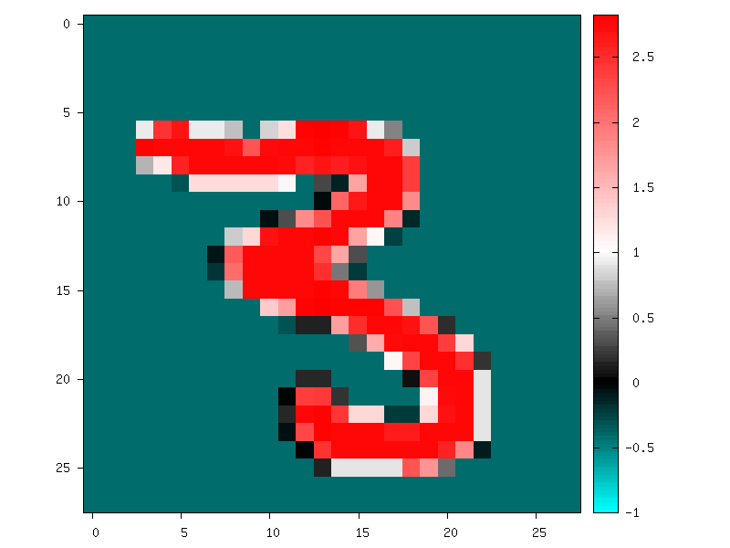

Stimuli data analysis
=====================

You can enable stimuli data reporting with the following section (the
name of the section must start with ``env.StimuliData``):

.. code-block:: ini

    [env.StimuliData-raw]
    ApplyTo=LearnOnly
    LogSizeRange=1
    LogValueRange=1

The stimuli data reported for the full MNIST learning set will look
like:

::

    env.StimuliData-raw data:
    Number of stimuli: 60000
    Data width range: [28, 28]
    Data height range: [28, 28]
    Data channels range: [1, 1]
    Value range: [0, 255]
    Value mean: 33.3184
    Value std. dev.: 78.5675

Zero-mean and unity standard deviation normalization
----------------------------------------------------

It it possible to normalize the whole database to have zero mean and
unity standard deviation on the learning set using a
``RangeAffineTransformation`` transformation:

.. code-block:: ini

    ; Stimuli normalization based on learning set global mean and std.dev.
    [env.Transformation-normalize]
    Type=RangeAffineTransformation
    FirstOperator=Minus
    FirstValue=[env.StimuliData-raw]_GlobalValue.mean
    SecondOperator=Divides
    SecondValue=[env.StimuliData-raw]_GlobalValue.stdDev

The variables ``_GlobalValue.mean`` and ``_GlobalValue.stdDev`` are
automatically generated in the ``[env.StimuliData-raw]`` block. Thanks
to this facility, unknown and arbitrary database can be analysed and
normalized in one single step without requiring any external data
manipulation.

After normalization, the stimuli data reported is:

::

    env.StimuliData-normalized data:
    Number of stimuli: 60000
    Data width range: [28, 28]
    Data height range: [28, 28]
    Data channels range: [1, 1]
    Value range: [-0.424074, 2.82154]
    Value mean: 2.64796e-07
    Value std. dev.: 1

Where we can check that the global mean is close to 0 and the standard
deviation is 1 on the whole dataset. The result of the transformation on
the first images of the set can be checked in the generated *frames*
folder, as shown in figure [fig:frame0Mean1StdDev].

   Image of the set after normalization.

Substracting the mean image of the set
--------------------------------------

Using the ``StimuliData`` object followed with an
``AffineTransformation``, it is also possible to use the mean image of
the dataset to normalize the data:

.. code-block:: ini

    [env.StimuliData-meanData]
    ApplyTo=LearnOnly
    MeanData=1 ; Provides the _MeanData parameter used in the transformation

    [env.Transformation]
    Type=AffineTransformation
    FirstOperator=Minus
    FirstValue=[env.StimuliData-meanData]_MeanData

The resulting global mean image can be visualized in
*env.StimuliData-meanData/meanData.bin.png* an is shown in figure
[fig:meanData].

         ``MeanData`` parameter enabled.

   Global mean image generated by ``StimuliData`` with the ``MeanData``
   parameter enabled.

After this transformation, the reported stimuli data becomes:

::

    env.StimuliData-processed data:
    Number of stimuli: 60000
    Data width range: [28, 28]
    Data height range: [28, 28]
    Data channels range: [1, 1]
    Value range: [-139.554, 254.979]
    Value mean: -3.45583e-08
    Value std. dev.: 66.1288

The result of the transformation on the first images of the set can be
checked in the generated *frames* folder, as shown in figure
[fig:frameMinusMean].

         substracting the global mean image (keep in mind that the original
         image value range is [0, 255]).

   Image of the set after the ``AffineTransformation`` substracting the
   global mean image (keep in mind that the original image value range
   is [0, 255]).
