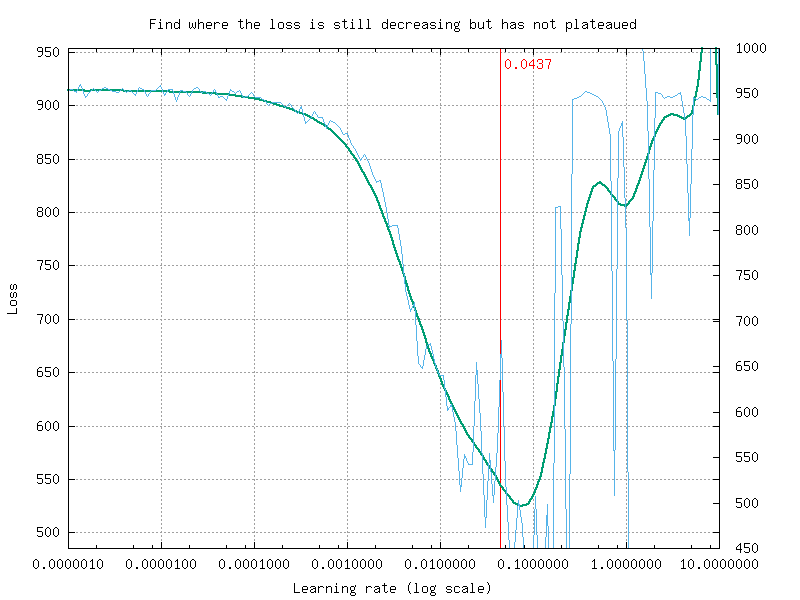

Tutorials
=========

Learning deep neural networks: tips and tricks
----------------------------------------------

Choose the learning solver
~~~~~~~~~~~~~~~~~~~~~~~~~~

Generally, you should use the SGD solver with a momemtum (typical value
for the momentum: 0.9). It generalizes better, often significantly
better, than adaptive methods like Adam
:cite:`2017arXiv170508292W`.

Adaptive solvers, like Adam, may be used for fast exploration and
prototyping, thanks to their fast convergence.

Choose the learning hyper-parameters
~~~~~~~~~~~~~~~~~~~~~~~~~~~~~~~~~~~~

You can use the ``-find-lr`` option available in the ``n2d2`` executable
to automatically find the best learning rate for a given neural network.

Usage example:

::

    ./n2d2 model.ini -find-lr 10000

This commnand starts from a very low learning rate (1.0e-6) and increase
it exponentially to reach the maximum value (10.0) after 10000 steps, as
shown in figure [fig:findLrRange]. The loss change during this phase is
then plotted in function of the learning rate, as shown in figure
[fig:findLr].

         number of iterations, equals to the number of steps divided by the
         batch size (here: 24).

   Exponential increase of the learning rate over the specified number
   of iterations, equals to the number of steps divided by the batch
   size (here: 24).

   Loss change as a function of the learning rate.

Note that in N2D2, the learning rate is automatically normalized by the
global batch size (:math:`N \times \text{\lstinline!IterationSize!}`)
for the ``SGDSolver``. A simple linear scaling rule is used, as
recommanded in :cite:`DBLP:journals/corr/GoyalDGNWKTJH17`.
The effective learning rate :math:`\alpha_{\text{eff}}` applied for
parameters update is therefore:

.. math:: \alpha_{\text{eff}} = \frac{\alpha}{N \times \text{\lstinline!IterationSize!}} \text{ with $\alpha$ = \lstinline!LearningRate!}

Typical values for the ``SGDSolver`` are:

::

    Solvers.LearningRate=0.01
    Solvers.Decay=0.0001
    Solvers.Momentum=0.9

Convergence and normalization
~~~~~~~~~~~~~~~~~~~~~~~~~~~~~

Deep networks (> 30 layers) and especially residual networks usually
don’t converge without normalization. Indeed, batch normalization is
almost always used. *ZeroInit* is a method that can be used to overcome
this issue without normalization :cite:`zhang2018residual`.

Building a classifier neural network
------------------------------------

For this tutorial, we will use the classical MNIST handwritten digit
dataset. A driver module already exists for this dataset, named
``MNIST_IDX_Database``.

To instantiate it, just add the following lines in a new INI file:

.. code-block:: ini

    [database]
    Type=MNIST_IDX_Database
    Validation=0.2 ; Use 20\% of the dataset for validation

In order to create a neural network, we first need to define its input,
which is declared with a ``[sp]`` section (*sp* for *StimuliProvider*).
In this section, we configure the size of the input and the batch size:

.. code-block:: ini

    [sp]
    SizeX=32
    SizeY=32
    BatchSize=128

We can also add pre-processing transformations to the *StimuliProvider*,
knowing that the final data size after transformations must match the
size declared in the ``[sp]`` section. Here, we must rescale the MNIST
28x28 images to match the 32x32 network input size.

.. code-block:: ini

    [sp.Transformation_1]
    Type=RescaleTransformation
    Width=[sp]SizeX
    Height=[sp]SizeY

Next, we declare the neural network layers. In this example, we
reproduced the well-known LeNet network. The first layer is a 5x5
convolutional layer, with 6 channels. Since there is only one input
channel, there will be only 6 convolution kernels in this layer.

.. code-block:: ini

    [conv1]
    Input=sp
    Type=Conv
    KernelWidth=5
    KernelHeight=5
    NbOutputs=6

The next layer is a 2x2 MAX pooling layer, with a stride of 2
(non-overlapping MAX pooling).

.. code-block:: ini

    [pool1]
    Input=conv1
    Type=Pool
    PoolWidth=2
    PoolHeight=2
    NbOutputs=[conv1]NbOutputs
    Stride=2
    Pooling=Max
    Mapping.Size=1 ; One to one connection between input and output channels

The next layer is a 5x5 convolutional layer with 16 channels.

.. code-block:: ini

    [conv2]
    Input=pool1
    Type=Conv
    KernelWidth=5
    KernelHeight=5
    NbOutputs=16

Note that in LeNet, the ``[conv2]`` layer is not fully connected to the
pooling layer. In N2D2, a custom mapping can be defined for each input
connection. The connection of :math:`n`-th output map to the inputs is
defined by the :math:`n`-th column of the matrix below, where the rows
correspond to the inputs.

.. code-block:: ini

    Mapping(pool1)=\
    1 0 0 0 1 1 1 0 0 1 1 1 1 0 1 1 \
    1 1 0 0 0 1 1 1 0 0 1 1 1 1 0 1 \
    1 1 1 0 0 0 1 1 1 0 0 1 0 1 1 1 \
    0 1 1 1 0 0 1 1 1 1 0 0 1 0 1 1 \
    0 0 1 1 1 0 0 1 1 1 1 0 1 1 0 1 \
    0 0 0 1 1 1 0 0 1 1 1 1 0 1 1 1

Another MAX pooling and convolution layer follow:

.. code-block:: ini

    [pool2]
    Input=conv2
    Type=Pool
    PoolWidth=2
    PoolHeight=2
    NbOutputs=[conv2]NbOutputs
    Stride=2
    Pooling=Max
    Mapping.Size=1

    [conv3]
    Input=pool2
    Type=Conv
    KernelWidth=5
    KernelHeight=5
    NbOutputs=120

The network is composed of two fully-connected layers of 84 and 10
neurons respectively:

.. code-block:: ini

    [fc1]
    Input=conv3
    Type=Fc
    NbOutputs=84

    [fc2]
    Input=fc1
    Type=Fc
    NbOutputs=10

Finally, we use a softmax layer to obtain output classification
probabilities and compute the loss function.

.. code-block:: ini

    [softmax]
    Input=fc2
    Type=Softmax
    NbOutputs=[fc2]NbOutputs
    WithLoss=1

In order to tell N2D2 to compute the error and the classification score
on this softmax layer, one must attach a N2D2 *Target* to this layer,
with a section with the same name suffixed with ``.Target``:

.. code-block:: ini

    [softmax.Target]

By default, the activation function for the convolution and the
fully-connected layers is the hyperbolic tangent. Because the ``[fc2]``
layer is fed to a softmax, it should not have any activation function.
We can specify it by adding the following line in the ``[fc2]`` section:

.. code-block:: ini

    [fc2]
    ...
    ActivationFunction=Linear

In order to improve further the networks performances, several things
can be done:

**Use ReLU activation functions.** In order to do so, just add the
following in the ``[conv1]``, ``[conv2]``, ``[conv3]`` and ``[fc1]``
layer sections:

.. code-block:: ini

    ActivationFunction=Rectifier

For the ReLU activation function to be effective, the weights must be
initialized carefully, in order to avoid dead units that would be stuck
in the :math:`]-\infty,0]` output range before the ReLU function. In
N2D2, one can use a custom ``WeightsFiller`` for the weights
initialization. For the ReLU activation function, a popular and
efficient filler is the so-called ``XavierFiller`` (see the
[par:XavierFiller] section for more information):

.. code-block:: ini

    WeightsFiller=XavierFiller

**Use dropout layers.** Dropout is highly effective to improve the
network generalization capacity. Here is an example of a dropout layer
inserted between the ``[fc1]`` and ``[fc2]`` layers:

.. code-block:: ini

    [fc1]
    ...

    [fc1.drop]
    Input=fc1
    Type=Dropout
    NbOutputs=[fc1]NbOutputs

    [fc2]
    Input=fc1.drop ; Replaces "Input=fc1"
    ...

**Tune the learning parameters.** You may want to tune the learning rate
and other learning parameters depending on the learning problem at hand.
In order to do so, you can add a configuration section that can be
common (or not) to all the layers. Here is an example of configuration
section:

.. code-block:: ini

    [conv1]
    ...
    ConfigSection=common.config

    [...]
    ...

    [common.config]
    NoBias=1
    WeightsSolver.LearningRate=0.05
    WeightsSolver.Decay=0.0005
    Solvers.LearningRatePolicy=StepDecay
    Solvers.LearningRateStepSize=[sp]_EpochSize
    Solvers.LearningRateDecay=0.993
    Solvers.Clamping=-1.0:1.0

For more details on the configuration parameters for the ``Solver``, see
section [sec:WeightSolvers].

**Add input distortion.** See for example the
``DistortionTransformation`` (section [par:DistortionTransformation]).

The complete INI model corresponding to this tutorial can be found in
*models/LeNet.ini*.

In order to use CUDA/GPU accelerated learning, the default layer model
should be switched to ``Frame_CUDA``. You can enable this model by
adding the following line at the top of the INI file (before the first
section):

.. code-block:: ini

    DefaultModel=Frame_CUDA

Building a segmentation neural network
--------------------------------------

In this tutorial, we will learn how to do image segmentation with N2D2.
As an example, we will implement a face detection and gender recognition
neural network, using the IMDB-WIKI dataset.

First, we need to instanciate the IMDB-WIKI dataset built-in N2D2
driver:

.. code-block:: ini

    [database]
    Type=IMDBWIKI_Database
    WikiSet=1 ; Use the WIKI part of the dataset
    IMDBSet=0 ; Don't use the IMDB part (less accurate annotation)
    Learn=0.90
    Validation=0.05
    DefaultLabel=background ; Label for pixels outside any ROI (default is no label, pixels are ignored)

We must specify a default label for the background, because we want to
learn to differenciate faces from the background (and not simply ignore
the background for the learning).

The network input is then declared:

.. code-block:: ini

    [sp]
    SizeX=480
    SizeY=360
    BatchSize=48
    CompositeStimuli=1

In order to work with segmented data, i.e. data with bounding box
annotations or pixel-wise annotations (as opposed to a single label per
data), one must enable the ``CompositeStimuli`` option in the ``[sp]``
section.

We can then perform various operations on the data before feeding it to
the network, like for example converting the 3-channels RGB input images
to single-channel gray images:

.. code-block:: ini

    [sp.Transformation-1]
    Type=ChannelExtractionTransformation
    CSChannel=Gray

We must only rescale the images to match the networks input size. This
can be done using a ``RescaleTransformation``, followed by a
``PadCropTransformation`` if one want to keep the images aspect ratio.

.. code-block:: ini

    [sp.Transformation-2]
    Type=RescaleTransformation
    Width=[sp]SizeX
    Height=[sp]SizeY
    KeepAspectRatio=1 ; Keep images aspect ratio

    ; Required to ensure all the images are the same size
    [sp.Transformation-3]
    Type=PadCropTransformation
    Width=[sp]SizeX
    Height=[sp]SizeY

A common additional operation to extend the learning set is to apply
random horizontal mirror to images. This can be achieved with the
following ``FlipTransformation``:

.. code-block:: ini

    [sp.OnTheFlyTransformation-4]
    Type=FlipTransformation
    RandomHorizontalFlip=1
    ApplyTo=LearnOnly ; Apply this transformation only on the learning set

Note that this is an *on-the-fly* transformation, meaning it cannot be
cached and is re-executed every time even for the same stimuli. We also
apply this transformation only on the learning set, with the ``ApplyTo``
option.

Next, the neural network can be described:

.. code-block:: ini

    [conv1.1]
    Input=sp
    Type=Conv
    ...

    [pool1]
    ...

    [...]
    ...

    [fc2]
    Input=drop1
    Type=Conv
    ...

    [drop2]
    Input=fc2
    Type=Dropout
    NbOutputs=[fc2]NbOutputs

A full network description can be found in the *IMDBWIKI.ini* file in
the *models* directory of N2D2. It is a fully-CNN network.

Here we will focus on the output layers required to detect the faces and
classify their gender. We start from the ``[drop2]`` layer, which has
128 channels of size 60x45.

Faces detection
~~~~~~~~~~~~~~~

We want to first add an output stage for the faces detection. It is a
1x1 convolutional layer with a single 60x45 output map. For each output
pixel, this layer outputs the probability that the pixel belongs to a
face.

.. code-block:: ini

    [fc3.face]
    Input=drop2
    Type=Conv
    KernelWidth=1
    KernelHeight=1
    NbOutputs=1
    Stride=1
    ActivationFunction=LogisticWithLoss
    WeightsFiller=XavierFiller
    ConfigSection=common.config ; Same solver options that the other layers

In order to do so, the activation function of this layer must be of type
``LogisticWithLoss``.

We must also tell N2D2 to compute the error and the classification score
on this softmax layer, by attaching a N2D2 *Target* to this layer, with
a section with the same name suffixed with ``.Target``:

.. code-block:: ini

    [fc3.face.Target]
    LabelsMapping=\${N2D2_MODELS}/IMDBWIKI_target_face.dat
    ; Visualization parameters
    NoDisplayLabel=0
    LabelsHueOffset=90

In this *Target*, we must specify how the dataset annotations are mapped
to the layer’s output. This can be done in a separate file using the
``LabelsMapping`` parameter. Here, since the output layer has a single
output per pixel, the target value can only be 0 or 1. A target value of
-1 means that this output is ignored (no error back-propagated). Since
the only annotations in the IMDB-WIKI dataset are faces, the mapping
described in the *IMDBWIKI\_target\_face.dat* file is easy:

::

    # background
    background 0

    # padding (*) is ignored (-1)
    * -1

    # not background = face
    default 1

Gender recognition
~~~~~~~~~~~~~~~~~~

We can also add a second output stage for gender recognition. Like
before, it would be a 1x1 convolutional layer with a single 60x45 output
map. But here, for each output pixel, this layer would output the
probability that the pixel represents a female face.

.. code-block:: ini

    [fc3.gender]
    Input=drop2
    Type=Conv
    KernelWidth=1
    KernelHeight=1
    NbOutputs=1
    Stride=1
    ActivationFunction=LogisticWithLoss
    WeightsFiller=XavierFiller
    ConfigSection=common.config

The output layer is therefore identical to the face’s output layer, but
the target mapping is different. For the target mapping, the idea is
simply to ignore all pixels not belonging to a face and affect the
target 0 to male pixels and the target 1 to female pixels.

.. code-block:: ini

    [fc3.gender.Target]
    LabelsMapping=\${N2D2_MODELS}/IMDBWIKI_target_gender.dat
    ; Only display gender probability for pixels detected as face pixels
    MaskLabelTarget=fc3.face.Target
    MaskedLabel=1

The content of the *IMDBWIKI\_target\_gender.dat* file would therefore
look like:

::

    # background
    # ?-* (unknown gender)
    # padding
    default -1

    # male gender
    M-? 0   # unknown age
    M-0 0
    M-1 0
    M-2 0
    ...
    M-98 0
    M-99 0

    # female gender
    F-? 1   # unknown age
    F-0 1
    F-1 1
    F-2 1
    ...
    F-98 1
    F-99 1

ROIs extraction
~~~~~~~~~~~~~~~

The next step would be to extract detected face ROIs and assign for each
ROI the most probable gender. To this end, we can first set a detection
threshold, in terms of probability, to select face pixels. In the
following, the threshold is fixed to 75% face probability:

.. code-block:: ini

    [post.Transformation-thres]
    Input=fc3.face
    Type=Transformation
    NbOutputs=1
    Transformation=ThresholdTransformation
    Operation=ToZero
    Threshold=0.75

We can then assign a target of type ``TargetROIs`` to this layer that
will automatically create the bounding box using a segmentation
algorithm.

.. code-block:: ini

    [post.Transformation-thres.Target-face]
    Type=TargetROIs
    MinOverlap=0.33 ; Min. overlap fraction to match the ROI to an annotation
    FilterMinWidth=5 ; Min. ROI width
    FilterMinHeight=5 ; Min. ROI height
    FilterMinAspectRatio=0.5 ; Min. ROI aspect ratio
    FilterMaxAspectRatio=1.5 ; Max. ROI aspect ratio
    LabelsMapping=\${N2D2_MODELS}/IMDBWIKI_target_face.dat

In order to assign a gender to the extracted ROIs, the above target must
be modified to:

.. code-block:: ini

    [post.Transformation-thres.Target-gender]
    Type=TargetROIs
    ROIsLabelTarget=fc3.gender.Target
    MinOverlap=0.33
    FilterMinWidth=5
    FilterMinHeight=5
    FilterMinAspectRatio=0.5
    FilterMaxAspectRatio=1.5
    LabelsMapping=\${N2D2_MODELS}/IMDBWIKI_target_gender.dat

Here, we use the ``fc3.gender.Target`` target to determine the most
probable gender of the ROI.

Data visualization
~~~~~~~~~~~~~~~~~~

For each *Target* in the network, a corresponding folder is created in
the simulation directory, which contains learning, validation and test
confusion matrixes. The output estimation of the network for each
stimulus is also generated automatically for the test dataset and can be
visualized with the *./test.py* helper tool. An example is shown in
figure [fig:targetvisu].

   Example of the target visualization helper tool.

Transcoding a learned network in spike-coding
---------------------------------------------

N2D2 embeds an event-based simulator (historically known as ’Xnet’) and
allows to transcode a whole DNN in a spike-coding version and evaluate
the resulting spiking neural network performances. In this tutorial, we
will transcode the LeNet network described in section
[sec:BuildingClassifierNN].

Render the network compatible with spike simulations
~~~~~~~~~~~~~~~~~~~~~~~~~~~~~~~~~~~~~~~~~~~~~~~~~~~~

The first step is to specify that we want to use a transcode model
(allowing both formal and spike simulation of the same network), by
changing the ``DefaultModel`` to:

.. code-block:: ini

    DefaultModel=Transcode_CUDA

In order to perform spike simulations, the input of the network must be
of type *Environment*, which is a derived class of *StimuliProvider*
that adds spike coding support. In the INI model file, it is therefore
necessary to replace the ``[sp]`` section by an ``[env]`` section and
replace all references of ``sp`` to ``env``.

Note that these changes have at this point no impact at all on the
formal coding simulations. The beginning of the INI file should be:

.. code-block:: ini

    DefaultModel=!\color{red}{Transcode\_CUDA}!

    ; Database
    [database]
    Type=MNIST_IDX_Database
    Validation=0.2 ; Use 20% of the dataset for validation

    ; Environment
    [!\color{red}{env}!]
    SizeX=32
    SizeY=32
    BatchSize=128

    [env.Transformation_1]
    Type=RescaleTransformation
    Width=[!\color{red}{env}!]SizeX
    Height=[!\color{red}{env}!]SizeY

    [conv1]
    Input=!\color{red}{env}!
    ...

The dropout layer has no equivalence in spike-coding inference and must
be removed:

.. code-block:: ini

    ...
    !\color{red}{\st{[fc1.drop]}}!
    !\color{red}{\st{Input=fc1}}!
    !\color{red}{\st{Type=Dropout}}!
    !\color{red}{\st{NbOutputs=[fc1]NbOutputs}}!

    [fc2]
    Input=fc1!\color{red}{\st{.drop}}!
    ...

The softmax layer has no equivalence in spike-coding inference and must
be removed as well. The *Target* must therefore be attached to
``[fc2]``:

.. code-block:: ini

    ...
    !\color{red}{\st{[softmax]}}!
    !\color{red}{\st{Input=fc2}}!
    !\color{red}{\st{Type=Softmax}}!
    !\color{red}{\st{NbOutputs=[fc2]NbOutputs}}!
    !\color{red}{\st{WithLoss=1}}!

    !\color{red}{\st{[softmax.Target]}}!

    [fc2.Target]
    ...

The network is now compatible with spike-coding simulations. However, we
did not specify at this point how to translate the input stimuli data
into spikes, nor the spiking neuron parameters (threshold value, leak
time constant...).

Configure spike-coding parameters
~~~~~~~~~~~~~~~~~~~~~~~~~~~~~~~~~

The first step is to configure how the input stimuli data must be coded
into spikes. To this end, we must attach a configuration section to the
*Environment*. Here, we specify a periodic coding with random initial
jitter with a minimum period of 10 ns and a maximum period of 100 us:

.. code-block:: ini

    ...
    ConfigSection=env.config

    [env.config]
    ; Spike-based computing
    StimulusType=JitteredPeriodic
    PeriodMin=1,000,000 ; unit = fs
    PeriodMeanMin=10,000,000 ; unit = fs
    PeriodMeanMax=100,000,000,000 ; unit = fs
    PeriodRelStdDev=0.0

The next step is to specify the neurons parameters, that will be common
to all layers and can therefore be specified in the ``[common.config]``
section. In N2D2, the base spike-coding layers use a Leaky
Integrate-and-Fire (LIF) neuron model. By default, the leak time
constant is zero, resulting to simple Integrate-and-Fire (IF) neurons.

Here we simply specify that the neurons threshold must be the unity,
that the threshold is only positive and that there is no incoming
synaptic delay:

.. code-block:: ini

    ...
    ; Spike-based computing
    Threshold=1.0
    BipolarThreshold=0
    IncomingDelay=0

Finally, we can limit the number of spikes required for the computation
of each stimulus by adding a decision delta threshold at the output
layer:

.. code-block:: ini

    ...
    ConfigSection=common.config,fc2.config

    [fc2.Target]

    [fc2.config]
    ; Spike-based computing
    TerminateDelta=4
    BipolarThreshold=1

The complete INI model corresponding to this tutorial can be found in
*models/LeNet\_Spike.ini*.

Here is a summary of the steps required to reproduce the whole
experiment:

::

    ./n2d2 "\$N2D2_MODELS/LeNet.ini" -learn 6000000 -log 100000
    ./n2d2 "\$N2D2_MODELS/LeNet_Spike.ini" -test

The final recognition rate reported at the end of the spike inference
should be almost identical to the formal coding network (around 99% for
the LeNet network).

Various statistics are available at the end of the spike-coding
simulation in the *stats\_spike* folder and the *stats\_spike.log* file.
Looking in the *stats\_spike.log* file, one can read the following line
towards the end of the file:

::

    Read events per virtual synapse per pattern (average): 0.654124

This line reports the average number of accumulation operations per
synapse per input stimulus in the network. If this number if below 1.0,
it means that the spiking version of the network is more efficient than
its formal counterpart in terms of total number of operations!

