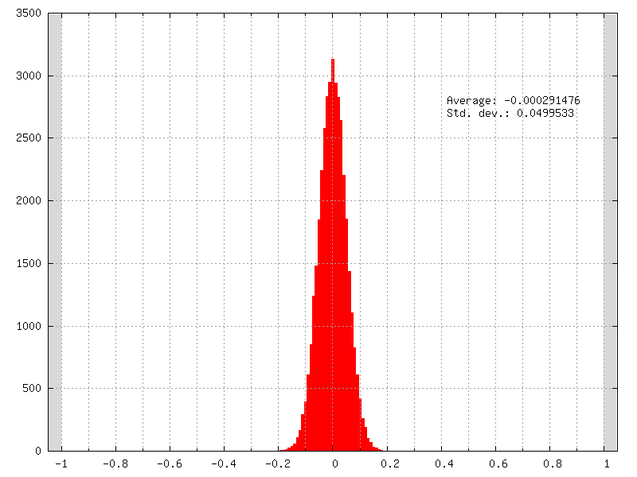

Network Layers
==============

Layer definition
----------------

Common set of parameters for any kind of layer.

+--------------------------------------+-----------------------------------------------------------------------------------------+
| Option [default value]               | Description                                                                             |
+======================================+=========================================================================================+
| ``Input``                            | Name of the section(s) for the input layer(s). Comma separated                          |
+--------------------------------------+-----------------------------------------------------------------------------------------+
| ``Type``                             | Type of the layer. Can be any of the type described below                               |
+--------------------------------------+-----------------------------------------------------------------------------------------+
| ``Model`` [``DefaultModel``]         | Layer model to use                                                                      |
+--------------------------------------+-----------------------------------------------------------------------------------------+
| ``DataType`` [``DefaultDataType``]   | Layer data type to use. Please note that some layers may not support every data type.   |
+--------------------------------------+-----------------------------------------------------------------------------------------+
| ``ConfigSection`` []                 | Name of the configuration section for layer                                             |
+--------------------------------------+-----------------------------------------------------------------------------------------+

Weight fillers
--------------

Fillers to initialize weights and biases in the different type of layer.

Usage example:

.. code-block:: ini

    [conv1]
    ...
    WeightsFiller=NormalFiller
    WeightsFiller.Mean=0.0
    WeightsFiller.StdDev=0.05
    ...

The initial weights distribution for each layer can be checked in the
*weights_init* folder, with an example shown in figure
[fig:weightsInitDistrib].

         distribution (``NormalFiller``) with a 0 mean and a 0.05 standard
         deviation.

   Initial weights distribution of a layer using a normal distribution
   (``NormalFiller``) with a 0 mean and a 0.05 standard deviation.

ConstantFiller
~~~~~~~~~~~~~~

Fill with a constant value.

+----------------------------+-------------------------+
| Option                     | Description             |
+============================+=========================+
| *FillerName*\ ``.Value``   | Value for the filling   |
+----------------------------+-------------------------+

HeFiller
~~~~~~~~

Fill with an normal distribution with normalized variance taking into
account the rectifier nonlinearity :cite:`He2015`. This
filler is sometimes referred as MSRA filler.

+-----------------------------------------------+--------------------------------------------------------------+
| Option [default value]                        | Description                                                  |
+===============================================+==============================================================+
| *FillerName*\ ``.VarianceNorm`` [``FanIn``]   | Normalization, can be ``FanIn``, ``Average`` or ``FanOut``   |
+-----------------------------------------------+--------------------------------------------------------------+
| *FillerName*\ ``.Scaling`` [1.0]              | Scaling factor                                               |
+-----------------------------------------------+--------------------------------------------------------------+

Use a normal distribution with standard deviation
:math:`\sqrt{\frac{2.0}{n}}`.

- :math:`n` = :math:`fan\text{-}in` with ``FanIn``, resulting in
  :math:`Var(W)=\frac{2}{fan\text{-}in}`

- :math:`n` = :math:`\frac{(fan\text{-}in + fan\text{-}out)}{2}`
  with ``Average``, resulting in
  :math:`Var(W)=\frac{4}{fan\text{-}in + fan\text{-}out}`

- :math:`n` = :math:`fan\text{-}out` with ``FanOut``, resulting in
  :math:`Var(W)=\frac{2}{fan\text{-}out}`

NormalFiller
~~~~~~~~~~~~

Fill with a normal distribution.

+-----------------------------------+------------------------------------------+
| Option [default value]            | Description                              |
+===================================+==========================================+
| *FillerName*\ ``.Mean`` [0.0]     | Mean value of the distribution           |
+-----------------------------------+------------------------------------------+
| *FillerName*\ ``.StdDev`` [1.0]   | Standard deviation of the distribution   |
+-----------------------------------+------------------------------------------+

UniformFiller
~~~~~~~~~~~~~

Fill with an uniform distribution.

+--------------------------------+---------------+
| Option [default value]         | Description   |
+================================+===============+
| *FillerName*\ ``.Min`` [0.0]   | Min. value    |
+--------------------------------+---------------+
| *FillerName*\ ``.Max`` [1.0]   | Max. value    |
+--------------------------------+---------------+

XavierFiller
~~~~~~~~~~~~

Fill with an uniform distribution with normalized variance
:cite:`Glorot2010`.

+-------------------------------------------------+--------------------------------------------------------------+
| Option [default value]                          | Description                                                  |
+=================================================+==============================================================+
| *FillerName*\ ``.VarianceNorm`` [``FanIn``]     | Normalization, can be ``FanIn``, ``Average`` or ``FanOut``   |
+-------------------------------------------------+--------------------------------------------------------------+
| *FillerName*\ ``.Distribution`` [``Uniform``]   | Distribution, can be ``Uniform`` or ``Normal``               |
+-------------------------------------------------+--------------------------------------------------------------+
| *FillerName*\ ``.Scaling`` [1.0]                | Scaling factor                                               |
+-------------------------------------------------+--------------------------------------------------------------+

Use an uniform distribution with interval :math:`[-scale,scale]`, with
:math:`scale = \sqrt{\frac{3.0}{n}}`.

- :math:`n` = :math:`fan\text{-}in` with ``FanIn``, resulting in
  :math:`Var(W)=\frac{1}{fan\text{-}in}`

- :math:`n` = :math:`\frac{(fan\text{-}in + fan\text{-}out)}{2}`
  with ``Average``, resulting in
  :math:`Var(W)=\frac{2}{fan\text{-}in + fan\text{-}out}`

- :math:`n` = :math:`fan\text{-}out` with ``FanOut``, resulting in
  :math:`Var(W)=\frac{1}{fan\text{-}out}`

Weight solvers
--------------

SGDSolver_Frame
~~~~~~~~~~~~~~~

SGD Solver for ``Frame`` models.

+----------------------------------------------------+-------------------------------------------------------------------------------------------------------------------------+
| Option [default value]                             | Description                                                                                                             |
+====================================================+=========================================================================================================================+
| *SolverName*\ ``.LearningRate`` [0.01]             | Learning rate                                                                                                           |
+----------------------------------------------------+-------------------------------------------------------------------------------------------------------------------------+
| *SolverName*\ ``.Momentum`` [0.0]                  | Momentum                                                                                                                |
+----------------------------------------------------+-------------------------------------------------------------------------------------------------------------------------+
| *SolverName*\ ``.Decay`` [0.0]                     | Decay                                                                                                                   |
+----------------------------------------------------+-------------------------------------------------------------------------------------------------------------------------+
| *SolverName*\ ``.LearningRatePolicy`` [``None``]   | Learning rate decay policy. Can be any of ``None``, ``StepDecay``, ``ExponentialDecay``, ``InvTDecay``, ``PolyDecay``   |
+----------------------------------------------------+-------------------------------------------------------------------------------------------------------------------------+
| *SolverName*\ ``.LearningRateStepSize`` [1]        | Learning rate step size (in number of stimuli)                                                                          |
+----------------------------------------------------+-------------------------------------------------------------------------------------------------------------------------+
| *SolverName*\ ``.LearningRateDecay`` [0.1]         | Learning rate decay                                                                                                     |
+----------------------------------------------------+-------------------------------------------------------------------------------------------------------------------------+
| *SolverName*\ ``.Clamping`` [0]                    | If true, clamp the weights and bias between -1 and 1                                                                    |
+----------------------------------------------------+-------------------------------------------------------------------------------------------------------------------------+
| *SolverName*\ ``.Power`` [0.0]                     | Polynomial learning rule power parameter                                                                                |
+----------------------------------------------------+-------------------------------------------------------------------------------------------------------------------------+
| *SolverName*\ ``.MaxIterations`` [0.0]             | Polynomial learning rule maximum number of iterations                                                                   |
+----------------------------------------------------+-------------------------------------------------------------------------------------------------------------------------+

The learning rate decay policies are the following:

- ``StepDecay``: every *SolverName*\ ``.LearningRateStepSize`` stimuli,
  the learning rate is reduced by a factor
  *SolverName*\ ``.LearningRateDecay``;

- ``ExponentialDecay``: the learning rate is
  :math:`\alpha = \alpha_{0}\exp(-k t)`, with :math:`\alpha_{0}` the
  initial learning rate *SolverName*\ ``.LearningRate``, :math:`k` the
  rate decay *SolverName* ``.LearningRateDecay`` and :math:`t` the step
  number (one step every *SolverName*\ ``.LearningRateStepSize``
  stimuli);

- ``InvTDecay``: the learning rate is
  :math:`\alpha = \alpha_{0} / (1 + k t)`, with :math:`\alpha_{0}` the
  initial learning rate *SolverName*\ ``.LearningRate``, :math:`k` the
  rate decay *SolverName*\ ``.LearningRateDecay`` and :math:`t` the step
  number (one step every *SolverName*\ ``.LearningRateStepSize``
  stimuli).

- ``InvDecay``: the learning rate is
  :math:`\alpha = \alpha_{0} * (1 + k t)^{-n}`, with :math:`\alpha_{0}`
  the initial learning rate *SolverName*\ ``.LearningRate``, :math:`k`
  the rate decay *SolverName*\ ``.LearningRateDecay``, :math:`t` the
  current iteration and :math:`n` the power parameter
  *SolverName*\ ``.Power``

- ``PolyDecay``: the learning rate is
  :math:`\alpha = \alpha_{0} * (1 - \frac{k}{t})^n`, with
  :math:`\alpha_{0}` the initial learning rate
  *SolverName*\ ``.LearningRate``, :math:`k` the current iteration,
  :math:`t` the maximum number of iteration
  *SolverName*\ ``.MaxIterations`` and :math:`n` the power parameter
  *SolverName*\ ``.Power``

SGDSolver_Frame_CUDA
~~~~~~~~~~~~~~~~~~~~

SGD Solver for ``Frame_CUDA`` models.

+----------------------------------------------------+----------------------------------------------------------------------------------------------------------+
| Option [default value]                             | Description                                                                                              |
+====================================================+==========================================================================================================+
| *SolverName*\ ``.LearningRate`` [0.01]             | Learning rate                                                                                            |
+----------------------------------------------------+----------------------------------------------------------------------------------------------------------+
| *SolverName*\ ``.Momentum`` [0.0]                  | Momentum                                                                                                 |
+----------------------------------------------------+----------------------------------------------------------------------------------------------------------+
| *SolverName*\ ``.Decay`` [0.0]                     | Decay                                                                                                    |
+----------------------------------------------------+----------------------------------------------------------------------------------------------------------+
| *SolverName*\ ``.LearningRatePolicy`` [``None``]   | Learning rate decay policy. Can be any of ``None``, ``StepDecay``, ``ExponentialDecay``, ``InvTDecay``   |
+----------------------------------------------------+----------------------------------------------------------------------------------------------------------+
| *SolverName*\ ``.LearningRateStepSize`` [1]        | Learning rate step size (in number of stimuli)                                                           |
+----------------------------------------------------+----------------------------------------------------------------------------------------------------------+
| *SolverName*\ ``.LearningRateDecay`` [0.1]         | Learning rate decay                                                                                      |
+----------------------------------------------------+----------------------------------------------------------------------------------------------------------+
| *SolverName*\ ``.Clamping`` [0]                    | If true, clamp the weights and bias between -1 and 1                                                     |
+----------------------------------------------------+----------------------------------------------------------------------------------------------------------+

The learning rate decay policies are identical to the ones in the
``SGDSolver_Frame`` solver.

AdamSolver_Frame
~~~~~~~~~~~~~~~~

Adam Solver for ``Frame`` models :cite:`KingmaB14`.

+-------------------------------------------+-----------------------------------------------------------------------+
| Option [default value]                    | Description                                                           |
+===========================================+=======================================================================+
| *SolverName*\ ``.LearningRate`` [0.001]   | Learning rate (stepsize)                                              |
+-------------------------------------------+-----------------------------------------------------------------------+
| *SolverName*\ ``.Beta1`` [0.9]            | Exponential decay rate of these moving average of the first moment    |
+-------------------------------------------+-----------------------------------------------------------------------+
| *SolverName*\ ``.Beta2`` [0.999]          | Exponential decay rate of these moving average of the second moment   |
+-------------------------------------------+-----------------------------------------------------------------------+
| *SolverName*\ ``.Epsilon`` [1.0e-8]       | Epsilon                                                               |
+-------------------------------------------+-----------------------------------------------------------------------+

AdamSolver_Frame_CUDA
~~~~~~~~~~~~~~~~~~~~~

Adam Solver for ``Frame_CUDA`` models :cite:`KingmaB14`.

+-------------------------------------------+-----------------------------------------------------------------------+
| Option [default value]                    | Description                                                           |
+===========================================+=======================================================================+
| *SolverName*\ ``.LearningRate`` [0.001]   | Learning rate (stepsize)                                              |
+-------------------------------------------+-----------------------------------------------------------------------+
| *SolverName*\ ``.Beta1`` [0.9]            | Exponential decay rate of these moving average of the first moment    |
+-------------------------------------------+-----------------------------------------------------------------------+
| *SolverName*\ ``.Beta2`` [0.999]          | Exponential decay rate of these moving average of the second moment   |
+-------------------------------------------+-----------------------------------------------------------------------+
| *SolverName*\ ``.Epsilon`` [1.0e-8]       | Epsilon                                                               |
+-------------------------------------------+-----------------------------------------------------------------------+

Activation functions
--------------------

Activation function to be used at the output of layers.

Usage example:

.. code-block:: ini

    [conv1]
    ...
    ActivationFunction=Rectifier
    ActivationFunction.LeakSlope=0.01
    ActivationFunction.Clipping=20
    ...

Logistic
~~~~~~~~

Logistic activation function.

LogisticWithLoss
~~~~~~~~~~~~~~~~

Logistic with loss activation function.

Rectifier
~~~~~~~~~

Rectifier or ReLU activation function.

+------------------------------------------+---------------------------------------+
| Option [default value]                   | Description                           |
+==========================================+=======================================+
| ``ActivationFunction.LeakSlope`` [0.0]   | Leak slope for negative inputs        |
+------------------------------------------+---------------------------------------+
| ``ActivationFunction.Clipping`` [0.0]    | Clipping value for positive outputs   |
+------------------------------------------+---------------------------------------+

Saturation
~~~~~~~~~~

Saturation activation function.

Softplus
~~~~~~~~

Softplus activation function.

Tanh
~~~~

Tanh activation function.

Computes :math:`y = tanh(\alpha x)`.

+--------------------------------------+----------------------------+
| Option [default value]               | Description                |
+======================================+============================+
| ``ActivationFunction.Alpha`` [1.0]   | :math:`\alpha` parameter   |
+--------------------------------------+----------------------------+

TanhLeCun
~~~~~~~~~

Tanh activation function with an :math:`\alpha` parameter of
:math:`1.7159 \times (2.0/3.0)`.

Anchor
------

Anchor layer for Faster R-CNN or Single Shot Detector.

+-----------------------------------------------------+--------------------------------------------------------------------------------------------------------------------------------------------------+
| Option [default value]                              | Description                                                                                                                                      |
+=====================================================+==================================================================================================================================================+
| ``Input``                                           | This layer takes one or two inputs. The total number of input channels must be ``ScoresCls`` + 4, with ``ScoresCls`` being equal to 1 or 2.      |
+-----------------------------------------------------+--------------------------------------------------------------------------------------------------------------------------------------------------+
| ``Anchor[*]``                                       | Anchors definition. For each anchor, there must be two space-separated values: the root area and the aspect ratio.                               |
+-----------------------------------------------------+--------------------------------------------------------------------------------------------------------------------------------------------------+
| ``ScoresCls``                                       | Number of classes per anchor. Must be 1 (if the scores input uses logistic regression) or 2 (if the scores input is a two-class softmax layer)   |
+-----------------------------------------------------+--------------------------------------------------------------------------------------------------------------------------------------------------+
| ``FeatureMapWidth`` [``StimuliProvider.Width``]     | Reference width use to scale anchors coordinate.                                                                                                 |
+-----------------------------------------------------+--------------------------------------------------------------------------------------------------------------------------------------------------+
| ``FeatureMapHeight`` [``StimuliProvider.Height``]   | Reference height use to scale anchors coordinate.                                                                                                |
+-----------------------------------------------------+--------------------------------------------------------------------------------------------------------------------------------------------------+

Configuration parameters (*Frame* models)
~~~~~~~~~~~~~~~~~~~~~~~~~~~~~~~~~~~~~~~~~

+--------------------------------+---------------+-------------------------------------------------------------------------------------------------------------------------------+
| Option [default value]         | Model(s)      | Description                                                                                                                   |
+================================+===============+===============================================================================================================================+
| ``PositiveIoU`` [0.7]          | *all Frame*   | Assign a positive label for anchors whose IoU overlap is higher than ``PositiveIoU`` with any ground-truth box                |
+--------------------------------+---------------+-------------------------------------------------------------------------------------------------------------------------------+
| ``NegativeIoU`` [0.3]          | *all Frame*   | Assign a negative label for non-positive anchors whose IoU overlap is lower than ``NegativeIoU`` for all ground-truth boxes   |
+--------------------------------+---------------+-------------------------------------------------------------------------------------------------------------------------------+
| ``LossLambda`` [10.0]          | *all Frame*   | Balancing parameter :math:`\lambda`                                                                                           |
+--------------------------------+---------------+-------------------------------------------------------------------------------------------------------------------------------+
| ``LossPositiveSample`` [128]   | *all Frame*   | Number of random positive samples for the loss computation                                                                    |
+--------------------------------+---------------+-------------------------------------------------------------------------------------------------------------------------------+
| ``LossNegativeSample`` [128]   | *all Frame*   | Number of random negative samples for the loss computation                                                                    |
+--------------------------------+---------------+-------------------------------------------------------------------------------------------------------------------------------+

Usage example:

.. code-block:: ini

    ; RPN network: cls layer
    [scores]
    Input=...
    Type=Conv
    KernelWidth=1
    KernelHeight=1
    ; 18 channels for 9 anchors
    NbOutputs=18
    ...

    [scores.softmax]
    Input=scores
    Type=Softmax
    NbOutputs=[scores]NbOutputs
    WithLoss=1

    ; RPN network: coordinates layer
    [coordinates]
    Input=...
    Type=Conv
    KernelWidth=1
    KernelHeight=1
    ; 36 channels for 4 coordinates x 9 anchors
    NbOutputs=36
    ...

    ; RPN network: anchors
    [anchors]
    Input=scores.softmax,coordinates
    Type=Anchor
    ScoresCls=2 ; using a two-class softmax for the scores
    Anchor[0]=32 1.0
    Anchor[1]=48 1.0
    Anchor[2]=64 1.0
    Anchor[3]=80 1.0
    Anchor[4]=96 1.0
    Anchor[5]=112 1.0
    Anchor[6]=128 1.0
    Anchor[7]=144 1.0
    Anchor[8]=160 1.0
    ConfigSection=anchors.config

    [anchors.config]
    PositiveIoU=0.7
    NegativeIoU=0.3
    LossLambda=1.0

Outputs remapping
~~~~~~~~~~~~~~~~~

Outputs remapping allows to convert *scores* and *coordinates* output
feature maps layout from another ordering that the one used in the N2D2
``Anchor`` layer, during weights import/export.

For example, lets consider that the imported weights corresponds to the
following output feature maps ordering:

::

    0 anchor[0].y
    1 anchor[0].x
    2 anchor[0].h
    3 anchor[0].w
    4 anchor[1].y
    5 anchor[1].x
    6 anchor[1].h
    7 anchor[1].w
    8 anchor[2].y
    9 anchor[2].x
    10 anchor[2].h
    11 anchor[2].w

The output feature maps ordering required by the ``Anchor`` layer is:

::

    0 anchor[0].x
    1 anchor[1].x
    2 anchor[2].x
    3 anchor[0].y
    4 anchor[1].y
    5 anchor[2].y
    6 anchor[0].w
    7 anchor[1].w
    8 anchor[2].w
    9 anchor[0].h
    10 anchor[1].h
    11 anchor[2].h

The feature maps ordering can be changed during weights import/export:

.. code-block:: ini

    ; RPN network: coordinates layer
    [coordinates]
    Input=...
    Type=Conv
    KernelWidth=1
    KernelHeight=1
    ; 36 channels for 4 coordinates x 9 anchors
    NbOutputs=36
    ...
    ConfigSection=coordinates.config

    [coordinates.config]
    WeightsExportFormat=HWCO ; Weights format used by TensorFlow
    OutputsRemap=1:4,0:4,3:4,2:4

BatchNorm
---------

Batch Normalization layer :cite:`Ioffe2015`.

+-------------------------------------+-------------------------------------------------------------------------------------------------------------------------------------------------------------+
| Option [default value]              | Description                                                                                                                                                 |
+=====================================+=============================================================================================================================================================+
| ``NbOutputs``                       | Number of output neurons                                                                                                                                    |
+-------------------------------------+-------------------------------------------------------------------------------------------------------------------------------------------------------------+
| ``ActivationFunction`` []           | Activation function. Can be any of ``Logistic``, ``LogisticWithLoss``, ``Rectifier``, ``Softplus``, ``TanhLeCun``, ``Linear``, ``Saturation`` or ``Tanh``   |
|                                     | (none by default)                                                                                                                                           |
+-------------------------------------+-------------------------------------------------------------------------------------------------------------------------------------------------------------+
| ``ScalesSharing`` []                | Share the scales with an other layer                                                                                                                        |
+-------------------------------------+-------------------------------------------------------------------------------------------------------------------------------------------------------------+
| ``BiasesSharing`` []                | Share the biases with an other layer                                                                                                                        |
+-------------------------------------+-------------------------------------------------------------------------------------------------------------------------------------------------------------+
| ``MeansSharing`` []                 | Share the means with an other layer                                                                                                                         |
+-------------------------------------+-------------------------------------------------------------------------------------------------------------------------------------------------------------+
| ``VariancesSharing`` []             | Share the variances with an other layer                                                                                                                     |
+-------------------------------------+-------------------------------------------------------------------------------------------------------------------------------------------------------------+

Configuration parameters (*Frame* models)
~~~~~~~~~~~~~~~~~~~~~~~~~~~~~~~~~~~~~~~~~

+-----------------------------------+---------------+---------------------------------------------------------------------------------------------------------------------------------------------------------------------------------+
| Option [default value]            | Model(s)      | Description                                                                                                                                                                     |
+===================================+===============+=================================================================================================================================================================================+
| ``Solvers.``\ \*                  | *all Frame*   | Any solver parameters                                                                                                                                                           |
+-----------------------------------+---------------+---------------------------------------------------------------------------------------------------------------------------------------------------------------------------------+
| ``ScaleSolver.``\ \*              | *all Frame*   | Scale solver parameters, take precedence over the ``Solvers.``\ \* parameters                                                                                                   |
+-----------------------------------+---------------+---------------------------------------------------------------------------------------------------------------------------------------------------------------------------------+
| ``BiasSolver.``\ \*               | *all Frame*   | Bias solver parameters, take precedence over the ``Solvers.``\ \* parameters                                                                                                    |
+-----------------------------------+---------------+---------------------------------------------------------------------------------------------------------------------------------------------------------------------------------+
| ``Epsilon`` [0.0]                 | *all Frame*   | Epsilon value used in the batch normalization formula. If 0.0, automatically choose the minimum possible value.                                                                 |
+-----------------------------------+---------------+---------------------------------------------------------------------------------------------------------------------------------------------------------------------------------+
| ``MovingAverageMomentum`` [0.1]   | *all Frame*   | MovingAverageMomentum: used for the moving average of batch-wise means and standard deviations during training. The closer to 1.0, the more it will depend on the last batch.   |
+-----------------------------------+---------------+---------------------------------------------------------------------------------------------------------------------------------------------------------------------------------+

Conv
----

Convolutional layer.

+-------------------------------+----------------------------------------------------+
| Option [default value]        | Description                                        |
+===============================+====================================================+
| ``KernelWidth``               | Width of the kernels                               |
+-------------------------------+----------------------------------------------------+
| ``KernelHeight``              | Height of the kernels                              |
+-------------------------------+----------------------------------------------------+
| ``KernelDepth`` []            | Depth of the kernels (implies 3D kernels)          |
+-------------------------------+----------------------------------------------------+
| ``KernelSize`` []             | Kernels size (implies 2D square kernels)           |
+-------------------------------+----------------------------------------------------+
| ``KernelDims`` []             | List of space-separated dimensions for N-D kernels |
+-------------------------------+----------------------------------------------------+
| ``NbOutputs``                 | Number of output channels                          |
+-------------------------------+----------------------------------------------------+
| ``SubSampleX`` [1]            | X-axis subsampling factor of the output feature    |
|                               | maps                                               |
+-------------------------------+----------------------------------------------------+
| ``SubSampleY`` [1]            | Y-axis subsampling factor of the output feature    |
|                               | maps                                               |
+-------------------------------+----------------------------------------------------+
| ``SubSampleZ`` []             | Z-axis subsampling factor of the output feature    |
|                               | maps                                               |
+-------------------------------+----------------------------------------------------+
| ``SubSample`` [1]             | Subsampling factor of the output feature maps      |
+-------------------------------+----------------------------------------------------+
| ``SubSampleDims`` []          | List of space-separated subsampling dimensions     |
|                               | for N-D kernels                                    |
+-------------------------------+----------------------------------------------------+
| ``StrideX`` [1]               | X-axis stride of the kernels                       |
+-------------------------------+----------------------------------------------------+
| ``StrideY`` [1]               | Y-axis stride of the kernels                       |
+-------------------------------+----------------------------------------------------+
| ``StrideZ`` []                | Z-axis stride of the kernels                       |
+-------------------------------+----------------------------------------------------+
| ``Stride`` [1]                | Stride of the kernels                              |
+-------------------------------+----------------------------------------------------+
| ``StrideDims`` []             | List of space-separated stride dimensions for N-D  |
|                               | kernels                                            |
+-------------------------------+----------------------------------------------------+
| ``PaddingX`` [0]              | X-axis input padding                               |
+-------------------------------+----------------------------------------------------+
| ``PaddingY`` [0]              | Y-axis input padding                               |
+-------------------------------+----------------------------------------------------+
| ``PaddingZ`` []               | Z-axis input padding                               |
+-------------------------------+----------------------------------------------------+
| ``Padding`` [0]               | Input padding                                      |
+-------------------------------+----------------------------------------------------+
| ``PaddingDims`` []            | List of space-separated padding dimensions for     |
|                               | N-D kernels                                        |
+-------------------------------+----------------------------------------------------+
| ``DilationX`` [1]             | X-axis dilation of the kernels                     |
+-------------------------------+----------------------------------------------------+
| ``DilationY`` [1]             | Y-axis dilation of the kernels                     |
+-------------------------------+----------------------------------------------------+
| ``DilationZ`` []              | Z-axis dilation of the kernels                     |
+-------------------------------+----------------------------------------------------+
| ``Dilation`` [1]              | Dilation of the kernels                            |
+-------------------------------+----------------------------------------------------+
| ``DilationDims`` []           | List of space-separated dilation dimensions for    |
|                               | N-D kernels                                        |
+-------------------------------+----------------------------------------------------+
| ``ActivationFunction``        | Activation function. Can be any of ``Logistic``,   |
| []                            | ``LogisticWithLoss``, ``Rectifier``, ``Softplus``, |
|                               | ``TanhLeCun``, ``Linear``, ``Saturation`` or       |
|                               | ``Tanh`` (none by default)                         |
+-------------------------------+----------------------------------------------------+
| ``WeightsFiller``             | Weights initial values filler                      |
| [``NormalFiller(0.0, 0.05)``] |                                                    |
+-------------------------------+----------------------------------------------------+
| ``BiasFiller``                | Biases initial values filler                       |
| [``NormalFiller(0.0, 0.05)``] |                                                    |
+-------------------------------+----------------------------------------------------+
| ``Mapping.NbGroups`` []       | Mapping: number of groups (mutually exclusive      |
|                               | with all other Mapping.\* options)                 |
+-------------------------------+----------------------------------------------------+
| ``Mapping.ChannelsPerGroup``  | Mapping: number of channels per group (mutually    |
| []                            | exclusive with all other Mapping.\* options)       |
+-------------------------------+----------------------------------------------------+
| ``Mapping.SizeX`` [1]         | Mapping canvas pattern default width               |
+-------------------------------+----------------------------------------------------+
| ``Mapping.SizeY`` [1]         | Mapping canvas pattern default height              |
+-------------------------------+----------------------------------------------------+
| ``Mapping.Size`` [1]          | Mapping canvas pattern default size (mutually      |
|                               | exclusive with ``Mapping.SizeX`` and               |
|                               | ``Mapping.SizeY``)                                 |
+-------------------------------+----------------------------------------------------+
| ``Mapping.StrideX`` [1]       | Mapping canvas default X-axis step                 |
+-------------------------------+----------------------------------------------------+
| ``Mapping.StrideY`` [1]       | Mapping canvas default Y-axis step                 |
+-------------------------------+----------------------------------------------------+
| ``Mapping.Stride`` [1]        | Mapping canvas default step (mutually exclusive    |
|                               | with``Mapping.StrideX`` and ``Mapping.StrideY``)   |
+-------------------------------+----------------------------------------------------+
| ``Mapping.OffsetX`` [0]       | Mapping canvas default X-axis offset               |
+-------------------------------+----------------------------------------------------+
| ``Mapping.OffsetY`` [0]       | Mapping canvas default Y-axis offset               |
+-------------------------------+----------------------------------------------------+
| ``Mapping.Offset`` [0]        | Mapping canvas default offset (mutually exclusive  |
|                               | with ``Mapping.OffsetX`` and ``Mapping.OffsetY``)  |
+-------------------------------+----------------------------------------------------+
| ``Mapping.NbIterations`` [0]  | Mapping canvas pattern default number of           |
|                               | iterations (0 means no limit)                      |
+-------------------------------+----------------------------------------------------+
| ``Mapping(in).SizeX`` [1]     | Mapping canvas pattern default width for           |
|                               | input layer ``in``                                 |
+-------------------------------+----------------------------------------------------+
| ``Mapping(in).SizeY`` [1]     | Mapping canvas pattern default height for          |
|                               | input layer ``in``                                 |
+-------------------------------+----------------------------------------------------+
| ``Mapping(in).Size`` [1]      | Mapping canvas pattern default size for            |
|                               | input layer ``in`` (mutually exclusive with        |
|                               | ``Mapping(in).SizeX`` and ``Mapping(in).SizeY``)   |
+-------------------------------+----------------------------------------------------+
| ``Mapping(in).StrideX`` [1]   | Mapping canvas default X-axis step for             |
|                               | input layer ``in``                                 |
+-------------------------------+----------------------------------------------------+
| ``Mapping(in).StrideY`` [1]   | Mapping canvas default Y-axis step for             |
|                               | input layer ``in``                                 |
+-------------------------------+----------------------------------------------------+
| ``Mapping(in).Stride`` [1]    | Mapping canvas default step for input layer ``in`` |
|                               | (mutually exclusive with ``Mapping(in).StrideX``   |
|                               | and ``Mapping(in).StrideY``)                       |
+-------------------------------+----------------------------------------------------+
| ``Mapping(in).OffsetX`` [0]   | Mapping canvas default X-axis offset for           |
|                               | input layer ``in``                                 |
+-------------------------------+----------------------------------------------------+
| ``Mapping(in).OffsetY`` [0]   | Mapping canvas default Y-axis offset for           |
|                               | input layer ``in``                                 |
+-------------------------------+----------------------------------------------------+
| ``Mapping(in).Offset`` [0]    | Mapping canvas default offset for input            |
|                               | layer ``in`` (mutually exclusive with              |
|                               | ``Mapping(in).OffsetX`` and                        |
|                               | ``Mapping(in).OffsetY``)                           |
+-------------------------------+----------------------------------------------------+
| ``Mapping(in).NbIterations``  | Mapping canvas pattern default number of           |
| [0]                           | iterations for input layer ``in`` (0 means no      |
|                               | limit)                                             |
+-------------------------------+----------------------------------------------------+
| ``WeightsSharing`` []         | Share the weights with an other layer              |
+-------------------------------+----------------------------------------------------+
| ``BiasesSharing`` []          | Share the biases with an other layer               |
+-------------------------------+----------------------------------------------------+

Configuration parameters (*Frame* models)
~~~~~~~~~~~~~~~~~~~~~~~~~~~~~~~~~~~~~~~~~

+--------------------------------------+---------------+--------------------------------------------------------------------------------------------------------------------------------------------------------------------------------------------------------------------------------------------------------------------------------------------------------------------+
| Option [default value]               | Model(s)      | Description                                                                                                                                                                                                                                                                                                        |
+======================================+===============+====================================================================================================================================================================================================================================================================================================================+
| ``NoBias`` [0]                       | *all Frame*   | If true, don’t use bias                                                                                                                                                                                                                                                                                            |
+--------------------------------------+---------------+--------------------------------------------------------------------------------------------------------------------------------------------------------------------------------------------------------------------------------------------------------------------------------------------------------------------+
| ``Solvers.``\ \*                     | *all Frame*   | Any solver parameters                                                                                                                                                                                                                                                                                              |
+--------------------------------------+---------------+--------------------------------------------------------------------------------------------------------------------------------------------------------------------------------------------------------------------------------------------------------------------------------------------------------------------+
| ``WeightsSolver.``\ \*               | *all Frame*   | Weights solver parameters, take precedence over the ``Solvers.``\ \* parameters                                                                                                                                                                                                                                    |
+--------------------------------------+---------------+--------------------------------------------------------------------------------------------------------------------------------------------------------------------------------------------------------------------------------------------------------------------------------------------------------------------+
| ``BiasSolver.``\ \*                  | *all Frame*   | Bias solver parameters, take precedence over the ``Solvers.``\ \* parameters                                                                                                                                                                                                                                       |
+--------------------------------------+---------------+--------------------------------------------------------------------------------------------------------------------------------------------------------------------------------------------------------------------------------------------------------------------------------------------------------------------+
| ``WeightsExportFormat`` [``OCHW``]   | *all Frame*   | Weights import/export format. Can be ``OCHW`` or ``OCHW``, with ``O`` the output feature map, ``C`` the input feature map (channel), ``H`` the kernel row and ``W`` the kernel column, in the order of the outermost dimension (in the leftmost position) to the innermost dimension (in the rightmost position)   |
+--------------------------------------+---------------+--------------------------------------------------------------------------------------------------------------------------------------------------------------------------------------------------------------------------------------------------------------------------------------------------------------------+
| ``WeightsExportFlip`` [0]            | *all Frame*   | If true, import/export flipped kernels                                                                                                                                                                                                                                                                             |
+--------------------------------------+---------------+--------------------------------------------------------------------------------------------------------------------------------------------------------------------------------------------------------------------------------------------------------------------------------------------------------------------+

Configuration parameters (*Spike* models)
~~~~~~~~~~~~~~~~~~~~~~~~~~~~~~~~~~~~~~~~~

*Experimental option (implementation may be wrong or susceptible to
change)*

+---------------------------------------------------+-----------------------------+---------------------------------------------------------------------------------------------------------------------------------------------------------------------------------------------+
| Option [default value]                            | Model(s)                    | Description                                                                                                                                                                                 |
+===================================================+=============================+=============================================================================================================================================================================================+
| ``IncomingDelay`` [1 ``TimePs``;100 ``TimeFs``]   | *all Spike*                 | Synaptic incoming delay :math:`w_{delay}`                                                                                                                                                   |
+---------------------------------------------------+-----------------------------+---------------------------------------------------------------------------------------------------------------------------------------------------------------------------------------------+
| ``Threshold`` [1.0]                               | ``Spike``, ``Spike_RRAM``   | Threshold of the neuron :math:`I_{thres}`                                                                                                                                                   |
+---------------------------------------------------+-----------------------------+---------------------------------------------------------------------------------------------------------------------------------------------------------------------------------------------+
| ``BipolarThreshold`` [1]                          | ``Spike``, ``Spike_RRAM``   | If true, the threshold is also applied to the absolute value of negative values (generating negative spikes)                                                                                |
+---------------------------------------------------+-----------------------------+---------------------------------------------------------------------------------------------------------------------------------------------------------------------------------------------+
| ``Leak`` [0.0]                                    | ``Spike``, ``Spike_RRAM``   | Neural leak time constant :math:`\tau_{leak}` (if 0, no leak)                                                                                                                               |
+---------------------------------------------------+-----------------------------+---------------------------------------------------------------------------------------------------------------------------------------------------------------------------------------------+
| ``Refractory`` [0.0]                              | ``Spike``, ``Spike_RRAM``   | Neural refractory period :math:`T_{refrac}`                                                                                                                                                 |
+---------------------------------------------------+-----------------------------+---------------------------------------------------------------------------------------------------------------------------------------------------------------------------------------------+
| ``WeightsRelInit`` [0.0;0.05]                     | ``Spike``                   | Relative initial synaptic weight :math:`w_{init}`                                                                                                                                           |
+---------------------------------------------------+-----------------------------+---------------------------------------------------------------------------------------------------------------------------------------------------------------------------------------------+
| ``WeightsMinMean`` [1;0.1]                        | ``Spike_RRAM``              | Mean minimum synaptic weight :math:`w_{min}`                                                                                                                                                |
+---------------------------------------------------+-----------------------------+---------------------------------------------------------------------------------------------------------------------------------------------------------------------------------------------+
| ``WeightsMaxMean`` [100;10.0]                     | ``Spike_RRAM``              | Mean maximum synaptic weight :math:`w_{max}`                                                                                                                                                |
+---------------------------------------------------+-----------------------------+---------------------------------------------------------------------------------------------------------------------------------------------------------------------------------------------+
| ``WeightsMinVarSlope`` [0.0]                      | ``Spike_RRAM``              | OXRAM specific parameter                                                                                                                                                                    |
+---------------------------------------------------+-----------------------------+---------------------------------------------------------------------------------------------------------------------------------------------------------------------------------------------+
| ``WeightsMinVarOrigin`` [0.0]                     | ``Spike_RRAM``              | OXRAM specific parameter                                                                                                                                                                    |
+---------------------------------------------------+-----------------------------+---------------------------------------------------------------------------------------------------------------------------------------------------------------------------------------------+
| ``WeightsMaxVarSlope`` [0.0]                      | ``Spike_RRAM``              | OXRAM specific parameter                                                                                                                                                                    |
+---------------------------------------------------+-----------------------------+---------------------------------------------------------------------------------------------------------------------------------------------------------------------------------------------+
| ``WeightsMaxVarOrigin`` [0.0]                     | ``Spike_RRAM``              | OXRAM specific parameter                                                                                                                                                                    |
+---------------------------------------------------+-----------------------------+---------------------------------------------------------------------------------------------------------------------------------------------------------------------------------------------+
| ``WeightsSetProba`` [1.0]                         | ``Spike_RRAM``              | Intrinsic SET switching probability :math:`P_{SET}` (upon receiving a SET programming pulse). Assuming uniform statistical distribution (not well supported by experiments on RRAM)         |
+---------------------------------------------------+-----------------------------+---------------------------------------------------------------------------------------------------------------------------------------------------------------------------------------------+
| ``WeightsResetProba`` [1.0]                       | ``Spike_RRAM``              | Intrinsic RESET switching probability :math:`P_{RESET}` (upon receiving a RESET programming pulse). Assuming uniform statistical distribution (not well supported by experiments on RRAM)   |
+---------------------------------------------------+-----------------------------+---------------------------------------------------------------------------------------------------------------------------------------------------------------------------------------------+
| ``SynapticRedundancy`` [1]                        | ``Spike_RRAM``              | Synaptic redundancy (number of RRAM device per synapse)                                                                                                                                     |
+---------------------------------------------------+-----------------------------+---------------------------------------------------------------------------------------------------------------------------------------------------------------------------------------------+
| ``BipolarWeights`` [0]                            | ``Spike_RRAM``              | Bipolar weights                                                                                                                                                                             |
+---------------------------------------------------+-----------------------------+---------------------------------------------------------------------------------------------------------------------------------------------------------------------------------------------+
| ``BipolarIntegration`` [0]                        | ``Spike_RRAM``              | Bipolar integration                                                                                                                                                                         |
+---------------------------------------------------+-----------------------------+---------------------------------------------------------------------------------------------------------------------------------------------------------------------------------------------+
| ``LtpProba`` [0.2]                                | ``Spike_RRAM``              | Extrinsic STDP LTP probability (cumulative with intrinsic SET switching probability :math:`P_{SET}`)                                                                                        |
+---------------------------------------------------+-----------------------------+---------------------------------------------------------------------------------------------------------------------------------------------------------------------------------------------+
| ``LtdProba`` [0.1]                                | ``Spike_RRAM``              | Extrinsic STDP LTD probability (cumulative with intrinsic RESET switching probability :math:`P_{RESET}`)                                                                                    |
+---------------------------------------------------+-----------------------------+---------------------------------------------------------------------------------------------------------------------------------------------------------------------------------------------+
| ``StdpLtp`` [1000 ``TimePs``]                     | ``Spike_RRAM``              | STDP LTP time window :math:`T_{LTP}`                                                                                                                                                        |
+---------------------------------------------------+-----------------------------+---------------------------------------------------------------------------------------------------------------------------------------------------------------------------------------------+
| ``InhibitRefractory`` [0 ``TimePs``]              | ``Spike_RRAM``              | Neural lateral inhibition period :math:`T_{inhibit}`                                                                                                                                        |
+---------------------------------------------------+-----------------------------+---------------------------------------------------------------------------------------------------------------------------------------------------------------------------------------------+
| ``EnableStdp`` [1]                                | ``Spike_RRAM``              | If false, STDP is disabled (no synaptic weight change)                                                                                                                                      |
+---------------------------------------------------+-----------------------------+---------------------------------------------------------------------------------------------------------------------------------------------------------------------------------------------+
| ``RefractoryIntegration`` [1]                     | ``Spike_RRAM``              | If true, reset the integration to 0 during the refractory period                                                                                                                            |
+---------------------------------------------------+-----------------------------+---------------------------------------------------------------------------------------------------------------------------------------------------------------------------------------------+
| ``DigitalIntegration`` [0]                        | ``Spike_RRAM``              | If false, the analog value of the devices is integrated, instead of their binary value                                                                                                      |
+---------------------------------------------------+-----------------------------+---------------------------------------------------------------------------------------------------------------------------------------------------------------------------------------------+

Deconv
------

Deconvolution layer.

+-------------------------------+----------------------------------------------------+
| Option [default value]        | Description                                        |
+===============================+====================================================+
| ``KernelWidth``               | Width of the kernels                               |
+-------------------------------+----------------------------------------------------+
| ``KernelHeight``              | Height of the kernels                              |
+-------------------------------+----------------------------------------------------+
| ``KernelDepth`` []            | Depth of the kernels (implies 3D kernels)          |
+-------------------------------+----------------------------------------------------+
| ``KernelSize`` []             | Kernels size (implies 2D square kernels)           |
+-------------------------------+----------------------------------------------------+
| ``KernelDims`` []             | List of space-separated dimensions for N-D kernels |
+-------------------------------+----------------------------------------------------+
| ``NbOutputs``                 | Number of output channels                          |
+-------------------------------+----------------------------------------------------+
| ``SubSampleX`` [1]            | X-axis subsampling factor of the output feature    |
|                               | maps                                               |
+-------------------------------+----------------------------------------------------+
| ``SubSampleY`` [1]            | Y-axis subsampling factor of the output feature    |
|                               | maps                                               |
+-------------------------------+----------------------------------------------------+
| ``SubSampleZ`` []             | Z-axis subsampling factor of the output feature    |
|                               | maps                                               |
+-------------------------------+----------------------------------------------------+
| ``SubSample`` [1]             | Subsampling factor of the output feature maps      |
+-------------------------------+----------------------------------------------------+
| ``SubSampleDims`` []          | List of space-separated subsampling dimensions     |
|                               | for N-D kernels                                    |
+-------------------------------+----------------------------------------------------+
| ``StrideX`` [1]               | X-axis stride of the kernels                       |
+-------------------------------+----------------------------------------------------+
| ``StrideY`` [1]               | Y-axis stride of the kernels                       |
+-------------------------------+----------------------------------------------------+
| ``StrideZ`` []                | Z-axis stride of the kernels                       |
+-------------------------------+----------------------------------------------------+
| ``Stride`` [1]                | Stride of the kernels                              |
+-------------------------------+----------------------------------------------------+
| ``StrideDims`` []             | List of space-separated stride dimensions for N-D  |
|                               | kernels                                            |
+-------------------------------+----------------------------------------------------+
| ``PaddingX`` [0]              | X-axis input padding                               |
+-------------------------------+----------------------------------------------------+
| ``PaddingY`` [0]              | Y-axis input padding                               |
+-------------------------------+----------------------------------------------------+
| ``PaddingZ`` []               | Z-axis input padding                               |
+-------------------------------+----------------------------------------------------+
| ``Padding`` [0]               | Input padding                                      |
+-------------------------------+----------------------------------------------------+
| ``PaddingDims`` []            | List of space-separated padding dimensions for     |
|                               | N-D kernels                                        |
+-------------------------------+----------------------------------------------------+
| ``DilationX`` [1]             | X-axis dilation of the kernels                     |
+-------------------------------+----------------------------------------------------+
| ``DilationY`` [1]             | Y-axis dilation of the kernels                     |
+-------------------------------+----------------------------------------------------+
| ``DilationZ`` []              | Z-axis dilation of the kernels                     |
+-------------------------------+----------------------------------------------------+
| ``Dilation`` [1]              | Dilation of the kernels                            |
+-------------------------------+----------------------------------------------------+
| ``DilationDims`` []           | List of space-separated dilation dimensions for    |
|                               | N-D kernels                                        |
+-------------------------------+----------------------------------------------------+
| ``ActivationFunction``        | Activation function. Can be any of ``Logistic``,   |
| []                            | ``LogisticWithLoss``, ``Rectifier``, ``Softplus``, |
|                               | ``TanhLeCun``, ``Linear``, ``Saturation`` or       |
|                               | ``Tanh`` (none by default)                         |
+-------------------------------+----------------------------------------------------+
| ``WeightsFiller``             | Weights initial values filler                      |
| [``NormalFiller(0.0, 0.05)``] |                                                    |
+-------------------------------+----------------------------------------------------+
| ``BiasFiller``                | Biases initial values filler                       |
| [``NormalFiller(0.0, 0.05)``] |                                                    |
+-------------------------------+----------------------------------------------------+
| ``Mapping.NbGroups`` []       | Mapping: number of groups (mutually exclusive      |
|                               | with all other Mapping.\* options)                 |
+-------------------------------+----------------------------------------------------+
| ``Mapping.ChannelsPerGroup``  | Mapping: number of channels per group (mutually    |
| []                            | exclusive with all other Mapping.\* options)       |
+-------------------------------+----------------------------------------------------+
| ``Mapping.SizeX`` [1]         | Mapping canvas pattern default width               |
+-------------------------------+----------------------------------------------------+
| ``Mapping.SizeY`` [1]         | Mapping canvas pattern default height              |
+-------------------------------+----------------------------------------------------+
| ``Mapping.Size`` [1]          | Mapping canvas pattern default size (mutually      |
|                               | exclusive with ``Mapping.SizeX`` and               |
|                               | ``Mapping.SizeY``)                                 |
+-------------------------------+----------------------------------------------------+
| ``Mapping.StrideX`` [1]       | Mapping canvas default X-axis step                 |
+-------------------------------+----------------------------------------------------+
| ``Mapping.StrideY`` [1]       | Mapping canvas default Y-axis step                 |
+-------------------------------+----------------------------------------------------+
| ``Mapping.Stride`` [1]        | Mapping canvas default step (mutually exclusive    |
|                               | with``Mapping.StrideX`` and ``Mapping.StrideY``)   |
+-------------------------------+----------------------------------------------------+
| ``Mapping.OffsetX`` [0]       | Mapping canvas default X-axis offset               |
+-------------------------------+----------------------------------------------------+
| ``Mapping.OffsetY`` [0]       | Mapping canvas default Y-axis offset               |
+-------------------------------+----------------------------------------------------+
| ``Mapping.Offset`` [0]        | Mapping canvas default offset (mutually exclusive  |
|                               | with ``Mapping.OffsetX`` and ``Mapping.OffsetY``)  |
+-------------------------------+----------------------------------------------------+
| ``Mapping.NbIterations`` [0]  | Mapping canvas pattern default number of           |
|                               | iterations (0 means no limit)                      |
+-------------------------------+----------------------------------------------------+
| ``Mapping(in).SizeX`` [1]     | Mapping canvas pattern default width for           |
|                               | input layer ``in``                                 |
+-------------------------------+----------------------------------------------------+
| ``Mapping(in).SizeY`` [1]     | Mapping canvas pattern default height for          |
|                               | input layer ``in``                                 |
+-------------------------------+----------------------------------------------------+
| ``Mapping(in).Size`` [1]      | Mapping canvas pattern default size for            |
|                               | input layer ``in`` (mutually exclusive with        |
|                               | ``Mapping(in).SizeX`` and ``Mapping(in).SizeY``)   |
+-------------------------------+----------------------------------------------------+
| ``Mapping(in).StrideX`` [1]   | Mapping canvas default X-axis step for             |
|                               | input layer ``in``                                 |
+-------------------------------+----------------------------------------------------+
| ``Mapping(in).StrideY`` [1]   | Mapping canvas default Y-axis step for             |
|                               | input layer ``in``                                 |
+-------------------------------+----------------------------------------------------+
| ``Mapping(in).Stride`` [1]    | Mapping canvas default step for input layer ``in`` |
|                               | (mutually exclusive with ``Mapping(in).StrideX``   |
|                               | and ``Mapping(in).StrideY``)                       |
+-------------------------------+----------------------------------------------------+
| ``Mapping(in).OffsetX`` [0]   | Mapping canvas default X-axis offset for           |
|                               | input layer ``in``                                 |
+-------------------------------+----------------------------------------------------+
| ``Mapping(in).OffsetY`` [0]   | Mapping canvas default Y-axis offset for           |
|                               | input layer ``in``                                 |
+-------------------------------+----------------------------------------------------+
| ``Mapping(in).Offset`` [0]    | Mapping canvas default offset for input            |
|                               | layer ``in`` (mutually exclusive with              |
|                               | ``Mapping(in).OffsetX`` and                        |
|                               | ``Mapping(in).OffsetY``)                           |
+-------------------------------+----------------------------------------------------+
| ``Mapping(in).NbIterations``  | Mapping canvas pattern default number of           |
| [0]                           | iterations for input layer ``in`` (0 means no      |
|                               | limit)                                             |
+-------------------------------+----------------------------------------------------+
| ``WeightsSharing`` []         | Share the weights with an other layer              |
+-------------------------------+----------------------------------------------------+
| ``BiasesSharing`` []          | Share the biases with an other layer               |
+-------------------------------+----------------------------------------------------+

Configuration parameters (*Frame* models)
~~~~~~~~~~~~~~~~~~~~~~~~~~~~~~~~~~~~~~~~~

+--------------------------------------+---------------+--------------------------------------------------------------------------------------------------------------------------------------------------------------------------------------------------------------------------------------------------------------------------------------------------------------------+
| Option [default value]               | Model(s)      | Description                                                                                                                                                                                                                                                                                                        |
+======================================+===============+====================================================================================================================================================================================================================================================================================================================+
| ``NoBias`` [0]                       | *all Frame*   | If true, don’t use bias                                                                                                                                                                                                                                                                                            |
+--------------------------------------+---------------+--------------------------------------------------------------------------------------------------------------------------------------------------------------------------------------------------------------------------------------------------------------------------------------------------------------------+
| ``BackPropagate`` [1]                | *all Frame*   | If true, enable backpropogation                                                                                                                                                                                                                                                                                    |
+--------------------------------------+---------------+--------------------------------------------------------------------------------------------------------------------------------------------------------------------------------------------------------------------------------------------------------------------------------------------------------------------+
| ``Solvers.``\ \*                     | *all Frame*   | Any solver parameters                                                                                                                                                                                                                                                                                              |
+--------------------------------------+---------------+--------------------------------------------------------------------------------------------------------------------------------------------------------------------------------------------------------------------------------------------------------------------------------------------------------------------+
| ``WeightsSolver.``\ \*               | *all Frame*   | Weights solver parameters, take precedence over the ``Solvers.``\ \* parameters                                                                                                                                                                                                                                    |
+--------------------------------------+---------------+--------------------------------------------------------------------------------------------------------------------------------------------------------------------------------------------------------------------------------------------------------------------------------------------------------------------+
| ``BiasSolver.``\ \*                  | *all Frame*   | Bias solver parameters, take precedence over the ``Solvers.``\ \* parameters                                                                                                                                                                                                                                       |
+--------------------------------------+---------------+--------------------------------------------------------------------------------------------------------------------------------------------------------------------------------------------------------------------------------------------------------------------------------------------------------------------+
| ``WeightsExportFormat`` [``OCHW``]   | *all Frame*   | Weights import/export format. Can be ``OCHW`` or ``OCHW``, with ``O`` the output feature map, ``C`` the input feature map (channel), ``H`` the kernel row and ``W`` the kernel column, in the order of the outermost dimension (in the leftmost position) to the innermost dimension (in the rightmost position)   |
+--------------------------------------+---------------+--------------------------------------------------------------------------------------------------------------------------------------------------------------------------------------------------------------------------------------------------------------------------------------------------------------------+
| ``WeightsExportFlip`` [0]            | *all Frame*   | If true, import/export flipped kernels                                                                                                                                                                                                                                                                             |
+--------------------------------------+---------------+--------------------------------------------------------------------------------------------------------------------------------------------------------------------------------------------------------------------------------------------------------------------------------------------------------------------+

Dropout
-------

Dropout layer :cite:`Srivastava2014`.

+--------------------------+----------------------------+
| Option [default value]   | Description                |
+==========================+============================+
| ``NbOutputs``            | Number of output neurons   |
+--------------------------+----------------------------+

Configuration parameters (*Frame* models)
~~~~~~~~~~~~~~~~~~~~~~~~~~~~~~~~~~~~~~~~~

+--------------------------+-------------------+--------------------------------------------------------------------+
| Option [default value]   | Model(s)          | Description                                                        |
+==========================+===================+====================================================================+
| ``Dropout`` [0.5]        | *all Frame*       | The probability with which the value from input would be dropped   |
+--------------------------+-------------------+--------------------------------------------------------------------+

ElemWise
--------

Element-wise operation layer.

+---------------------------------------+-------------------------------------------------------------------------------------------------------------------------------------------------------------+
| Option [default value]                | Description                                                                                                                                                 |
+=======================================+=============================================================================================================================================================+
| ``NbOutputs``                         | Number of output neurons                                                                                                                                    |
+---------------------------------------+-------------------------------------------------------------------------------------------------------------------------------------------------------------+
| ``Operation``                         | Type of operation (``Sum``, ``AbsSum``, ``EuclideanSum``, ``Prod``, or ``Max``)                                                                             |
+---------------------------------------+-------------------------------------------------------------------------------------------------------------------------------------------------------------+
| ``Weights`` [1.0]                     | Weights for the ``Sum``, ``AbsSum``, and ``EuclideanSum`` operation, in the same order as the inputs                                                        |
+---------------------------------------+-------------------------------------------------------------------------------------------------------------------------------------------------------------+
| ``Shifts`` [0.0]                      | Shifts for the ``Sum`` and ``EuclideanSum`` operation, in the same order as the inputs                                                                      |
+---------------------------------------+-------------------------------------------------------------------------------------------------------------------------------------------------------------+
| ``ActivationFunction`` []             | Activation function. Can be any of ``Logistic``, ``LogisticWithLoss``, ``Rectifier``, ``Softplus``, ``TanhLeCun``, ``Linear``, ``Saturation`` or ``Tanh``   |
|                                       | (none by default)                                                                                                                                           |
+---------------------------------------+-------------------------------------------------------------------------------------------------------------------------------------------------------------+

Given :math:`N` input tensors :math:`T_{i}`, performs the following
operation:

Sum operation
~~~~~~~~~~~~~

:math:`T_{out} = \sum_{1}^{N}(w_{i} T_{i} + s_{i})`

AbsSum operation
~~~~~~~~~~~~~~~~

:math:`T_{out} = \sum_{1}^{N}(w_{i} |T_{i}|)`

EuclideanSum operation
~~~~~~~~~~~~~~~~~~~~~~

:math:`T_{out} = \sqrt{\sum_{1}^{N}\left(w_{i} T_{i} + s_{i}\right)^{2}}`

Prod operation
~~~~~~~~~~~~~~

:math:`T_{out} = \prod_{1}^{N}(T_{i})`

Max operation
~~~~~~~~~~~~~

:math:`T_{out} = MAX_{1}^{N}(T_{i})`

Examples
~~~~~~~~

Sum of two inputs (:math:`T_{out} = T_{1} + T_{2}`):

.. code-block:: ini

    [elemwise_sum]
    Input=layer1,layer2
    Type=ElemWise
    NbOutputs=[layer1]NbOutputs
    Operation=Sum

Weighted sum of two inputs, by a factor 0.5 for ``layer1`` and 1.0 for
``layer2`` (:math:`T_{out} = 0.5 \times T_{1} + 1.0 \times T_{2}`):

.. code-block:: ini

    [elemwise_weighted_sum]
    Input=layer1,layer2
    Type=ElemWise
    NbOutputs=[layer1]NbOutputs
    Operation=Sum
    Weights=0.5 1.0

Single input scaling by a factor 0.5 and shifted by 0.1
(:math:`T_{out} = 0.5 \times T_{1}` + 0.1):

.. code-block:: ini

    [elemwise_scale]
    Input=layer1
    Type=ElemWise
    NbOutputs=[layer1]NbOutputs
    Operation=Sum
    Weights=0.5
    Shifts=0.1

Absolute value of an input (:math:`T_{out} = |T_{1}|`):

.. code-block:: ini

    [elemwise_abs]
    Input=layer1
    Type=ElemWise
    NbOutputs=[layer1]NbOutputs
    Operation=Abs

FMP
---

Fractional max pooling layer :cite:`Graham2014`.

+---------------------------------------+-------------------------------------------------------------------------------------------------------------------------------------------------------------+
| Option [default value]                | Description                                                                                                                                                 |
+=======================================+=============================================================================================================================================================+
| ``NbOutputs``                         | Number of output channels                                                                                                                                   |
+---------------------------------------+-------------------------------------------------------------------------------------------------------------------------------------------------------------+
| ``ScalingRatio``                      | Scaling ratio. The output size is :math:`round\left(\frac{\text{input size}}{\text{scaling ratio}}\right)`.                                                 |
+---------------------------------------+-------------------------------------------------------------------------------------------------------------------------------------------------------------+
| ``ActivationFunction`` []             | Activation function. Can be any of ``Logistic``, ``LogisticWithLoss``, ``Rectifier``, ``Softplus``, ``TanhLeCun``, ``Linear``, ``Saturation`` or ``Tanh``   |
|                                       | (none by default)                                                                                                                                           |
+---------------------------------------+-------------------------------------------------------------------------------------------------------------------------------------------------------------+

Configuration parameters (*Frame* models)
~~~~~~~~~~~~~~~~~~~~~~~~~~~~~~~~~~~~~~~~~

+--------------------------+---------------+------------------------------------------------------------------+
| Option [default value]   | Model(s)      | Description                                                      |
+==========================+===============+==================================================================+
| ``Overlapping`` [1]      | *all Frame*   | If true, use overlapping regions, else use disjoint regions      |
+--------------------------+---------------+------------------------------------------------------------------+
| ``PseudoRandom`` [1]     | *all Frame*   | If true, use pseudorandom sequences, else use random sequences   |
+--------------------------+---------------+------------------------------------------------------------------+

Fc 
---

Fully connected layer.

+-------------------------------------+-------------------------------------------------------------------------------------------------------------------------------------------------------------+
| Option [default value]              | Description                                                                                                                                                 |
+=====================================+=============================================================================================================================================================+
| ``NbOutputs``                       | Number of output neurons                                                                                                                                    |
+-------------------------------------+-------------------------------------------------------------------------------------------------------------------------------------------------------------+
| ``WeightsFiller``                   | Weights initial values filler                                                                                                                               |
+-------------------------------------+-------------------------------------------------------------------------------------------------------------------------------------------------------------+
| [``NormalFiller(0.0, 0.05)``]       |                                                                                                                                                             |
+-------------------------------------+-------------------------------------------------------------------------------------------------------------------------------------------------------------+
| ``BiasFiller``                      | Biases initial values filler                                                                                                                                |
+-------------------------------------+-------------------------------------------------------------------------------------------------------------------------------------------------------------+
| [``NormalFiller(0.0, 0.05)``]       |                                                                                                                                                             |
+-------------------------------------+-------------------------------------------------------------------------------------------------------------------------------------------------------------+
| ``ActivationFunction`` []           | Activation function. Can be any of ``Logistic``, ``LogisticWithLoss``, ``Rectifier``, ``Softplus``, ``TanhLeCun``, ``Linear``, ``Saturation`` or ``Tanh``   |
|                                     | (none by default)                                                                                                                                           |
+-------------------------------------+-------------------------------------------------------------------------------------------------------------------------------------------------------------+

Configuration parameters (*Frame* models)
~~~~~~~~~~~~~~~~~~~~~~~~~~~~~~~~~~~~~~~~~

+--------------------------+---------------+-----------------------------------------------------------------------------------+
| Option [default value]   | Model(s)      | Description                                                                       |
+==========================+===============+===================================================================================+
| ``NoBias`` [0]           | *all Frame*   | If true, don’t use bias                                                           |
+--------------------------+---------------+-----------------------------------------------------------------------------------+
| ``BackPropagate`` [1]    | *all Frame*   | If true, enable backpropogation                                                   |
+--------------------------+---------------+-----------------------------------------------------------------------------------+
| ``Solvers.``\ \*         | *all Frame*   | Any solver parameters                                                             |
+--------------------------+---------------+-----------------------------------------------------------------------------------+
| ``WeightsSolver.``\ \*   | *all Frame*   | Weights solver parameters, take precedence over the ``Solvers.``\ \* parameters   |
+--------------------------+---------------+-----------------------------------------------------------------------------------+
| ``BiasSolver.``\ \*      | *all Frame*   | Bias solver parameters, take precedence over the ``Solvers.``\ \* parameters      |
+--------------------------+---------------+-----------------------------------------------------------------------------------+
| ``DropConnect`` [1.0]    | ``Frame``     | If below 1.0, fraction of synapses that are disabled with drop connect            |
+--------------------------+---------------+-----------------------------------------------------------------------------------+

Configuration parameters (*Spike* models)
~~~~~~~~~~~~~~~~~~~~~~~~~~~~~~~~~~~~~~~~~

+---------------------------------------------------+-----------------------------+---------------------------------------------------------------------------------------------------------------------------------------------------------------------------------------------+
| Option [default value]                            | Model(s)                    | Description                                                                                                                                                                                 |
+===================================================+=============================+=============================================================================================================================================================================================+
| ``IncomingDelay`` [1 ``TimePs``;100 ``TimeFs``]   | *all Spike*                 | Synaptic incoming delay :math:`w_{delay}`                                                                                                                                                   |
+---------------------------------------------------+-----------------------------+---------------------------------------------------------------------------------------------------------------------------------------------------------------------------------------------+
| ``Threshold`` [1.0]                               | ``Spike``, ``Spike_RRAM``   | Threshold of the neuron :math:`I_{thres}`                                                                                                                                                   |
+---------------------------------------------------+-----------------------------+---------------------------------------------------------------------------------------------------------------------------------------------------------------------------------------------+
| ``BipolarThreshold`` [1]                          | ``Spike``, ``Spike_RRAM``   | If true, the threshold is also applied to the absolute value of negative values (generating negative spikes)                                                                                |
+---------------------------------------------------+-----------------------------+---------------------------------------------------------------------------------------------------------------------------------------------------------------------------------------------+
| ``Leak`` [0.0]                                    | ``Spike``, ``Spike_RRAM``   | Neural leak time constant :math:`\tau_{leak}` (if 0, no leak)                                                                                                                               |
+---------------------------------------------------+-----------------------------+---------------------------------------------------------------------------------------------------------------------------------------------------------------------------------------------+
| ``Refractory`` [0.0]                              | ``Spike``, ``Spike_RRAM``   | Neural refractory period :math:`T_{refrac}`                                                                                                                                                 |
+---------------------------------------------------+-----------------------------+---------------------------------------------------------------------------------------------------------------------------------------------------------------------------------------------+
| ``TerminateDelta`` [0]                            | ``Spike``, ``Spike_RRAM``   | Terminate delta                                                                                                                                                                             |
+---------------------------------------------------+-----------------------------+---------------------------------------------------------------------------------------------------------------------------------------------------------------------------------------------+
| ``WeightsRelInit`` [0.0;0.05]                     | ``Spike``                   | Relative initial synaptic weight :math:`w_{init}`                                                                                                                                           |
+---------------------------------------------------+-----------------------------+---------------------------------------------------------------------------------------------------------------------------------------------------------------------------------------------+
| ``WeightsMinMean`` [1;0.1]                        | ``Spike_RRAM``              | Mean minimum synaptic weight :math:`w_{min}`                                                                                                                                                |
+---------------------------------------------------+-----------------------------+---------------------------------------------------------------------------------------------------------------------------------------------------------------------------------------------+
| ``WeightsMaxMean`` [100;10.0]                     | ``Spike_RRAM``              | Mean maximum synaptic weight :math:`w_{max}`                                                                                                                                                |
+---------------------------------------------------+-----------------------------+---------------------------------------------------------------------------------------------------------------------------------------------------------------------------------------------+
| ``WeightsMinVarSlope`` [0.0]                      | ``Spike_RRAM``              | OXRAM specific parameter                                                                                                                                                                    |
+---------------------------------------------------+-----------------------------+---------------------------------------------------------------------------------------------------------------------------------------------------------------------------------------------+
| ``WeightsMinVarOrigin`` [0.0]                     | ``Spike_RRAM``              | OXRAM specific parameter                                                                                                                                                                    |
+---------------------------------------------------+-----------------------------+---------------------------------------------------------------------------------------------------------------------------------------------------------------------------------------------+
| ``WeightsMaxVarSlope`` [0.0]                      | ``Spike_RRAM``              | OXRAM specific parameter                                                                                                                                                                    |
+---------------------------------------------------+-----------------------------+---------------------------------------------------------------------------------------------------------------------------------------------------------------------------------------------+
| ``WeightsMaxVarOrigin`` [0.0]                     | ``Spike_RRAM``              | OXRAM specific parameter                                                                                                                                                                    |
+---------------------------------------------------+-----------------------------+---------------------------------------------------------------------------------------------------------------------------------------------------------------------------------------------+
| ``WeightsSetProba`` [1.0]                         | ``Spike_RRAM``              | Intrinsic SET switching probability :math:`P_{SET}` (upon receiving a SET programming pulse). Assuming uniform statistical distribution (not well supported by experiments on RRAM)         |
+---------------------------------------------------+-----------------------------+---------------------------------------------------------------------------------------------------------------------------------------------------------------------------------------------+
| ``WeightsResetProba`` [1.0]                       | ``Spike_RRAM``              | Intrinsic RESET switching probability :math:`P_{RESET}` (upon receiving a RESET programming pulse). Assuming uniform statistical distribution (not well supported by experiments on RRAM)   |
+---------------------------------------------------+-----------------------------+---------------------------------------------------------------------------------------------------------------------------------------------------------------------------------------------+
| ``SynapticRedundancy`` [1]                        | ``Spike_RRAM``              | Synaptic redundancy (number of RRAM device per synapse)                                                                                                                                     |
+---------------------------------------------------+-----------------------------+---------------------------------------------------------------------------------------------------------------------------------------------------------------------------------------------+
| ``BipolarWeights`` [0]                            | ``Spike_RRAM``              | Bipolar weights                                                                                                                                                                             |
+---------------------------------------------------+-----------------------------+---------------------------------------------------------------------------------------------------------------------------------------------------------------------------------------------+
| ``BipolarIntegration`` [0]                        | ``Spike_RRAM``              | Bipolar integration                                                                                                                                                                         |
+---------------------------------------------------+-----------------------------+---------------------------------------------------------------------------------------------------------------------------------------------------------------------------------------------+
| ``LtpProba`` [0.2]                                | ``Spike_RRAM``              | Extrinsic STDP LTP probability (cumulative with intrinsic SET switching probability :math:`P_{SET}`)                                                                                        |
+---------------------------------------------------+-----------------------------+---------------------------------------------------------------------------------------------------------------------------------------------------------------------------------------------+
| ``LtdProba`` [0.1]                                | ``Spike_RRAM``              | Extrinsic STDP LTD probability (cumulative with intrinsic RESET switching probability :math:`P_{RESET}`)                                                                                    |
+---------------------------------------------------+-----------------------------+---------------------------------------------------------------------------------------------------------------------------------------------------------------------------------------------+
| ``StdpLtp`` [1000 ``TimePs``]                     | ``Spike_RRAM``              | STDP LTP time window :math:`T_{LTP}`                                                                                                                                                        |
+---------------------------------------------------+-----------------------------+---------------------------------------------------------------------------------------------------------------------------------------------------------------------------------------------+
| ``InhibitRefractory`` [0 ``TimePs``]              | ``Spike_RRAM``              | Neural lateral inhibition period :math:`T_{inhibit}`                                                                                                                                        |
+---------------------------------------------------+-----------------------------+---------------------------------------------------------------------------------------------------------------------------------------------------------------------------------------------+
| ``EnableStdp`` [1]                                | ``Spike_RRAM``              | If false, STDP is disabled (no synaptic weight change)                                                                                                                                      |
+---------------------------------------------------+-----------------------------+---------------------------------------------------------------------------------------------------------------------------------------------------------------------------------------------+
| ``RefractoryIntegration`` [1]                     | ``Spike_RRAM``              | If true, reset the integration to 0 during the refractory period                                                                                                                            |
+---------------------------------------------------+-----------------------------+---------------------------------------------------------------------------------------------------------------------------------------------------------------------------------------------+
| ``DigitalIntegration`` [0]                        | ``Spike_RRAM``              | If false, the analog value of the devices is integrated, instead of their binary value                                                                                                      |
+---------------------------------------------------+-----------------------------+---------------------------------------------------------------------------------------------------------------------------------------------------------------------------------------------+

LRN
---

Local Response Normalization (LRN) layer.

+--------------------------+----------------------------+
| Option [default value]   | Description                |
+==========================+============================+
| ``NbOutputs``            | Number of output neurons   |
+--------------------------+----------------------------+

The response-normalized activity :math:`b_{x,y}^{i}` is given by the
expression:

.. math:: b_{x,y}^{i} = \frac{a_{x,y}^{i}}{\left(k + \alpha \sum\limits_{j=max(0,i-n/2)}^{min(N-1,i+n/2)}{\left(a_{x,y}^{j}\right)^2}\right)^{\beta}}

Configuration parameters (*Frame* models)
~~~~~~~~~~~~~~~~~~~~~~~~~~~~~~~~~~~~~~~~~

+--------------------------+-------------------+------------------------------------------------------------------------------+
| Option [default value]   | Model(s)          | Description                                                                  |
+==========================+===================+==============================================================================+
| ``N`` [5]                | *all Frame*       | Normalization window width in elements                                       |
+--------------------------+-------------------+------------------------------------------------------------------------------+
| ``Alpha`` [1.0e-4]       | *all Frame*       | Value of the alpha variance scaling parameter in the normalization formula   |
+--------------------------+-------------------+------------------------------------------------------------------------------+
| ``Beta`` [0.75]          | *all Frame*       | Value of the beta power parameter in the normalization formula               |
+--------------------------+-------------------+------------------------------------------------------------------------------+
| ``K`` [2.0]              | *all Frame*       | Value of the k parameter in normalization formula                            |
+--------------------------+-------------------+------------------------------------------------------------------------------+

LSTM 
----

Long Short Term Memory Layer :cite:`LSTM1997`.

Global layer parameters (*Frame_CUDA* models)
~~~~~~~~~~~~~~~~~~~~~~~~~~~~~~~~~~~~~~~~~~~~~

+-----------------------------------------+-----------------------------------------------------------------------------------------------------------------------------------------------------------------+
| Option [default value]                  | Description                                                                                                                                                     |
+=========================================+=================================================================================================================================================================+
| ``SeqLength``                           | Maximum sequence length that the LSTM can take as an input.                                                                                                     |
+-----------------------------------------+-----------------------------------------------------------------------------------------------------------------------------------------------------------------+
| ``BatchSize``                           | Number of sequences used for a single weights actualisation process : size of the batch.                                                                        |
+-----------------------------------------+-----------------------------------------------------------------------------------------------------------------------------------------------------------------+
| ``InputDim``                            | Dimension of every element composing a sequence.                                                                                                                |
+-----------------------------------------+-----------------------------------------------------------------------------------------------------------------------------------------------------------------+
| ``HiddenSize``                          | Dimension of the LSTM inner state and output.                                                                                                                   |
+-----------------------------------------+-----------------------------------------------------------------------------------------------------------------------------------------------------------------+
| ``SingleBackpropFeeding`` [1]           | If disabled return the full output sequence.                                                                                                                    |
+-----------------------------------------+-----------------------------------------------------------------------------------------------------------------------------------------------------------------+
| ``Bidirectional`` [0]                   | If enabled, build a bidirectional structure.                                                                                                                    |
+-----------------------------------------+-----------------------------------------------------------------------------------------------------------------------------------------------------------------+
| ``AllGatesWeightsFiller``               | All Gates weights initial values filler.                                                                                                                        |
+-----------------------------------------+-----------------------------------------------------------------------------------------------------------------------------------------------------------------+
| ``AllGatesBiasFiller``                  | All Gates bias initial values filler.                                                                                                                           |
+-----------------------------------------+-----------------------------------------------------------------------------------------------------------------------------------------------------------------+
| ``WeightsInputGateFiller``              | Input gate previous layer and recurrent weights initial values filler. Take precedence over AllGatesWeightsFiller parameter.                                    |
+-----------------------------------------+-----------------------------------------------------------------------------------------------------------------------------------------------------------------+
| ``WeightsForgetGateFiller``             | Forget gate previous layer and recurrent weights initial values filler. Take precedence over AllGatesWeightsFiller parameter.                                   |
+-----------------------------------------+-----------------------------------------------------------------------------------------------------------------------------------------------------------------+
| ``WeightsCellGateFiller``               | Cell gate (or new memory) previous layer and recurrent weights initial values filler. Take precedence over AllGatesWeightsFiller parameter.                     |
+-----------------------------------------+-----------------------------------------------------------------------------------------------------------------------------------------------------------------+
| ``WeightsOutputGateFiller``             | Output gate previous layer and recurrent weights initial values filler. Take precedence over AllGatesWeightsFiller parameter.                                   |
+-----------------------------------------+-----------------------------------------------------------------------------------------------------------------------------------------------------------------+
| ``BiasInputGateFiller``                 | Input gate previous layer and recurrent bias initial values filler. Take precedence over AllGatesBiasFiller parameter.                                          |
+-----------------------------------------+-----------------------------------------------------------------------------------------------------------------------------------------------------------------+
| ``BiasRecurrentForgetGateFiller``       | Forget gate recurrent bias initial values filler. Take precedence over AllGatesBiasFiller parameter. Often set to 1.0 to show better convergence performance.   |
+-----------------------------------------+-----------------------------------------------------------------------------------------------------------------------------------------------------------------+
| ``BiasPreviousLayerForgetGateFiller``   | Forget gate previous layer bias initial values filler. Take precedence over AllGatesBiasFiller parameter.                                                       |
+-----------------------------------------+-----------------------------------------------------------------------------------------------------------------------------------------------------------------+
| ``BiasCellGateFiller``                  | Cell gate (or new memory) previous layer and recurrent bias initial values filler. Take precedence over AllGatesBiasFiller parameter.                           |
+-----------------------------------------+-----------------------------------------------------------------------------------------------------------------------------------------------------------------+
| ``BiasOutputGateFiller``                | Output gate previous layer and recurrent bias initial values filler. Take precedence over AllGatesBiasFiller parameter.                                         |
+-----------------------------------------+-----------------------------------------------------------------------------------------------------------------------------------------------------------------+
| ``HxFiller``                            | Recurrent previous state initialisation. Often set to 0.0                                                                                                       |
+-----------------------------------------+-----------------------------------------------------------------------------------------------------------------------------------------------------------------+
| ``CxFiller``                            | Recurrent previous LSTM inner state initialisation. Often set to 0.0                                                                                            |
+-----------------------------------------+-----------------------------------------------------------------------------------------------------------------------------------------------------------------+

Configuration parameters (*Frame_CUDA* models)
~~~~~~~~~~~~~~~~~~~~~~~~~~~~~~~~~~~~~~~~~~~~~~

+--------------------------+---------------+------------------------------------------------------------------------------------------------------------------------------------+
| Option [default value]   | Model(s)      | Description                                                                                                                        |
+==========================+===============+====================================================================================================================================+
| ``Solvers.``\ \*         | *all Frame*   | Any solver parameters                                                                                                              |
+--------------------------+---------------+------------------------------------------------------------------------------------------------------------------------------------+
| ``Dropout`` [0.0]        | *all Frame*   | The probability with which the value from input would be dropped.                                                                  |
+--------------------------+---------------+------------------------------------------------------------------------------------------------------------------------------------+
| ``InputMode`` []         | *all Frame*   | If enabled, drop the matrix multiplication of the input data.                                                                      |
+--------------------------+---------------+------------------------------------------------------------------------------------------------------------------------------------+
| ``Algo`` [0]             | *all Frame*   | Allow to choose different cuDNN implementation. Can be 0 : STANDARD, 1 : STATIC, 2 : DYNAMIC. Case 1 and 2 aren’t supported yet.   |
+--------------------------+---------------+------------------------------------------------------------------------------------------------------------------------------------+

Current restrictions
~~~~~~~~~~~~~~~~~~~~

-  Only Frame_Cuda version is supported yet.

-  The implementation only support input sequences with a fixed length
   associated with a single label.

-  CuDNN structures requires the input data to be ordered as [1,
   InputDim, BatchSize, SeqLength]. Depending on the use case (like
   sequential-MNIST), the input data would need to be shuffled between
   the stimuli provisder and the RNN in order to process batches of
   data. No shuffling layer is yet operational. In that case, set batch
   to one for first experiments.

Further development requirements
~~~~~~~~~~~~~~~~~~~~~~~~~~~~~~~~

When it comes to RNN, two main factors needs to be considered to build
proper interfaces :

#. Whether the input data has a variable or a fixed length over the data
   base, that is to say whether the input data will have a variable or
   fixed Sequence length. Of course the main strength of a RNN is to
   process variable length data.

#. Labelling granularity of the input data, that is to say wheteher
   every elements of a sequence is labelled or the sequence itself has
   only one label.

For instance, let’s consider sentences as sequences of words in which
every word would be part of a vocabulary. Sentences could have a
variable length and every element/word would have a label. In that
case, every relevant element of the output sequence from the recurrent
structure is turned into a prediction throught a fully connected layer
with a linear activation fonction and a softmax.

On the opposite, using sequential-MNIST database, the sequence length
would be the same regarding every image and there is only one label
for an image. In that case, the last element of the output sequence is
the most relevant one to be turned into a prediction as it carries the
information of the entire input sequence.

To provide flexibility according to these factors, the first
implementation choice is to set a maximum sequence length
emphSeqLength as an hyperparameter that the User provide. Variable
length senquences can be processed by padding the remaining steps of
the input sequence.

Then two cases occur as the labeling granularity is scaled at each
element of the sequence or scaled at the sequence itself:

#. The sequence itself has only one label :

   .. figure:: _static/Tvar_P1.png
      :alt: RNN model : variable sequence length and labeling scaled at
            the sequence

      RNN model : variable sequence length and labeling scaled at the
      sequence

   | The model has a fixed size with one fully connected mapped to the
     relevant element of the output sequence according to the input
     sequence.

#. Every elements of a sequence is labelled :

   .. figure:: _static/Tvar_Pi.png
      :alt: RNN model : variable sequence length and labeling scaled at
            each element of the sequence

      RNN model : variable sequence length and labeling scaled at each
      element of the sequence

| The model has a fixed size with one big fully connected (or Tmax fully
  connected) mapped to the relevant elements of the output sequence
  according to the input sequence. The remaining elements need to be
  masked so it doesn’t influence longer sequences.

Development guidance
~~~~~~~~~~~~~~~~~~~~

-  Replace the inner local variables of LSTMCell_Frame_Cuda with a
   generic layer of shuffling (on device) to enable the the process of
   data batch.

-  Develop some kind of label embedding within the layer to better
   articulate the labeling granularity of the input data.

-  Adapt structures to support the STATIC and DYNAMIC algorithm of cuDNN
   functions.

Normalize
---------

Normalize layer.

+--------------------------+---------------------------------------------------+
| Option [default value]   | Description                                       |
+==========================+===================================================+
| ``NbOutputs``            | Number of output feature maps                     |
+--------------------------+---------------------------------------------------+
| ``Norm``                 | Norm to be used. Can be, ``L1`` or ``L2``         |
+--------------------------+---------------------------------------------------+

Padding
-------

Padding layer.

+--------------------------+-----------------------------------------------------+
| Option [default value]   | Description                                         |
+==========================+=====================================================+
| ``NbOutputs``            | Number of output neurons                            |
+--------------------------+-----------------------------------------------------+
| ``TopPadding``           | Size of the top padding (positive or negative)      |
+--------------------------+-----------------------------------------------------+
| ``BottomPadding``        | Size of the bottom padding (positive or negative)   |
+--------------------------+-----------------------------------------------------+
| ``LeftPadding``          | Size of the left padding (positive or negative)     |
+--------------------------+-----------------------------------------------------+
| ``RightPadding``         | Size of the right padding (positive or negative)    |
+--------------------------+-----------------------------------------------------+

| The padding layer allow to insert asymmetric padding for each layer
  axes.

Pool
----

Pooling layer.

There are two CUDA models for this cell:

``Frame_CUDA``, which uses CuDNN as back-end and only supports
one-to-one input to output map connection;

``Frame_EXT_CUDA``, which uses custom CUDA kernels and allows arbitrary
connections between input and output maps (and can therefore be used to
implement Maxout or both Maxout and Pooling simultaneously).

Maxout example
~~~~~~~~~~~~~~

In the following INI section, one implements a Maxout between each
consecutive pair of 8 input maps:

.. code-block:: ini

    [maxout_layer]
    Input=...
    Type=Pool
    Model=Frame_EXT_CUDA
    PoolWidth=1
    PoolHeight=1
    NbOutputs=4
    Pooling=Max
    Mapping.SizeY=2
    Mapping.StrideY=2

The layer connectivity is the following:

+---+---+---+---+---+---+
| # | 1 | X |   |   |   |
|   +---+---+---+---+---+
| i | 2 | X |   |   |   |
| n +---+---+---+---+---+
| p | 3 |   | X |   |   |
| u +---+---+---+---+---+
| t | 4 |   | X |   |   |
|   +---+---+---+---+---+
| m | 5 |   |   | X |   |
| a +---+---+---+---+---+
| p | 6 |   |   | X |   |
|   +---+---+---+---+---+
|   | 7 |   |   |   | X |
|   +---+---+---+---+---+
|   | 8 |   |   |   | X |
+---+---+---+---+---+---+
|       | 1 | 2 | 3 | 4 |
+       +---+---+---+---+
|       | # output map  |
+-------+---------------+

+-------------------------------+----------------------------------------------------+
| Option [default value]        | Description                                        |
+===============================+====================================================+
| ``Pooling``                   | Type of pooling (``Max`` or ``Average``)           |
+-------------------------------+----------------------------------------------------+
| ``PoolWidth``                 | Width of the pooling area                          |
+-------------------------------+----------------------------------------------------+
| ``PoolHeight``                | Height of the pooling area                         |
+-------------------------------+----------------------------------------------------+
| ``PoolDepth`` []              | Depth of the pooling area (implies 3D pooling      |
|                               | area)                                              |
+-------------------------------+----------------------------------------------------+
| ``PoolSize`` []               | Pooling area size (implies 2D square pooling area) |
+-------------------------------+----------------------------------------------------+
| ``PoolDims`` []               | List of space-separated dimensions for N-D pooling |
|                               | area                                               |
+-------------------------------+----------------------------------------------------+
| ``NbOutputs``                 | Number of output channels                          |
+-------------------------------+----------------------------------------------------+
| ``StrideX`` [1]               | X-axis stride of the pooling area                  |
+-------------------------------+----------------------------------------------------+
| ``StrideY`` [1]               | Y-axis stride of the pooling area                  |
+-------------------------------+----------------------------------------------------+
| ``StrideZ`` []                | Z-axis stride of the pooling area                  |
+-------------------------------+----------------------------------------------------+
| ``Stride`` [1]                | Stride of the pooling area                         |
+-------------------------------+----------------------------------------------------+
| ``StrideDims`` []             | List of space-separated stride dimensions for N-D  |
|                               | pooling area                                       |
+-------------------------------+----------------------------------------------------+
| ``PaddingX`` [0]              | X-axis input padding                               |
+-------------------------------+----------------------------------------------------+
| ``PaddingY`` [0]              | Y-axis input padding                               |
+-------------------------------+----------------------------------------------------+
| ``PaddingZ`` []               | Z-axis input padding                               |
+-------------------------------+----------------------------------------------------+
| ``Padding`` [0]               | Input padding                                      |
+-------------------------------+----------------------------------------------------+
| ``PaddingDims`` []            | List of space-separated padding dimensions for     |
|                               | N-D pooling area                                   |
+-------------------------------+----------------------------------------------------+
| ``ActivationFunction``        | Activation function. Can be any of ``Logistic``,   |
| []                            | ``LogisticWithLoss``, ``Rectifier``, ``Softplus``, |
|                               | ``TanhLeCun``, ``Linear``, ``Saturation`` or       |
|                               | ``Tanh`` (none by default)                         |
+-------------------------------+----------------------------------------------------+
| ``Mapping.NbGroups`` []       | Mapping: number of groups (mutually exclusive      |
|                               | with all other Mapping.\* options)                 |
+-------------------------------+----------------------------------------------------+
| ``Mapping.ChannelsPerGroup``  | Mapping: number of channels per group (mutually    |
| []                            | exclusive with all other Mapping.\* options)       |
+-------------------------------+----------------------------------------------------+
| ``Mapping.SizeX`` [1]         | Mapping canvas pattern default width               |
+-------------------------------+----------------------------------------------------+
| ``Mapping.SizeY`` [1]         | Mapping canvas pattern default height              |
+-------------------------------+----------------------------------------------------+
| ``Mapping.Size`` [1]          | Mapping canvas pattern default size (mutually      |
|                               | exclusive with ``Mapping.SizeX`` and               |
|                               | ``Mapping.SizeY``)                                 |
+-------------------------------+----------------------------------------------------+
| ``Mapping.StrideX`` [1]       | Mapping canvas default X-axis step                 |
+-------------------------------+----------------------------------------------------+
| ``Mapping.StrideY`` [1]       | Mapping canvas default Y-axis step                 |
+-------------------------------+----------------------------------------------------+
| ``Mapping.Stride`` [1]        | Mapping canvas default step (mutually exclusive    |
|                               | with``Mapping.StrideX`` and ``Mapping.StrideY``)   |
+-------------------------------+----------------------------------------------------+
| ``Mapping.OffsetX`` [0]       | Mapping canvas default X-axis offset               |
+-------------------------------+----------------------------------------------------+
| ``Mapping.OffsetY`` [0]       | Mapping canvas default Y-axis offset               |
+-------------------------------+----------------------------------------------------+
| ``Mapping.Offset`` [0]        | Mapping canvas default offset (mutually exclusive  |
|                               | with ``Mapping.OffsetX`` and ``Mapping.OffsetY``)  |
+-------------------------------+----------------------------------------------------+
| ``Mapping.NbIterations`` [0]  | Mapping canvas pattern default number of           |
|                               | iterations (0 means no limit)                      |
+-------------------------------+----------------------------------------------------+
| ``Mapping(in).SizeX`` [1]     | Mapping canvas pattern default width for           |
|                               | input layer ``in``                                 |
+-------------------------------+----------------------------------------------------+
| ``Mapping(in).SizeY`` [1]     | Mapping canvas pattern default height for          |
|                               | input layer ``in``                                 |
+-------------------------------+----------------------------------------------------+
| ``Mapping(in).Size`` [1]      | Mapping canvas pattern default size for            |
|                               | input layer ``in`` (mutually exclusive with        |
|                               | ``Mapping(in).SizeX`` and ``Mapping(in).SizeY``)   |
+-------------------------------+----------------------------------------------------+
| ``Mapping(in).StrideX`` [1]   | Mapping canvas default X-axis step for             |
|                               | input layer ``in``                                 |
+-------------------------------+----------------------------------------------------+
| ``Mapping(in).StrideY`` [1]   | Mapping canvas default Y-axis step for             |
|                               | input layer ``in``                                 |
+-------------------------------+----------------------------------------------------+
| ``Mapping(in).Stride`` [1]    | Mapping canvas default step for input layer ``in`` |
|                               | (mutually exclusive with ``Mapping(in).StrideX``   |
|                               | and ``Mapping(in).StrideY``)                       |
+-------------------------------+----------------------------------------------------+
| ``Mapping(in).OffsetX`` [0]   | Mapping canvas default X-axis offset for           |
|                               | input layer ``in``                                 |
+-------------------------------+----------------------------------------------------+
| ``Mapping(in).OffsetY`` [0]   | Mapping canvas default Y-axis offset for           |
|                               | input layer ``in``                                 |
+-------------------------------+----------------------------------------------------+
| ``Mapping(in).Offset`` [0]    | Mapping canvas default offset for input            |
|                               | layer ``in`` (mutually exclusive with              |
|                               | ``Mapping(in).OffsetX`` and                        |
|                               | ``Mapping(in).OffsetY``)                           |
+-------------------------------+----------------------------------------------------+
| ``Mapping(in).NbIterations``  | Mapping canvas pattern default number of           |
| [0]                           | iterations for input layer ``in`` (0 means no      |
|                               | limit)                                             |
+-------------------------------+----------------------------------------------------+

Configuration parameters (*Spike* models)
~~~~~~~~~~~~~~~~~~~~~~~~~~~~~~~~~~~~~~~~~

+---------------------------------------------------+---------------+---------------------------------------------+
| Option [default value]                            | Model(s)      | Description                                 |
+===================================================+===============+=============================================+
| ``IncomingDelay`` [1 ``TimePs``;100 ``TimeFs``]   | *all Spike*   | Synaptic incoming delay :math:`w_{delay}`   |
+---------------------------------------------------+---------------+---------------------------------------------+
| value                                             |               |                                             |
+---------------------------------------------------+---------------+---------------------------------------------+

Rbf
---

Radial basis function fully connected layer.

+----------------------------------+---------------------------------+
| Option [default value]           | Description                     |
+==================================+=================================+
| ``NbOutputs``                    | Number of output neurons        |
+----------------------------------+---------------------------------+
| ``CentersFiller``                | Centers initial values filler   |
+----------------------------------+---------------------------------+
| [``NormalFiller(0.5, 0.05)``]    |                                 |
+----------------------------------+---------------------------------+
| ``ScalingFiller``                | Scaling initial values filler   |
+----------------------------------+---------------------------------+
| [``NormalFiller(10.0, 0.05)``]   |                                 |
+----------------------------------+---------------------------------+

Configuration parameters (*Frame* models)
~~~~~~~~~~~~~~~~~~~~~~~~~~~~~~~~~~~~~~~~~

+----------------------------+---------------+-------------------------------------------------------------------------------------------------------+
| Option [default value]     | Model(s)      | Description                                                                                           |
+============================+===============+=======================================================================================================+
| ``Solvers.``\ \*           | *all Frame*   | Any solver parameters                                                                                 |
+----------------------------+---------------+-------------------------------------------------------------------------------------------------------+
| ``CentersSolver.``\ \*     | *all Frame*   | Centers solver parameters, take precedence over the ``Solvers.``\ \* parameters                       |
+----------------------------+---------------+-------------------------------------------------------------------------------------------------------+
| ``ScalingSolver.``\ \*     | *all Frame*   | Scaling solver parameters, take precedence over the ``Solvers.``\ \* parameters                       |
+----------------------------+---------------+-------------------------------------------------------------------------------------------------------+
| ``RbfApprox`` [``None``]   | ``Frame``     | Approximation for the Gaussian function, can be any of: ``None``, ``Rectangular`` or ``SemiLinear``   |
+----------------------------+---------------+-------------------------------------------------------------------------------------------------------+

Resize
------

Resize layer can be applied to change dimension of features maps or of
stimuli provider.

+--------------------------+-------------------------------------------------------------------------------------------------+
| Option [default value]   | Description                                                                                     |
+==========================+=================================================================================================+
| ``NbOutputs``            | Number of output feature maps                                                                   |
+--------------------------+-------------------------------------------------------------------------------------------------+
| ``OutputHeight``         | Output height dimension                                                                         |
+--------------------------+-------------------------------------------------------------------------------------------------+
| ``OutputWidth``          | Output width dimension                                                                          |
+--------------------------+-------------------------------------------------------------------------------------------------+
| ``Mode``                 | Resize interpolation mode. Can be, ``Bilinear`` or ``BilinearTF`` (TensorFlow implementation)   |
+--------------------------+-------------------------------------------------------------------------------------------------+

Configuration parameters
~~~~~~~~~~~~~~~~~~~~~~~~

+---------------------------+---------------+--------------------------------------------------------------------------+
| Option [default value]    | Model(s)      | Description                                                              |
+===========================+===============+==========================================================================+
| ``AlignCorners`` [True]   | *all Frame*   | Corner alignement mode if ``BilinearTF`` is used as interpolation mode   |
+---------------------------+---------------+--------------------------------------------------------------------------+

Softmax
-------

Softmax layer.

+--------------------------+---------------------------------------------------------------------------------------------------------+
| Option [default value]   | Description                                                                                             |
+==========================+=========================================================================================================+
| ``NbOutputs``            | Number of output neurons                                                                                |
+--------------------------+---------------------------------------------------------------------------------------------------------+
| ``WithLoss`` [0]         | Softmax followed with a multinomial logistic layer                                                      |
+--------------------------+---------------------------------------------------------------------------------------------------------+
| ``GroupSize`` [0]        | Softmax is applied on groups of outputs. The group size must be a divisor of ``NbOutputs`` parameter.   |
+--------------------------+---------------------------------------------------------------------------------------------------------+

The softmax function performs the following operation, with
:math:`a_{x,y}^{i}` and :math:`b_{x,y}^{i}` the input and the output
respectively at position :math:`(x,y)` on channel :math:`i`:

.. math::

   b_{x,y}^{i} = \frac{\exp(a_{x,y}^{i})}{\sum\limits_{j=0}^{N}
       {\exp(a_{x,y}^{j})}}

and

.. math::

   \text{d}a_{x,y}^{i} = \sum\limits_{j=0}^{N}{\left(\delta_{ij}
   - a_{x,y}^{i}\right) a_{x,y}^{j} \text{d}b_{x,y}^{j}}

When the ``WithLoss`` option is enabled, compute the gradient directly
in respect of the cross-entropy loss:

.. math:: L_{x,y} = \sum\limits_{j=0}^{N}{t_{x,y}^{j} \log(b_{x,y}^{j})}

In this case, the gradient output becomes:

.. math:: \text{d}a_{x,y}^{i} = \text{d}b_{x,y}^{i}

with

.. math:: \text{d}b_{x,y}^{i} = t_{x,y}^{i} - b_{x,y}^{i}

Transformation
--------------

Transformation layer, which can apply any transformation described in
[sec:transformations]. Useful for fully CNN post-processing for example.

+--------------------------+---------------------------------------+
| Option [default value]   | Description                           |
+==========================+=======================================+
| ``NbOutputs``            | Number of outputs                     |
+--------------------------+---------------------------------------+
| ``Transformation``       | Name of the transformation to apply   |
+--------------------------+---------------------------------------+

The ``Transformation`` options must be placed in the same section.

Usage example for fully CNNs:

.. code-block:: ini

    [post.Transformation-thres]
    Input=... ; for example, network's logistic of softmax output layer
    NbOutputs=1
    Type=Transformation
    Transformation=ThresholdTransformation
    Operation=ToZero
    Threshold=0.75

    [post.Transformation-morpho]
    Input=post.Transformation-thres
    NbOutputs=1
    Type=Transformation
    Transformation=MorphologyTransformation
    Operation=Opening
    Size=3

.. bibliography:: refs.bib

Threshold
---------

Apply a thresholding.

+--------------------------+---------------------------------------------------+
| Option [default value]   | Description                                       |
+==========================+===================================================+
| ``NbOutputs``            | Number of output feature maps                     |
+--------------------------+---------------------------------------------------+
| ``Threshold``            | Threshold value                                   |
+--------------------------+---------------------------------------------------+

Configuration parameters (*Frame* models)
~~~~~~~~~~~~~~~~~~~~~~~~~~~~~~~~~~~~~~~~~

+--------------------------+-------------------+---------------------------------------------------------------------+
| Option [default value]   | Model(s)          | Description                                                         |
+==========================+===================+=====================================================================+
| ``Operation`` [Binary]   | *all Frame*       | Thresholding operation to apply. Can be:                            |
+--------------------------+-------------------+---------------------------------------------------------------------+
|                          |                   | ``Binary``                                                          |
+--------------------------+-------------------+---------------------------------------------------------------------+
|                          |                   | ``BinaryInverted``                                                  |
+--------------------------+-------------------+---------------------------------------------------------------------+
|                          |                   | ``Truncate``                                                        |
+--------------------------+-------------------+---------------------------------------------------------------------+
|                          |                   | ``ToZero``                                                          |
+--------------------------+-------------------+---------------------------------------------------------------------+
|                          |                   | ``ToZeroInverted``                                                  |
+--------------------------+-------------------+---------------------------------------------------------------------+
| ``MaxValue`` [1.0]       | *all Frame*       | Max. value to use with ``Binary`` and ``BinaryInverted`` operations |
+--------------------------+-------------------+---------------------------------------------------------------------+

Unpool
------

Unpooling layer.

+-------------------------------+----------------------------------------------------+
| Option [default value]        | Description                                        |
+===============================+====================================================+
| ``Pooling``                   | Type of pooling (``Max`` or ``Average``)           |
+-------------------------------+----------------------------------------------------+
| ``PoolWidth``                 | Width of the pooling area                          |
+-------------------------------+----------------------------------------------------+
| ``PoolHeight``                | Height of the pooling area                         |
+-------------------------------+----------------------------------------------------+
| ``PoolDepth`` []              | Depth of the pooling area (implies 3D pooling      |
|                               | area)                                              |
+-------------------------------+----------------------------------------------------+
| ``PoolSize`` []               | Pooling area size (implies 2D square pooling area) |
+-------------------------------+----------------------------------------------------+
| ``PoolDims`` []               | List of space-separated dimensions for N-D pooling |
|                               | area                                               |
+-------------------------------+----------------------------------------------------+
| ``NbOutputs``                 | Number of output channels                          |
+-------------------------------+----------------------------------------------------+
| ``ArgMax``                    | Name of the associated pool layer for the argmax   |
|                               | (the pool layer input and the unpool layer output  |
|                               | dimension must match)                              |
+-------------------------------+----------------------------------------------------+
| ``StrideX`` [1]               | X-axis stride of the pooling area                  |
+-------------------------------+----------------------------------------------------+
| ``StrideY`` [1]               | Y-axis stride of the pooling area                  |
+-------------------------------+----------------------------------------------------+
| ``StrideZ`` []                | Z-axis stride of the pooling area                  |
+-------------------------------+----------------------------------------------------+
| ``Stride`` [1]                | Stride of the pooling area                         |
+-------------------------------+----------------------------------------------------+
| ``StrideDims`` []             | List of space-separated stride dimensions for N-D  |
|                               | pooling area                                       |
+-------------------------------+----------------------------------------------------+
| ``PaddingX`` [0]              | X-axis input padding                               |
+-------------------------------+----------------------------------------------------+
| ``PaddingY`` [0]              | Y-axis input padding                               |
+-------------------------------+----------------------------------------------------+
| ``PaddingZ`` []               | Z-axis input padding                               |
+-------------------------------+----------------------------------------------------+
| ``Padding`` [0]               | Input padding                                      |
+-------------------------------+----------------------------------------------------+
| ``PaddingDims`` []            | List of space-separated padding dimensions for     |
|                               | N-D pooling area                                   |
+-------------------------------+----------------------------------------------------+
| ``ActivationFunction``        | Activation function. Can be any of ``Logistic``,   |
| []                            | ``LogisticWithLoss``, ``Rectifier``, ``Softplus``, |
|                               | ``TanhLeCun``, ``Linear``, ``Saturation`` or       |
|                               | ``Tanh`` (none by default)                         |
+-------------------------------+----------------------------------------------------+
| ``Mapping.NbGroups`` []       | Mapping: number of groups (mutually exclusive      |
|                               | with all other Mapping.\* options)                 |
+-------------------------------+----------------------------------------------------+
| ``Mapping.ChannelsPerGroup``  | Mapping: number of channels per group (mutually    |
| []                            | exclusive with all other Mapping.\* options)       |
+-------------------------------+----------------------------------------------------+
| ``Mapping.SizeX`` [1]         | Mapping canvas pattern default width               |
+-------------------------------+----------------------------------------------------+
| ``Mapping.SizeY`` [1]         | Mapping canvas pattern default height              |
+-------------------------------+----------------------------------------------------+
| ``Mapping.Size`` [1]          | Mapping canvas pattern default size (mutually      |
|                               | exclusive with ``Mapping.SizeX`` and               |
|                               | ``Mapping.SizeY``)                                 |
+-------------------------------+----------------------------------------------------+
| ``Mapping.StrideX`` [1]       | Mapping canvas default X-axis step                 |
+-------------------------------+----------------------------------------------------+
| ``Mapping.StrideY`` [1]       | Mapping canvas default Y-axis step                 |
+-------------------------------+----------------------------------------------------+
| ``Mapping.Stride`` [1]        | Mapping canvas default step (mutually exclusive    |
|                               | with``Mapping.StrideX`` and ``Mapping.StrideY``)   |
+-------------------------------+----------------------------------------------------+
| ``Mapping.OffsetX`` [0]       | Mapping canvas default X-axis offset               |
+-------------------------------+----------------------------------------------------+
| ``Mapping.OffsetY`` [0]       | Mapping canvas default Y-axis offset               |
+-------------------------------+----------------------------------------------------+
| ``Mapping.Offset`` [0]        | Mapping canvas default offset (mutually exclusive  |
|                               | with ``Mapping.OffsetX`` and ``Mapping.OffsetY``)  |
+-------------------------------+----------------------------------------------------+
| ``Mapping.NbIterations`` [0]  | Mapping canvas pattern default number of           |
|                               | iterations (0 means no limit)                      |
+-------------------------------+----------------------------------------------------+
| ``Mapping(in).SizeX`` [1]     | Mapping canvas pattern default width for           |
|                               | input layer ``in``                                 |
+-------------------------------+----------------------------------------------------+
| ``Mapping(in).SizeY`` [1]     | Mapping canvas pattern default height for          |
|                               | input layer ``in``                                 |
+-------------------------------+----------------------------------------------------+
| ``Mapping(in).Size`` [1]      | Mapping canvas pattern default size for            |
|                               | input layer ``in`` (mutually exclusive with        |
|                               | ``Mapping(in).SizeX`` and ``Mapping(in).SizeY``)   |
+-------------------------------+----------------------------------------------------+
| ``Mapping(in).StrideX`` [1]   | Mapping canvas default X-axis step for             |
|                               | input layer ``in``                                 |
+-------------------------------+----------------------------------------------------+
| ``Mapping(in).StrideY`` [1]   | Mapping canvas default Y-axis step for             |
|                               | input layer ``in``                                 |
+-------------------------------+----------------------------------------------------+
| ``Mapping(in).Stride`` [1]    | Mapping canvas default step for input layer ``in`` |
|                               | (mutually exclusive with ``Mapping(in).StrideX``   |
|                               | and ``Mapping(in).StrideY``)                       |
+-------------------------------+----------------------------------------------------+
| ``Mapping(in).OffsetX`` [0]   | Mapping canvas default X-axis offset for           |
|                               | input layer ``in``                                 |
+-------------------------------+----------------------------------------------------+
| ``Mapping(in).OffsetY`` [0]   | Mapping canvas default Y-axis offset for           |
|                               | input layer ``in``                                 |
+-------------------------------+----------------------------------------------------+
| ``Mapping(in).Offset`` [0]    | Mapping canvas default offset for input            |
|                               | layer ``in`` (mutually exclusive with              |
|                               | ``Mapping(in).OffsetX`` and                        |
|                               | ``Mapping(in).OffsetY``)                           |
+-------------------------------+----------------------------------------------------+
| ``Mapping(in).NbIterations``  | Mapping canvas pattern default number of           |
| [0]                           | iterations for input layer ``in`` (0 means no      |
|                               | limit)                                             |
+-------------------------------+----------------------------------------------------+
