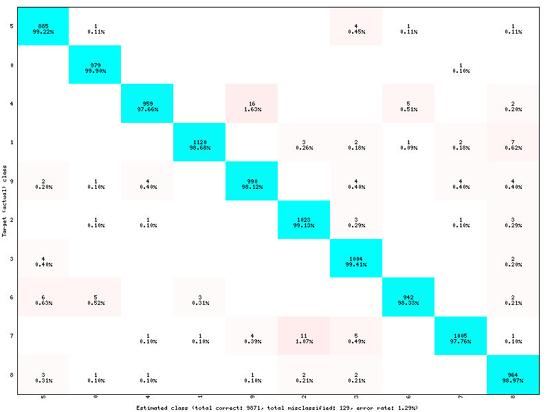
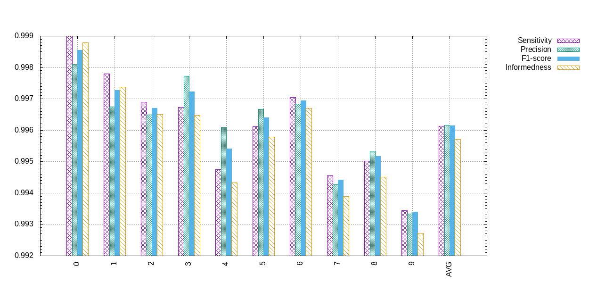

Targets (outputs & losses)
==========================

A ``Target`` is an output point of the neural network. A ``Target`` specifies 
how the error must be computed and back-propagated at the output of a layer, 
and computes a classification score. A target also specifies how the database 
labels must be mapped to the output neurons.

To specify that the back-propagated error must be computed at the output
of a given layer (generally the last layer, or output layer), one must
add a target section named *LayerName*\ ``.Target``:

.. code-block:: ini

    ...
    [LayerName.Target]
    TargetValue=1.0 ; default: 1.0
    DefaultValue=0.0 ; default: -1.0

From labels to targets
----------------------

Usually, there are as many output 
neurons as labels and each label is mapped to a different neuron. This is the 
default behavior in N2D2: each label in the dataset, by order of appearance 
when loading the data and label files (files are always loaded in the 
alphabetical order), is mapped to the next available output neuron. If there is 
more labels than output neurons, an error is thrown at runtime at the first 
occurrence of a new label exceeding the output neurons capacity.

This default behavior can be changed using a label-mapping file, where the label 
mapping is explicitly specified, which is useful to map several labels to the 
same output neuron for example.

To specify a target in the INI file, one must simply add a *LayerName*\ ``.Target`` section,
where *LayerName* is the name of the layer section to which the target must be 
associated, as illustrated below:

.. code-block:: ini

  ; Output layer
  [seg_output]
  Input=...
  Type=Conv
  KernelWidth=1
  KernelHeight=1
  NbOutputs=1
  Stride=1
  ActivationFunction=LogisticWithLoss
  WeightsFiller=XavierFiller
  ConfigSection=common.config

  [seg_output.Target]
  LabelsMapping=mapping.dat

The ``LabelsMapping`` parameter, when present, is the path to the file 
containing the mapping of the dataset labels to the outputs of the layer. 
In the present case, there is a single output neuron (per output pixel) in the 
*seg_output* layer, which is a special case where two labels can be mapped 
since the activation used is a logistic function. One label can be mapped to 
the output value 0 and one label can be mapped to the output value 1. 
With more than one output neuron (per output pixel) however, it only makes 
sense to map a single label per output.

The label mapping file format is a two-columns, space separated, text table, 
with the first column corresponding to the name of the label in the dataset 
and the second column to the index of the associated output neuron.

Two special label names exist:

-	``*`` corresponding to annotations without valid label (label ID is -1 in N2D2), sometimes referred to as "ignore label" in N2D2;
-	``default`` meaning any valid label name that is not explicitly listed in the label mapping file;

The ``background`` name is not a reserved label name, it is simply the name 
that is used as ``DefaultLabel`` in the ``Database`` driver.

Here is an example of label mapping file for the single output layer *seg_output*:

.. code-block:: ini

  # background (no defect)
  background 0

  # padding
  * -1

  # defect
  default 1

Wildcards can be used as well in the name of the label:

-	\* meaning any one or several character(s) starting from this position (non greedy, cannot be used alone as it would refer to the special name for invalid label);
-	\+ meaning any single character at this position.

The actual label mapping of every labels present in the dataset for a given 
output target is generated automatically when running the simulation. It is 
strongly advised to check this generated file to make sure that there is no 
error in the ``LabelsMapping`` file and that the mapping is done as intended. 
The file is generated in *seg_output.Target/labels_mapping.log.dat*.

Pixel-wise segmentation
~~~~~~~~~~~~~~~~~~~~~~~

Pixel-wise segmentation consists of directly learning a label for each output
pixel of the network, typically in a fully convolutional network. Without
upscaling, unpooling or deconvolution, the output size is generally smaller than
the input size, by a factor *S*, corresponding to the product of the strides of
the successive layers.

In practice, because of the scaling factor *S* of the network, each output pixel 
classify an input macro-pixel of size *SxS*. It is perfectly possible to get rid 
of this scaling factor by rescaling the output to the input size before the 
``Softmax`` layer, using bilinear sampling for example. This can be done during 
training, in order to precisely back-propagate the pixel-wise annotations, as 
the bilinear sampling algorithm is easily differentiable. However, for 
inference, the resampling of the output does not add information to the 
segmentation (no new information is created when upscaling an image with 
context-agnostic algorithms). This is why the scaling factor *S* may be kept for 
inference, without resampling, in order to reduce the computing and 
memory cost of processing the outputs.

Other strategies are possible to back-propagate the pixel-wise annotations, 
which need to take into account the scaling factor *S*:

-	Take the majority annotation within the macro-pixel *SxS*: the label attributed to the output pixel is the label which occurs the most often in the *SxS* macro-pixel;
-	Take the majority annotation within the macro-pixel *SxS*, at the exception of a weak annotation. In this case, any label other than the weak label in the macro-pixel takes precedence over the weak one. In N2D2, this is implemented with the ``WeakTarget`` parameter in ``[*.target]`` sections:
  - ``WeakTarget=-1`` means any target other than "ignore" takes precedence. This is useful if the background is ignored. If there is only a few pixels in the macro-pixel that are not background, they take precedence so that the macro-pixel is not considered as background.
  - ``WeakTarget=-2`` means there is no weak label.

Loss functions
--------------

The loss function in N2D2 is always implicitly defined.
For the ``Softmax`` layer or the ``Logistic`` activation, the loss is the *cross 
entropy loss*, when used with the ``WithLoss=1`` parameter. Otherwise, the 
default loss is the *MSE (L2) loss*.

The reason is that the error is defined at the output of a layer with the 
``Cell_Frame[_CUDA]::setOutputTarget()`` or ``Cell_Frame[_CUDA]::setOutputTargets()``, 
which set the value of the input gradient for the cell to *(target - output)*. 
These functions are called in the ``Target`` class.

So, if a ``Target`` is attached to any cell, the corresponding loss 
function would be the MSE loss, as the simple difference above is the derivative.
For the softmax or the logistic, the special parameter ``WithLoss``, 
when enabled, will simply by-pass the function derivative and directly set 
the output gradient of the function to the difference above. This effectively 
results to a cross entropy loss with regards to the input gradient of these 
functions, as per the mathematical simplification of the cross entropy loss 
derivative multiplied by the functions gradient.

.. admonition:: Demonstration

  The cross entropy loss for a single image is:

  .. math::

    L = -\sum_{j=1}^{M}{y_{j}\log(p_{j})}

  .. note::

    - M - number of classes (dog, cat, fish)
    - log - the natural log
    - y - binary indicator (0 or 1) if class label :math:`j` is the correct classification for this image
    - p - predicted probability that the image is of class :math:`j`

  The softmax performs the following operation:

  .. math::

    p_{i} = \frac{\exp{x_{i}}}{\sum_{k}\exp{x_{k}}}

  To perform the back-propagation, we need to compute the derivative of the loss 
  :math:`L` with respect to the inputs :math:`x_{i}`:

  .. math::

    \frac{\partial L}{\partial x_i}=-\sum_ky_k\frac{\partial \log p_k}{\partial x_i}=-\sum_ky_k\frac{1}{p_k}\frac{\partial p_k}{\partial x_i}
    
    =-y_i(1-p_i)-\sum_{k\neq i}y_k\frac{1}{p_k}({-p_kp_i})
    
    =-y_i(1-p_i)+\sum_{k\neq i}y_k({p_i})
    
    =-y_i+y_ip_i+\sum_{k\neq i}y_k({p_i})
    
    =p_i\left(\sum_k{y_k}\right)-y_i
    
    =p_i-y_i

  given that :math:`\sum_k{y_k}=1`, as :math:`y` is a vector with only one non-zero element, which is 1.

Target types
------------

Target
~~~~~~

Base ``Target`` class.

Base parameters:

+---------------------------------+-----------------+-------------------------------------------------------------------------------------------+
| Parameter                       | Default value   | Description                                                                               |
+=================================+=================+===========================================================================================+
| ``Type``                        | ``TargetScore`` | Type of ``Target``                                                                        |
+---------------------------------+-----------------+-------------------------------------------------------------------------------------------+
| ``TargetValue``                 | 1.0             | Target value for the target output neuron(s) (for classification)                         |
+---------------------------------+-----------------+-------------------------------------------------------------------------------------------+
| ``DefaultValue``                | 0.0             | Default value for the non-target output neuron(s) (for classification)                    |
+---------------------------------+-----------------+-------------------------------------------------------------------------------------------+
| ``TopN``                        | 1               | The top-N estimated targets per output neuron to save                                     |
+---------------------------------+-----------------+-------------------------------------------------------------------------------------------+
| ``BinaryThreshold``             | 0.5             | Threshold for single output (binary classification).                                      |
+---------------------------------+-----------------+-------------------------------------------------------------------------------------------+

Labels to targets parameters:

+---------------------------------+-----------------+-------------------------------------------------------------------------------------------+
| Parameter                       | Default value   | Description                                                                               |
+=================================+=================+===========================================================================================+
| ``DataAsTarget``                | 0               | If true (1), the data, and not the labels, is the target (for auto-encoders)              |
+---------------------------------+-----------------+-------------------------------------------------------------------------------------------+
| ``LabelsMapping``               |                 | Path to the file containing the labels to target mapping                                  |
+---------------------------------+-----------------+-------------------------------------------------------------------------------------------+
| ``CreateMissingLabels``         | 0               | If true (1), labels present in the labels mapping file but that are non-existent in the   |
|                                 |                 | database are created (with 0 associated stimuli)                                          |
+---------------------------------+-----------------+-------------------------------------------------------------------------------------------+
| ``WeakTarget``                  | -2              | When attributing a target to an output macropixel, any target other than                  |
|                                 |                 | ``WeakTarget`` in the macropixel takes precedence over ``WeakTarget``,                    |
|                                 |                 | regardless of their respective occurrence.                                                |
|                                 |                 |  - Value can be -1 (meaning any target other than "ignore" takes precedence).             |
|                                 |                 |  - Default value is -2 (meaning that there is no weak target, as a target is >= -1).      |
+---------------------------------+-----------------+-------------------------------------------------------------------------------------------+

Masking parameters:

+---------------------------------+-----------------+-------------------------------------------------------------------------------------------+
| Parameter                       | Default value   | Description                                                                               |
+=================================+=================+===========================================================================================+
| ``MaskLabelTarget``             |                 | Name of the ``Target`` to use for ``MaskedLabel``                                         |
+---------------------------------+-----------------+-------------------------------------------------------------------------------------------+
| ``MaskedLabel``                 | -1              | If >= 0, only estimated targets with ID ``MaskedLabel`` in the ``MaskLabelTarget`` target |
|                                 |                 | are considered in the estimated targets                                                   |
+---------------------------------+-----------------+-------------------------------------------------------------------------------------------+
| ``MaskedLabelValue``            | 0               | If true (1), the considered estimated targets values are weighted by the estimated        |
|                                 |                 | targets values with ID ``MaskedLabel`` in the ``MaskLabelTarget``                         |
+---------------------------------+-----------------+-------------------------------------------------------------------------------------------+

Estimated output images parameters:

+---------------------------------+-----------------+-------------------------------------------------------------------------------------------+
| Parameter                       | Default value   | Description                                                                               |
+=================================+=================+===========================================================================================+
| ``NoDisplayLabel``              | -1              | If >= 0, the corresponding label ID is ignored in the estimated output image              |
+---------------------------------+-----------------+-------------------------------------------------------------------------------------------+
| ``LabelsHueOffset``             | 0               | Hue offset for the first label ID (starting from 0), for the estimated output image       |
+---------------------------------+-----------------+-------------------------------------------------------------------------------------------+
| ``EstimatedLabelsValueDisplay`` | 1               | If true (1), the value in the HSV colorspace is equal to the estimated                    |
|                                 |                 | value. Otherwise, displayed value is 255 regardless of the confidence.                    |
+---------------------------------+-----------------+-------------------------------------------------------------------------------------------+
| ``ValueThreshold``              | 0.0             | Threshold for estimated value to be considered in the output logs.                        |
+---------------------------------+-----------------+-------------------------------------------------------------------------------------------+
| ``ImageLogFormat``              | jpg             | If left empty, use the database image origin format                                       |
+---------------------------------+-----------------+-------------------------------------------------------------------------------------------+

TargetScore
~~~~~~~~~~~

The default target, which automatically compute the confusion matrix, confusion 
metrics and score, for classification or segmentation networks.

Confusion matrix:

   Example of confusion matrix generated by a ``TargetScore``.

Confusion metrics:

   Example of confusion metrics generated by a ``TargetScore``.

Score:

.. figure:: _static/validation_score.png
   :alt: Example of validation score generated by a ``TargetScore``.

   Example of validation score generated by a ``TargetScore``.

TargetROIs
~~~~~~~~~~

The ``TargetROIs`` allow to perform connected-component labeling (CCL) on 
pixel-wise segmentation networks, to retrieve bounding boxes.

This approach is different from classical object detection networks, like SSD or 
Yolo, where bounding boxes are directly inferred from anchors.

+--------------------------+---------------+-------------------------------------------------------------------------------------------+
| Parameter                | Default value | Description                                                                               |
+==========================+===============+===========================================================================================+
| ``MinSize``              | 0             | Minimum number of macro-pixels above threshold than can constitute a bounding box.        |
|                          |               | Bounding boxes with fewer than ``MinSize`` macro-pixels above threshold are discarded     |
+--------------------------+---------------+-------------------------------------------------------------------------------------------+
| ``MinOverlap``           | 0.5           | Minimum overlap (IoU) of a bounding box with an annotation to be considered a match       |
+--------------------------+---------------+-------------------------------------------------------------------------------------------+
| ``FilterMinHeight``      | 0             | Minimum height of the ROI to keep it                                                      |
+--------------------------+---------------+-------------------------------------------------------------------------------------------+
| ``FilterMinWidth``       | 0             | Minimum width of the ROI to keep it                                                       |
+--------------------------+---------------+-------------------------------------------------------------------------------------------+
| ``FilterMinAspectRatio`` | 0.0           | Minimum aspect ratio (width/height) of the ROI to keep it (default is 0.0 = no minimum)   |
+--------------------------+---------------+-------------------------------------------------------------------------------------------+
| ``FilterMaxAspectRatio`` | 0.0           | Maximum aspect ratio (width/height) of the ROI to keep it (default is 0.0 = no minimum)   |
+--------------------------+---------------+-------------------------------------------------------------------------------------------+
| ``MergeMaxHDist``        | 1             | Maximum horizontal distance for merging (in macro-pixels)                                 |
+--------------------------+---------------+-------------------------------------------------------------------------------------------+
| ``MergeMaxVDist``        | 1             | Maximum vertical distance for merging (in macro-pixels)                                   |
+--------------------------+---------------+-------------------------------------------------------------------------------------------+
| ``ScoreTopN``            | 1             | TopN number of class scores to keep for the ROI                                           |
+--------------------------+---------------+-------------------------------------------------------------------------------------------+

