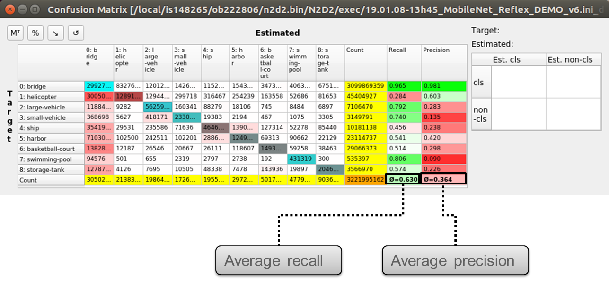
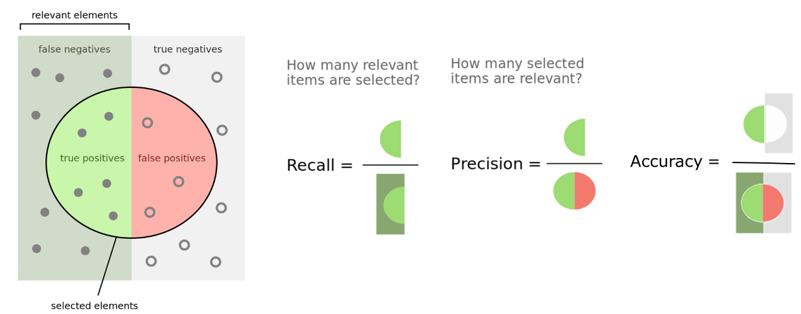
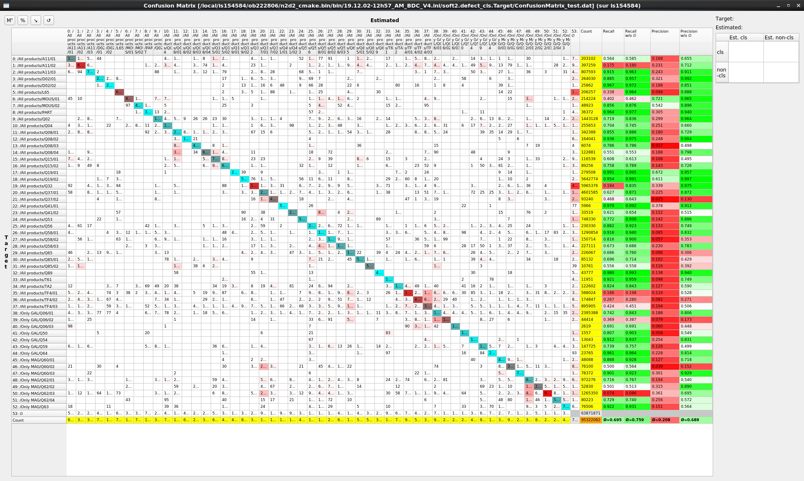
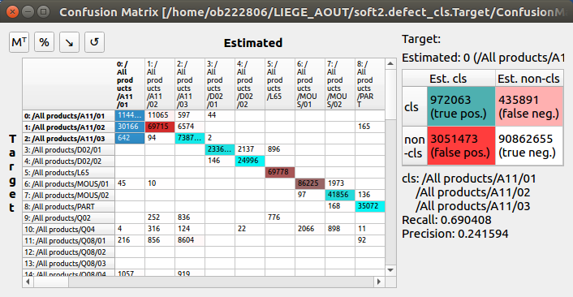
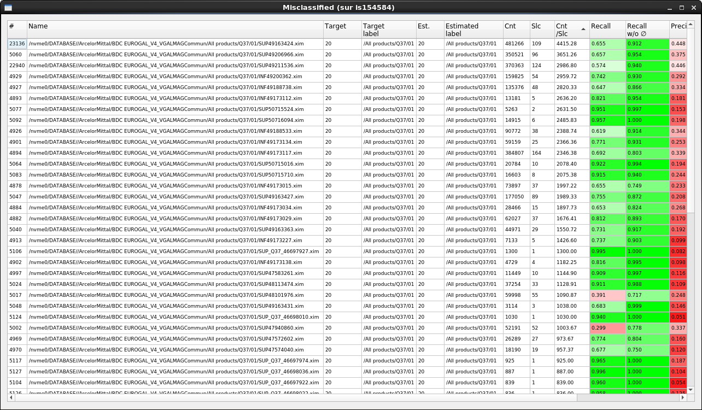
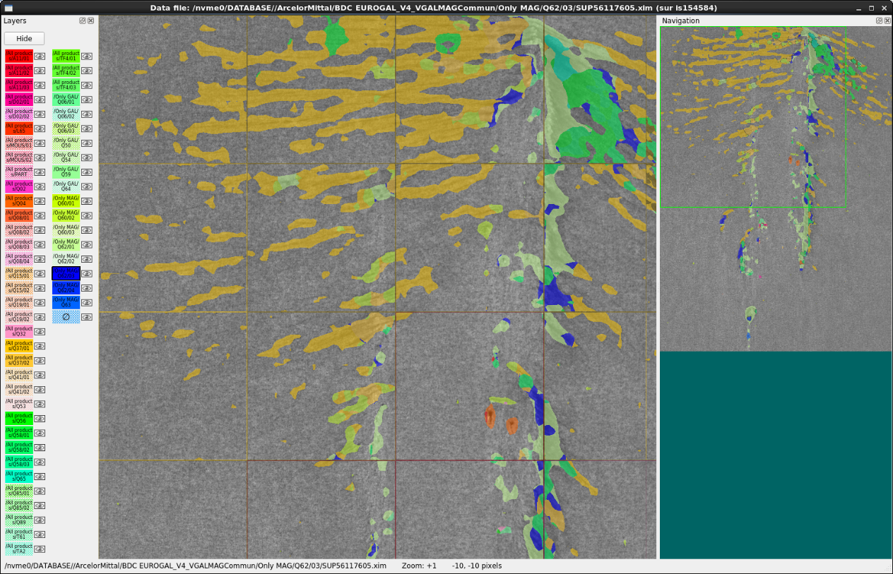

Performance evaluation tools
============================

Key performance metrics
-----------------------

The key performance metrics are the recall and precision for each class and 
the average recall and precision over all the classes. These performance 
metrics are automatically computed by the interactive confusion matrix tool
embedded in N2D2, as shown below.

         over all the classes in the interactive confusion matrix tool.

   Recall and precision for each class and average recall and precision
   over all the classes in the interactive confusion matrix tool.

The accuracy, in classification context, is not a valid metric for unbalanced 
classes, which is typically the case for object detection / segmentation 
applications, where the background represent a much larger portion of the 
objects or defects. Indeed, in this case, the number of true negative is 
easily much larger than the number of true positives, false positives and 
false negatives combined, leading to accuracies close to 100% even for no 
informative (non working) classification, as illustrated in the figure below.

   Recall, Precision and Accuracy definitions.

During the learning, N2D2 also provides a range of metrics with the 
confusion matrix, which are saved in the 
``*.Target/ConfusionMatrix_*_score.png`` file, as shown in the extract in 
the following figure. The metric used for the validation can be specified with 
the ``-valid-metric`` N2D2 command line argument. The default metric used 
is the recall (a.k.a. sensitivity).

.. figure:: ../_static/metrics.png
   :alt: Metrics associated to the confusion matrix in N2D2.

   Metrics associated to the confusion matrix in N2D2.

The metric figure used for the validation and the computing of the overall 
score in N2D2 is a raw figure, aggregating all the classes and images. It 
can therefore differ from the average metric reported in the confusion matrix, 
which is the average of the metric of each class.

Interactive Confusion Matrix Tool
---------------------------------

**N2D2-IP only: available upon request.**

Overview
~~~~~~~~

The interactive confusion matrix (main window show in next figure) tool allows 
you to explore, sort, combine or extract scores from large confusion matrix. 
Its main features are:

-	Sorting;
-	Transpose switch;
-	Recall and precision;
-	Aggregated recall and precision on selected classes;
-	Percentages / total count switch;
-	Reordering / ordering reset;
-	∅ for ignored area.

The tool can be run after a learning or a test in N2D2, by launching the 
``*.Target/ConfusionMatrix_*.py`` Python script (requires Python 3.7).

   Interactive confusion matrix tool main window.

Single class performances evaluation
~~~~~~~~~~~~~~~~~~~~~~~~~~~~~~~~~~~~

Single class recall and precision score metrics are shown for each row of the 
confusion matrix. There are two sets of metrics:

-	Recall w/o Ø and precision w/o Ø: metrics considering only the defect type confusion over the pixels annotated as defect, as show in the table below;

  .. figure:: ../_static/recall_precision_table_wo.png
  

-	Recall and precision: metrics including the defect/no defect confusion as well as the type confusion, as shown in the table below.

  .. figure:: ../_static/recall_precision_table.png

Classes aggregation
~~~~~~~~~~~~~~~~~~~

When selecting multiple row in the confusion table, the overall recall and 
precision are automatically computed for the selection by aggregating the 
selected values. They are displayed in the right table, as shown below.

   Classes aggregation recall and precision.

Selected items table view
~~~~~~~~~~~~~~~~~~~~~~~~~

When double-clicking on a single cell in the confusion table, or pressing 
the Enter key with a selection, the list of all the images with the 
confusions for the selected cells is displayed. The recall and precision are 
computed for each (image + target class) pair, as shown below.

   List of confusion for selected cells in the confusion matrix.

Items viewer
~~~~~~~~~~~~

When double-clicking on a row in the selected items table view, the ScoreTune 
viewer is opened for the corresponding image, showing the estimated classes 
in the image, as shown below. The F1 key allows to switch between the 
estimated classes and the annotations in the ScoreTune viewer.

   Items viewer (using ScoreTune).

Automatic Performances Report Generation
It is possible to copy selections from the confusion matrix table or the selected items table using the CTRL + c keyboard shortcut. Selections can be pasted to Microsoft Word or LibreOffice Writer keeping the tabular formatting from the interactive viewer. When copying rows from the selected items table, the corresponding images with the target and estimated annotation are copied as well for each row.

In addition to the copy and paste feature, full report can be generated automatically from the confusion matrix, using the F1 key in the main window. Parameters for the report generation can be modified directly in the Python script and are described below:

Automatic Performances Report Generation
----------------------------------------

**N2D2-IP only: available upon request.**

It is possible to copy selections from the confusion matrix table or the 
selected items table using the CTRL + c keyboard shortcut. Selections can be 
pasted to Microsoft Word or LibreOffice Writer keeping the tabular formatting 
from the interactive viewer. When copying rows from the selected items table, 
the corresponding images with the target and estimated annotation are copied 
as well for each row.

In addition to the copy and paste feature, full report can be generated 
automatically from the confusion matrix, using the F1 key in the main window. 
Parameters for the report generation can be modified directly in the Python 
script and are described below:

+----------------------+---------------+------------------------------------------------------------------------------------------------------+
| Parameter            | Default value | Description                                                                                          |
+======================+===============+======================================================================================================+
| nbMainHits           | 3             | Maximum number of items to include for the main hits                                                 |
+----------------------+---------------+------------------------------------------------------------------------------------------------------+
| thresMainHits        | 1000.0        | Threshold in count/slice for matching target and estimated items to consider a main hit              |
+----------------------+---------------+------------------------------------------------------------------------------------------------------+
| nbMainConfusions     | 10            | Maximum number of items to include for the main confusions                                           |
+----------------------+---------------+------------------------------------------------------------------------------------------------------+
| thresMainConfusions  | 100.0         | Threshold in count/slice for mismatching target and estimated items to consider a main confusion     |
+----------------------+---------------+------------------------------------------------------------------------------------------------------+
| nbMainMisses         | 10            | Maximum number of items to include for the main misses                                               |
+----------------------+---------------+------------------------------------------------------------------------------------------------------+
| thresMainMisses      | 1000.0        | Threshold in count/slice for mismatching target and Ø items to consider a main miss                  |
+----------------------+---------------+------------------------------------------------------------------------------------------------------+

