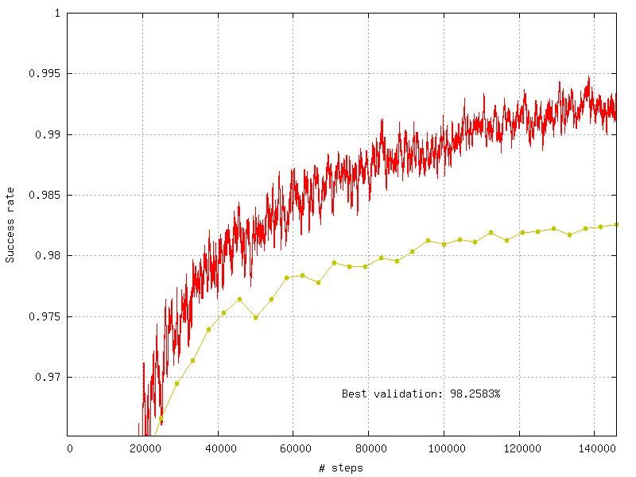
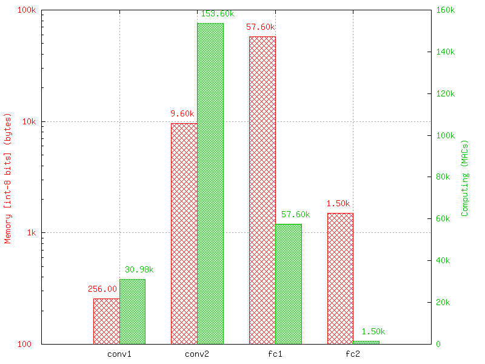
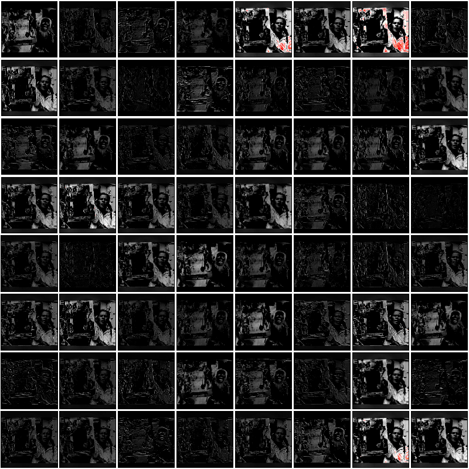

Performing simulations
======================

Minimum system requirements
---------------------------

- Supported processors:

  - ARM Cortex A15 (tested on Tegra K1)
  - ARM Cortex A53/A57 (tested on Tegra X1)
  - Pentium-compatible PC (Pentium III, Athlon or more-recent system 
    recommended)

- Supported operating systems:

  - Windows :math:`\geq` 7 or Windows Server
    :math:`\geq` 2012, 64 bits with Visual Studio :math:`\geq` 2015.2 (2015
    Update 2)
  - GNU/Linux with GCC :math:`\geq` 4.4 (tested on RHEL
    :math:`\geq` 6, Debian :math:`\geq` 6, Ubuntu :math:`\geq` 14.04)

- At least 256 MB of RAM (1 GB with GPU/CUDA) for MNIST dataset processing

- At least 150 MB available hard disk space + 350 MB for MNIST dataset
  processing

For CUDA acceleration:

- CUDA :math:`\geq` 6.5 and CuDNN :math:`\geq` 1.0

- NVIDIA GPU with CUDA compute capability :math:`\geq` 3 (starting from
  *Kepler* micro-architecture)

- At least 512 MB GPU RAM for MNIST dataset processing

Obtaining N2D2
--------------

Prerequisites
~~~~~~~~~~~~~

Red Hat Enterprise Linux (RHEL) 6
^^^^^^^^^^^^^^^^^^^^^^^^^^^^^^^^^

Make sure you have the following packages installed:

- ``cmake``

- ``gnuplot``

- ``opencv``

- ``opencv-devel`` (may require the ``rhel-x86_64-workstation-optional-6``
  repository channel)

Plus, to be able to use GPU acceleration:

- Install the CUDA repository package:

::

    rpm -Uhv http://developer.download.nvidia.com/compute/cuda/repos/rhel6/x86_64/cuda-repo-rhel6-7.5-18.x86_64.rpm
    yum clean expire-cache
    yum install cuda

- Install cuDNN from the NVIDIA website: register to `NVIDIA
  Developer <https://developer.nvidia.com/cudnn>`__ and download the
  latest version of cuDNN. Simply copy the header and library files from
  the cuDNN archive to the corresponding directories in the CUDA
  installation path (by default: /usr/local/cuda/include and
  /usr/local/cuda/lib64, respectively).

- Make sure the CUDA library path (e.g. /usr/local/cuda/lib64) is added to
  the LD\_LIBRARY\_PATH environment variable.

Ubuntu
^^^^^^

Make sure you have the following packages installed, if they are
available on your Ubuntu version:

- ``cmake``

- ``gnuplot``

- ``libopencv-dev``

- ``libcv-dev``

- ``libhighgui-dev``

Plus, to be able to use GPU acceleration:

- Install the CUDA repository package matching your distribution. For
  example, for Ubuntu 14.04 64 bits:

::

    wget http://developer.download.nvidia.com/compute/cuda/repos/ubuntu!\color{gray}{1404}!/!\color{gray}{x86\_64}!/cuda-repo-ubuntu!\color{gray}{1404}!_7.5-18_!\color{gray}{amd64}!.deb
    dpkg -i cuda-repo-ubuntu!\color{gray}{1404}!_7.5-18_!\color{gray}{amd64}!.deb

- Install the cuDNN repository package matching your distribution. For
  example, for Ubuntu 14.04 64 bits:

::

    wget http://developer.download.nvidia.com/compute/machine-learning/repos/ubuntu!\color{gray}{1404}!/!\color{gray}{x86\_64}!/nvidia-machine-learning-repo-ubuntu!\color{gray}{1404}!_4.0-2_!\color{gray}{amd64}!.deb
    dpkg -i nvidia-machine-learning-repo-ubuntu!\color{gray}{1404}!_4.0-2_!\color{gray}{amd64}!.deb

  Note that the cuDNN repository package is provided by NVIDIA for Ubuntu
  starting from version 14.04.

- Update the package lists: ``apt-get update``

- Install the CUDA and cuDNN required packages:

::

    apt-get install cuda-core-7-5 cuda-cudart-dev-7-5 cuda-cublas-dev-7-5 cuda-curand-dev-7-5 libcudnn5-dev

- Make sure there is a symlink to ``/usr/local/cuda``:

::

    ln -s /usr/local/cuda-7.5 /usr/local/cuda

- Make sure the CUDA library path (e.g. /usr/local/cuda/lib64) is added to
  the LD\_LIBRARY\_PATH environment variable.

Windows
^^^^^^^

On Windows 64 bits, Visual Studio :math:`\geq` 2015.2 (2015 Update 2) is
required.

Make sure you have the following software installed:

- CMake (http://www.cmake.org/): download and run the Windows installer.

- ``dirent.h`` C++ header (https://github.com/tronkko/dirent): to be put
  in the Visual Studio include path.

- Gnuplot (http://www.gnuplot.info/): the bin sub-directory in the install
  path needs to be added to the Windows ``PATH`` environment variable.

- OpenCV (http://opencv.org/): download the latest 2.x version for Windows
  and extract it to, for example, ``C:\OpenCV\``. Make sure to define the
  environment variable ``OpenCV_DIR`` to point to
  ``C:\OpenCV\opencv\build``. Make sure to add the bin sub-directory
  (``C:\OpenCV\opencv\build\x64\vc12\bin``) to the Windows ``PATH``
  environment variable.

Plus, to be able to use GPU acceleration:

- Download and install CUDA toolkit 8.0 located at
  https://developer.nvidia.com/compute/cuda/8.0/prod/local_installers/cuda_8.0.44_windows-exe:

::

    rename cuda_8.0.44_windows-exe cuda_8.0.44_windows.exe
    cuda_8.0.44_windows.exe -s compiler_8.0 cublas_8.0 cublas_dev_8.0 cudart_8.0 curand_8.0 curand_dev_8.0

- Update the ``PATH`` environment variable:

::

    set PATH=%ProgramFiles%\NVIDIA GPU Computing Toolkit\CUDA\v8.0\bin;%ProgramFiles%\NVIDIA GPU Computing Toolkit\CUDA\v8.0\libnvvp;%PATH%

- Download and install cuDNN 8.0 located at
  http://developer.download.nvidia.com/compute/redist/cudnn/v5.1/cudnn-8.0-windows7-x64-v5.1.zip
  (the following command assumes that you have 7-Zip installed):

::

    7z x cudnn-8.0-windows7-x64-v5.1.zip
    copy cuda\include\*.* ^
      "%ProgramFiles%\NVIDIA GPU Computing Toolkit\CUDA\v8.0\include\"
    copy cuda\lib\x64\*.* ^
      "%ProgramFiles%\NVIDIA GPU Computing Toolkit\CUDA\v8.0\lib\x64\"
    copy cuda\bin\*.* ^
      "%ProgramFiles%\NVIDIA GPU Computing Toolkit\CUDA\v8.0\bin\"

Getting the sources
~~~~~~~~~~~~~~~~~~~

Use the following command:

::

    git clone git@github.com:CEA-LIST/N2D2.git

Compilation
~~~~~~~~~~~

To compile the program:

::

    mkdir build
    cd build
    cmake .. && make

On Windows, you may have to specify the generator, for example:

::

    cmake .. -G"Visual Studio 14"

Then open the newly created N2D2 project in Visual Studio 2015. Select
“Release” for the build target. Right click on ``ALL_BUILD`` item and
select “Build”.

Downloading training datasets
-----------------------------

A python script located in the repository root directory allows you to
select and automatically download some well-known datasets, like MNIST
and GTSRB (the script requires Python 2.x with bindings for GTK 2
package):

::

    ./tools/install_stimuli_gui.py

By default, the datasets are downloaded in the path specified in the
``N2D2_DATA`` environment variable, which is the root path used by the
N2D2 tool to locate the databases. If the ``N2D2_DATA`` variable is not
set, the default value used is /local/$USER/n2d2\_data/ (or
/local/n2d2\_data/ if the ``USER`` environment variable is not set) on
Linux and C:\\n2d2\_data\\ on Windows.

Please make sure you have write access to the ``N2D2_DATA`` path, or if
not set, in the default /local/$USER/n2d2\_data/ path.

Run the learning
----------------

The following command will run the learning for 600,000 image
presentations/steps and log the performances of the network every 10,000
steps:

::

    ./n2d2 "mnist24_16c4s2_24c5s2_150_10.ini" -learn 600000 -log 10000

Note: you may want to check the gradient computation using the
``-check`` option. Note that it can be extremely long and can
occasionally fail if the required precision is too high.

Test a learned network
----------------------

After the learning is completed, this command evaluate the network
performances on the test data set:

::

    ./n2d2 "mnist24_16c4s2_24c5s2_150_10.ini" -test

Interpreting the results
~~~~~~~~~~~~~~~~~~~~~~~~

Recognition rate
^^^^^^^^^^^^^^^^

The recognition rate and the validation score are reported during the
learning in the *TargetScore\_/Success\_validation.png* file, as shown
in figure [fig:validationScore].

   Recognition rate and validation score during learning.

Confusion matrix
^^^^^^^^^^^^^^^^

The software automatically outputs the confusion matrix during learning,
validation and test, with an example shown in figure
[fig:ConfusionMatrix]. Each row of the matrix contains the number of
occurrences estimated by the network for each label, for all the data
corresponding to a single actual, target label. Or equivalently, each
column of the matrix contains the number of actual, target label
occurrences, corresponding to the same estimated label. Idealy, the
matrix should be diagonal, with no occurrence of an estimated label for
a different actual label (network mistake).

.. figure:: ../_static/confusion_matrix.png
   :alt: Example of confusion matrix obtained after the learning.

   Example of confusion matrix obtained after the learning.

The confusion matrix reports can be found in the simulation directory:

- *TargetScore\_/ConfusionMatrix\_learning.png*;

- *TargetScore\_/ConfusionMatrix\_validation.png*;

- *TargetScore\_/ConfusionMatrix\_test.png*.

Memory and computation requirements
^^^^^^^^^^^^^^^^^^^^^^^^^^^^^^^^^^^

The software also report the memory and computation requirements of the
network, as shown in figure [fig:stats]. The corresponding report can be
found in the *stats* sub-directory of the simulation.

   Example of memory and computation requirements of the network.

Kernels and weights distribution
^^^^^^^^^^^^^^^^^^^^^^^^^^^^^^^^

The synaptic weights obtained during and after the learning can be
analyzed, in terms of distribution (*weights* sub-directory of the
simulation) or in terms of kernels (*kernels* sub-directory of the
simulation), as shown in [fig:weights].

Output maps activity
^^^^^^^^^^^^^^^^^^^^

The initial output maps activity for each layer can be visualized in the
*outputs\_init* sub-directory of the simulation, as shown in figure
[fig:outputs].

         of the network.

   Output maps activity example of the first convolutional layer of the
   network.

