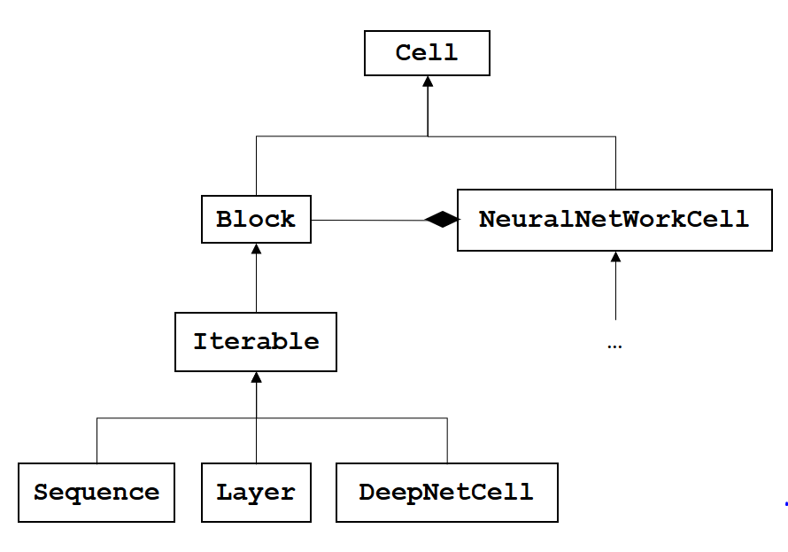

Cells
=====
 
Introduction
------------

Cell objects are the atomics elements that compose a deep neural network.

Each cell embed an :py:class:`N2D2.Cell` which do the computation.
:py:class:`n2d2.cells.NeuralNetworkCell` are not dependant of a DeepNet this allow a dynamic management of the computation. 

Cells are organize with the following logic : 

 - :py:class:`n2d2.cells.Block` : Store a collection of :py:class:`n2d2.cells.NeuralNetworkCell`, the storage order does **not** determine the graph computation;
 - :py:class:`n2d2.cells.DeepNetCell` : This Cell allow you to use an :py:class:`N2D2.DeepNet`, it can be used for `ONNX` and `INI` import;
 - :py:class:`n2d2.cells.Iterable` : Similar to :py:class:`n2d2.cells.Block` but the order of storage determine the computation graph;
 - :py:class:`n2d2.cells.Sequence` : A vertical structure to create neural network;
 - :py:class:`n2d2.cells.Layer` : An horizontal structure to create neural network.

.. autoclass:: n2d2.cells.NeuralNetworkCell
        :members:
        :inherited-members:

.. autoclass:: n2d2.cells.DeepNetCell
        :members:
        :inherited-members:

.. autoclass:: n2d2.cells.Sequence
        :members:
        :inherited-members:

.. autoclass:: n2d2.cells.Layer
        :members:
        :inherited-members:

Cells
-----

Conv
~~~~

.. autoclass:: n2d2.cells.Conv
        :members:
        :inherited-members:

Deconv
~~~~~~

.. autoclass:: n2d2.cells.Deconv
        :members:
        :inherited-members:

Fc
~~

.. autoclass:: n2d2.cells.Fc
        :members:
        :inherited-members:

Dropout
~~~~~~~

.. autoclass:: n2d2.cells.Dropout
        :members:
        :inherited-members:

ElemWise
~~~~~~~~

.. autoclass:: n2d2.cells.ElemWise
        :members:
        :inherited-members:

Padding
~~~~~~~

.. autoclass:: n2d2.cells.Padding
        :members:
        :inherited-members:
        
Softmax
~~~~~~~

.. autoclass:: n2d2.cells.Softmax
        :members:
        :inherited-members:

BatchNorm2d
~~~~~~~~~~~

.. autoclass:: n2d2.cells.BatchNorm2d
        :members:
        :inherited-members:

Pool
~~~~

.. autoclass:: n2d2.cells.Pool
        :members:
        :inherited-members:

Configuration section
---------------------

If you want to add the same parameters to multiple cells, you can use a :py:class:`n2d2.ConfigSection`.

.. autoclass:: n2d2.ConfigSection
        :members:
        :inherited-members:

:py:class:`n2d2.ConfigSection` are used like dictionaries and passes to the constructor of classes like ``kwargs``. 

Example
~~~~~~~

.. code-block:: python

        conv_config = n2d2.ConfigSection(no_bias=True)
        n2d2.cells.Conv(3, 32, [4, 4], **conv_config)

This creates a :py:class:`n2d2.cells.Conv` with the parameter `no_bias=True`.
This functionality allow you to write more concise code, when multiple cells share the same parameters.

.. warning::
        If you want to pass an object as a parameter for multiple n2d2 object. You need to create a wrapping function to create your object.
        Example :

        .. code-block:: python

                def conv_def():
                        return n2d2.ConfigSection(weights_solver=n2d2.solver.SGD())
                n2d2.cells.Conv(3, 32, [4, 4], **conv_def())

Mapping
-------

You can change the mapping of the input for some cells (see if they have ``mapping`` parameter available).

You can create a mapping manually with a :py:class:`n2d2.Tensor` object :

.. testcode::

        mapping=n2d2.Tensor([15, 24], datatype="bool")
        mapping.set_values([
        [1, 0, 0, 0, 0, 0, 0, 0, 0, 0, 0, 0, 0, 0, 0, 1, 0, 0, 0, 0, 0, 0, 1, 1],
        [1, 1, 0, 0, 0, 0, 0, 0, 0, 0, 0, 0, 0, 0, 0, 1, 0, 0, 0, 0, 0, 0, 1, 1],
        [0, 1, 1, 0, 0, 0, 0, 0, 0, 0, 0, 0, 0, 0, 0, 1, 1, 0, 0, 0, 0, 0, 1, 1],
        [0, 0, 1, 1, 0, 0, 0, 0, 0, 0, 0, 0, 0, 0, 0, 1, 1, 0, 0, 0, 0, 0, 1, 1],
        [0, 0, 0, 1, 1, 0, 0, 0, 0, 0, 0, 0, 0, 0, 0, 0, 1, 1, 0, 0, 0, 0, 1, 1],
        [0, 0, 0, 0, 1, 1, 0, 0, 0, 0, 0, 0, 0, 0, 0, 0, 1, 1, 0, 0, 0, 0, 1, 1],
        [0, 0, 0, 0, 0, 1, 1, 0, 0, 0, 0, 0, 0, 0, 0, 0, 0, 1, 1, 0, 0, 0, 1, 1],
        [0, 0, 0, 0, 0, 0, 1, 1, 0, 0, 0, 0, 0, 0, 0, 0, 0, 1, 1, 0, 0, 0, 1, 1],
        [0, 0, 0, 0, 0, 0, 0, 1, 1, 0, 0, 0, 0, 0, 0, 0, 0, 0, 1, 1, 0, 0, 1, 1],
        [0, 0, 0, 0, 0, 0, 0, 0, 1, 1, 0, 0, 0, 0, 0, 0, 0, 0, 1, 1, 0, 0, 1, 1],
        [0, 0, 0, 0, 0, 0, 0, 0, 0, 1, 1, 0, 0, 0, 0, 0, 0, 0, 0, 1, 1, 0, 1, 1],
        [0, 0, 0, 0, 0, 0, 0, 0, 0, 0, 1, 1, 0, 0, 0, 0, 0, 0, 0, 1, 1, 0, 1, 1],
        [0, 0, 0, 0, 0, 0, 0, 0, 0, 0, 0, 1, 1, 0, 0, 0, 0, 0, 0, 0, 1, 1, 1, 1],
        [0, 0, 0, 0, 0, 0, 0, 0, 0, 0, 0, 0, 1, 1, 0, 0, 0, 0, 0, 0, 1, 1, 1, 1],
        [0, 0, 0, 0, 0, 0, 0, 0, 0, 0, 0, 0, 0, 1, 1, 0, 0, 0, 0, 0, 0, 1, 1, 1],
        [0, 0, 0, 0, 0, 0, 0, 0, 0, 0, 0, 0, 0, 0, 1, 0, 0, 0, 0, 0, 0, 1, 1, 1]])

Or use the Mapping object :

.. testcode::

        mapping=n2d2.mapping.Mapping(nb_channels_per_group=2).create_mapping(15, 24)

Which create the following mapping :

.. testoutput::

        1 1 0 0 0 0 0 0 0 0 0 0 0 0 0 0 0 0 0 0 0 0 0 0
        0 0 1 1 0 0 0 0 0 0 0 0 0 0 0 0 0 0 0 0 0 0 0 0
        0 0 0 0 1 1 0 0 0 0 0 0 0 0 0 0 0 0 0 0 0 0 0 0
        0 0 0 0 0 0 1 1 0 0 0 0 0 0 0 0 0 0 0 0 0 0 0 0
        0 0 0 0 0 0 1 1 0 0 0 0 0 0 0 0 0 0 0 0 0 0 0 0
        0 0 0 0 0 0 0 0 1 1 0 0 0 0 0 0 0 0 0 0 0 0 0 0
        0 0 0 0 0 0 0 0 0 0 1 1 0 0 0 0 0 0 0 0 0 0 0 0
        0 0 0 0 0 0 0 0 0 0 0 0 1 1 0 0 0 0 0 0 0 0 0 0
        0 0 0 0 0 0 0 0 0 0 0 0 0 0 1 1 0 0 0 0 0 0 0 0
        0 0 0 0 0 0 0 0 0 0 0 0 0 0 1 1 0 0 0 0 0 0 0 0
        0 0 0 0 0 0 0 0 0 0 0 0 0 0 0 0 1 1 0 0 0 0 0 0
        0 0 0 0 0 0 0 0 0 0 0 0 0 0 0 0 0 0 1 1 0 0 0 0
        0 0 0 0 0 0 0 0 0 0 0 0 0 0 0 0 0 0 0 0 1 1 0 0
        0 0 0 0 0 0 0 0 0 0 0 0 0 0 0 0 0 0 0 0 0 0 1 1
        0 0 0 0 0 0 0 0 0 0 0 0 0 0 0 0 0 0 0 0 0 0 1 1

.. autoclass:: n2d2.mapping.Mapping
        :members:
        :inherited-members:

Solver
------

You can associate to some cell a specific weight solver.

.. autoclass:: n2d2.solver.Solver
        :members:
        :inherited-members:

SGD
~~~

.. autoclass:: n2d2.solver.SGD
        :members:
        :inherited-members:

Adam
~~~~

.. autoclass:: n2d2.solver.Adam
        :members:
        :inherited-members:

Filler
------

You can associate to some cell a specific weights and/or biases filler.

.. autoclass:: n2d2.filler.Filler
        :members:
        :inherited-members:

He
~~

.. autoclass:: n2d2.filler.He
        :members:
        :inherited-members:

Normal
~~~~~~

.. autoclass:: n2d2.filler.Normal
        :members:
        :inherited-members:

Constant
~~~~~~~~

.. autoclass:: n2d2.filler.Constant
        :members:
        :inherited-members:

Activations
-----------
 
 You can associate to some cell an activation function.

.. autoclass:: n2d2.activation.ActivationFunction
        :members:
        :inherited-members:

Linear
~~~~~~

.. autoclass:: n2d2.activation.Linear
        :members:
        :inherited-members:

Rectifier
~~~~~~~~~

.. autoclass:: n2d2.activation.Rectifier
        :members:
        :inherited-members:
        
Tanh
~~~~

.. autoclass:: n2d2.activation.Tanh
        :members:
        :inherited-members:

Loss function
-------------

.. autoclass:: n2d2.application.LossFunction
        :members:
        :inherited-members:

CrossEntropyClassifier
~~~~~~~~~~~~~~~~~~~~~~

.. autoclass:: n2d2.application.CrossEntropyClassifier
        :members:
        :inherited-members:

MeanSquareErrorRegression
~~~~~~~~~~~~~~~~~~~~~~~~~

.. autoclass:: n2d2.application.MeanSquareErrorRegression
        :members:
        :inherited-members: