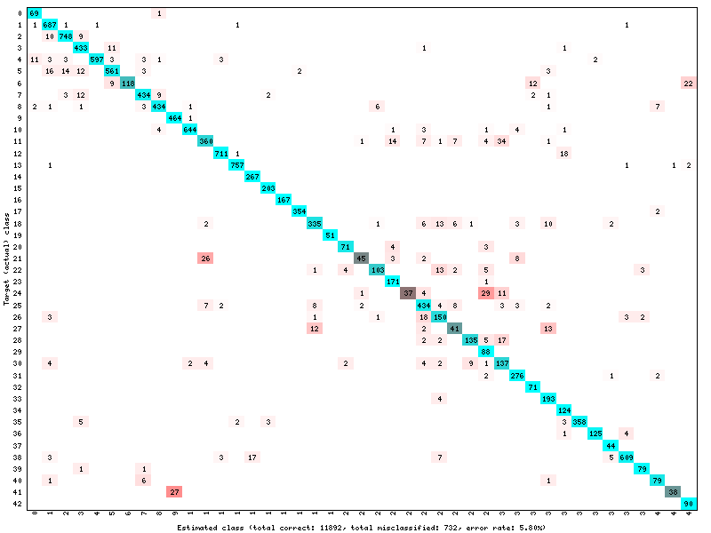
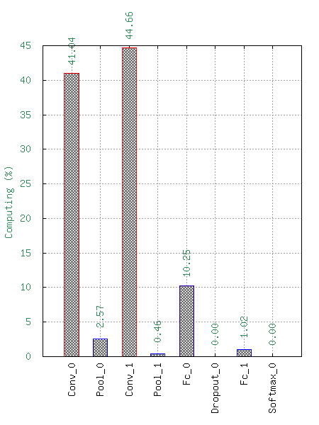
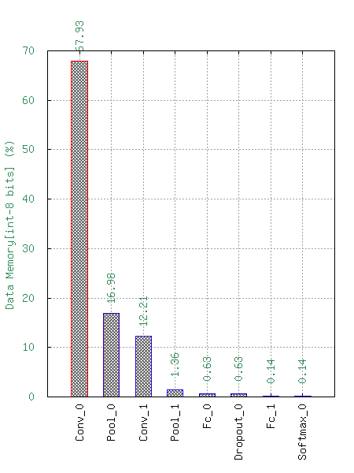
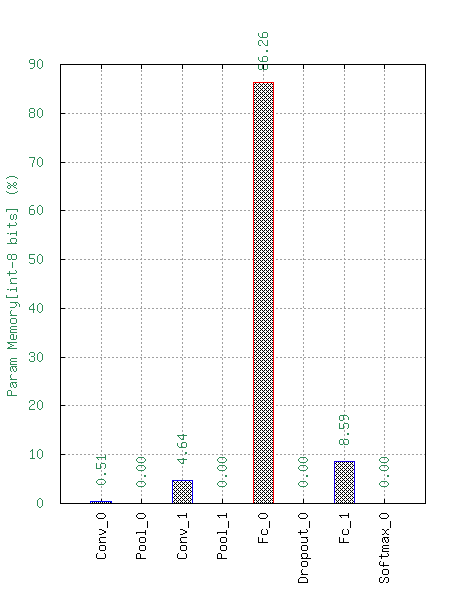

Example
=======

In this example we will create a simple neural network model, train it and use analysis tools to see the performances.
You can see the full script in the python folder ``GTSRB_example.py``

.. testsetup:: 

    import N2D2
    import n2d2
    from n2d2.cells.nn import Conv, Pool, Fc, Dropout
    from n2d2.activation import Linear, Rectifier
    from n2d2.filler import He, Xavier
    from n2d2.solver import SGD
    from n2d2 import ConfigSection

    nb_epoch = 1
    batch_size = 24
    data_path = "/nvme0/DATABASE/GTSRB"

Use-case presentation
---------------------

We propose to recognize traffic signs, for an advanced driver-assistance systems (ADAS).
The traffic signs are already segmented and extracted from images, taken from a front-view camera embedded in a car.

.. figure:: /_static/gtsrb.png
   :alt: Example of data featured in GTSRB.

To build our classifier, we will use the ``German Traffic Sign Benchmark (GTSRB)`` (https://benchmark.ini.rub.de/) a multi-class, single-image classification challenge held at the International Joint Conference on Neural Networks (IJCNN) 2011. 

This benchmark has the following properties:

- Single-image, multi-class classification problem;
- More than 40 classes;
- More than 50,000 images in total;
- Large, lifelike database.

Creation of the network
-----------------------

Defining the inputs of the Neural Network
~~~~~~~~~~~~~~~~~~~~~~~~~~~~~~~~~~~~~~~~~

First of all, if you have CUDA available, you can unable it with the following line :

.. testcode::

    n2d2.global_variables.default_model = "Frame_CUDA"

The default_model is ``Frame``. 

Once this is done, you can load the database by using the appropriate driver :py:class:`n2d2.database.GTSRB`. 
We set 20% of the data to be used for validation.
To feed data to the network, you need to create a :py:class:`n2d2.provider.DataProvider` this class will define the input fo neural network.

.. testcode::

    db = n2d2.database.GTSRB(0.2)
    db.load(data_path)
    provider = n2d2.provider.DataProvider(db, [29, 29, 1], batch_size=batch_size)

You can apply pre-processing to the data with :py:class:`n2d2.transform.Transformation` objects.
We have set the size of the input images to be 29x29 pixels with 1 channel when declaring the :py:class:`n2d2.provider.DataProvider`.
But the dataset is composed of image of size comprised from 15x15 to 250x250 pixels with 3 channel (R,G,B).
We will add a :py:class:`n2d2.transform.Rescale` to rescale the size of the image to be 29x29 pixels.
The other transformation :py:class:`n2d2.transform.ChannelExtraction` will set the number of channel to 1 by creating images in nuance of grey.

.. testcode::

    provider.add_transformation(n2d2.transform.ChannelExtraction('Gray'))
    provider.add_transformation(n2d2.transform.Rescale(width=29, height=29))

Defining the neural network
~~~~~~~~~~~~~~~~~~~~~~~~~~~

Now that we have defined the inputs, we can declare the neural network.
We will create a network inspired from the well-known LeNet network.

Before we define the network, we will create default configuration for the different type of layer with :py:class:`n2d2.ConfigSection`.
This will allow us to create cells more concisely. :py:class:`n2d2.ConfigSection` are used like python dictionary.

.. testcode::

    solver_config = ConfigSection(
        learning_rate=0.01, 
        momentum=0.9, 
        decay=0.0005, 
        learning_rate_decay=0.993)

    fc_config   = ConfigSection(weights_filler=Xavier(), 
                                no_bias=True, 
                                weights_solver=SGD(**solver_config))
    conv_config = ConfigSection(activation=Rectifier(), 
                                weights_filler=Xavier(), 
                                weights_solver=SGD(**solver_config), 
                                no_bias=True)

For the ReLU activation function to be effective, the weights must be initialized carefully, in order to avoid dead units that would be stuck in the ]−∞,0] output range before the ReLU function. In N2D2, one can use a custom WeightsFiller for the weights initialization. 
This is why we will use the :py:class:`n2d2.filler.Xavier` algorithm to fill the weights of the different cells.

To define the network, we will use :py:class:`n2d2.cells.Sequence` that take a list of :py:class:`n2d2.nn.NeuralNetworkCell`.

.. testcode::

    model = n2d2.cells.Sequence([
        Conv(1, 32, [4, 4], **conv_config),
        Pool([2, 2], stride_dims=[2, 2], pooling='Max'),
        Conv(32, 48, [5, 5], mapping=conv2_mapping, **conv_config),
        Pool([3, 3], stride_dims=[3, 3], pooling='Max'),
        Fc(48*3*3, 200, activation=Rectifier(), **fc_config),
        Dropout(),
        Fc(200, 43, activation=Linear(), **fc_config)
    ])

Note that in LeNet, the ``conv2`` layer is not fully connected to the pooling layer. 
In n2d2, a custom mapping can be defined for each input connection. 
We can do this with the mapping argument by passing a :py:class:`n2d2.Tensor`.
The connection of n-th output map to the inputs is defined by the n-th column of the matrix below, where the rows correspond to the inputs.

.. testcode::

    conv2_mapping=n2d2.Tensor([32, 48], datatype="bool")
    conv2_mapping.set_values([
    [1, 0, 0, 0, 0, 0, 0, 0, 0, 0, 0, 0, 0, 0, 0, 0, 0, 0, 0, 0, 0, 0, 0, 0, 0, 0, 0, 0, 0, 0, 0, 1, 0, 0, 0, 0, 0, 0, 0, 0, 0, 0, 0, 0, 0, 0, 1, 1],
    [1, 1, 0, 0, 0, 0, 0, 0, 0, 0, 0, 0, 0, 0, 0, 0, 0, 0, 0, 0, 0, 0, 0, 0, 0, 0, 0, 0, 0, 0, 0, 1, 0, 0, 0, 0, 0, 0, 0, 0, 0, 0, 0, 0, 0, 0, 1, 1],
    [0, 1, 1, 0, 0, 0, 0, 0, 0, 0, 0, 0, 0, 0, 0, 0, 0, 0, 0, 0, 0, 0, 0, 0, 0, 0, 0, 0, 0, 0, 0, 1, 1, 0, 0, 0, 0, 0, 0, 0, 0, 0, 0, 0, 0, 0, 1, 1],
    [0, 0, 1, 1, 0, 0, 0, 0, 0, 0, 0, 0, 0, 0, 0, 0, 0, 0, 0, 0, 0, 0, 0, 0, 0, 0, 0, 0, 0, 0, 0, 1, 1, 0, 0, 0, 0, 0, 0, 0, 0, 0, 0, 0, 0, 0, 1, 1],
    [0, 0, 0, 1, 1, 0, 0, 0, 0, 0, 0, 0, 0, 0, 0, 0, 0, 0, 0, 0, 0, 0, 0, 0, 0, 0, 0, 0, 0, 0, 0, 0, 1, 1, 0, 0, 0, 0, 0, 0, 0, 0, 0, 0, 0, 0, 1, 1],
    [0, 0, 0, 0, 1, 1, 0, 0, 0, 0, 0, 0, 0, 0, 0, 0, 0, 0, 0, 0, 0, 0, 0, 0, 0, 0, 0, 0, 0, 0, 0, 0, 1, 1, 0, 0, 0, 0, 0, 0, 0, 0, 0, 0, 0, 0, 1, 1],
    [0, 0, 0, 0, 0, 1, 1, 0, 0, 0, 0, 0, 0, 0, 0, 0, 0, 0, 0, 0, 0, 0, 0, 0, 0, 0, 0, 0, 0, 0, 0, 0, 0, 1, 1, 0, 0, 0, 0, 0, 0, 0, 0, 0, 0, 0, 1, 1],
    [0, 0, 0, 0, 0, 0, 1, 1, 0, 0, 0, 0, 0, 0, 0, 0, 0, 0, 0, 0, 0, 0, 0, 0, 0, 0, 0, 0, 0, 0, 0, 0, 0, 1, 1, 0, 0, 0, 0, 0, 0, 0, 0, 0, 0, 0, 1, 1],
    [0, 0, 0, 0, 0, 0, 0, 1, 1, 0, 0, 0, 0, 0, 0, 0, 0, 0, 0, 0, 0, 0, 0, 0, 0, 0, 0, 0, 0, 0, 0, 0, 0, 0, 1, 1, 0, 0, 0, 0, 0, 0, 0, 0, 0, 0, 1, 1],
    [0, 0, 0, 0, 0, 0, 0, 0, 1, 1, 0, 0, 0, 0, 0, 0, 0, 0, 0, 0, 0, 0, 0, 0, 0, 0, 0, 0, 0, 0, 0, 0, 0, 0, 1, 1, 0, 0, 0, 0, 0, 0, 0, 0, 0, 0, 1, 1],
    [0, 0, 0, 0, 0, 0, 0, 0, 0, 1, 1, 0, 0, 0, 0, 0, 0, 0, 0, 0, 0, 0, 0, 0, 0, 0, 0, 0, 0, 0, 0, 0, 0, 0, 0, 1, 1, 0, 0, 0, 0, 0, 0, 0, 0, 0, 1, 1],
    [0, 0, 0, 0, 0, 0, 0, 0, 0, 0, 1, 1, 0, 0, 0, 0, 0, 0, 0, 0, 0, 0, 0, 0, 0, 0, 0, 0, 0, 0, 0, 0, 0, 0, 0, 1, 1, 0, 0, 0, 0, 0, 0, 0, 0, 0, 1, 1],
    [0, 0, 0, 0, 0, 0, 0, 0, 0, 0, 0, 1, 1, 0, 0, 0, 0, 0, 0, 0, 0, 0, 0, 0, 0, 0, 0, 0, 0, 0, 0, 0, 0, 0, 0, 0, 1, 1, 0, 0, 0, 0, 0, 0, 0, 0, 1, 1],
    [0, 0, 0, 0, 0, 0, 0, 0, 0, 0, 0, 0, 1, 1, 0, 0, 0, 0, 0, 0, 0, 0, 0, 0, 0, 0, 0, 0, 0, 0, 0, 0, 0, 0, 0, 0, 1, 1, 0, 0, 0, 0, 0, 0, 0, 0, 1, 1],
    [0, 0, 0, 0, 0, 0, 0, 0, 0, 0, 0, 0, 0, 1, 1, 0, 0, 0, 0, 0, 0, 0, 0, 0, 0, 0, 0, 0, 0, 0, 0, 0, 0, 0, 0, 0, 0, 1, 1, 0, 0, 0, 0, 0, 0, 0, 1, 1],
    [0, 0, 0, 0, 0, 0, 0, 0, 0, 0, 0, 0, 0, 0, 1, 1, 0, 0, 0, 0, 0, 0, 0, 0, 0, 0, 0, 0, 0, 0, 0, 0, 0, 0, 0, 0, 0, 1, 1, 0, 0, 0, 0, 0, 0, 0, 1, 1],
    [0, 0, 0, 0, 0, 0, 0, 0, 0, 0, 0, 0, 0, 0, 0, 1, 1, 0, 0, 0, 0, 0, 0, 0, 0, 0, 0, 0, 0, 0, 0, 0, 0, 0, 0, 0, 0, 0, 1, 1, 0, 0, 0, 0, 0, 0, 1, 1],
    [0, 0, 0, 0, 0, 0, 0, 0, 0, 0, 0, 0, 0, 0, 0, 0, 1, 1, 0, 0, 0, 0, 0, 0, 0, 0, 0, 0, 0, 0, 0, 0, 0, 0, 0, 0, 0, 0, 1, 1, 0, 0, 0, 0, 0, 0, 1, 1],
    [0, 0, 0, 0, 0, 0, 0, 0, 0, 0, 0, 0, 0, 0, 0, 0, 0, 1, 1, 0, 0, 0, 0, 0, 0, 0, 0, 0, 0, 0, 0, 0, 0, 0, 0, 0, 0, 0, 0, 1, 1, 0, 0, 0, 0, 0, 1, 1],
    [0, 0, 0, 0, 0, 0, 0, 0, 0, 0, 0, 0, 0, 0, 0, 0, 0, 0, 1, 1, 0, 0, 0, 0, 0, 0, 0, 0, 0, 0, 0, 0, 0, 0, 0, 0, 0, 0, 0, 1, 1, 0, 0, 0, 0, 0, 1, 1],
    [0, 0, 0, 0, 0, 0, 0, 0, 0, 0, 0, 0, 0, 0, 0, 0, 0, 0, 0, 1, 1, 0, 0, 0, 0, 0, 0, 0, 0, 0, 0, 0, 0, 0, 0, 0, 0, 0, 0, 0, 1, 1, 0, 0, 0, 0, 1, 1],
    [0, 0, 0, 0, 0, 0, 0, 0, 0, 0, 0, 0, 0, 0, 0, 0, 0, 0, 0, 0, 1, 1, 0, 0, 0, 0, 0, 0, 0, 0, 0, 0, 0, 0, 0, 0, 0, 0, 0, 0, 1, 1, 0, 0, 0, 0, 1, 1],
    [0, 0, 0, 0, 0, 0, 0, 0, 0, 0, 0, 0, 0, 0, 0, 0, 0, 0, 0, 0, 0, 1, 1, 0, 0, 0, 0, 0, 0, 0, 0, 0, 0, 0, 0, 0, 0, 0, 0, 0, 0, 1, 1, 0, 0, 0, 1, 1],
    [0, 0, 0, 0, 0, 0, 0, 0, 0, 0, 0, 0, 0, 0, 0, 0, 0, 0, 0, 0, 0, 0, 1, 1, 0, 0, 0, 0, 0, 0, 0, 0, 0, 0, 0, 0, 0, 0, 0, 0, 0, 1, 1, 0, 0, 0, 1, 1],
    [0, 0, 0, 0, 0, 0, 0, 0, 0, 0, 0, 0, 0, 0, 0, 0, 0, 0, 0, 0, 0, 0, 0, 1, 1, 0, 0, 0, 0, 0, 0, 0, 0, 0, 0, 0, 0, 0, 0, 0, 0, 0, 1, 1, 0, 0, 1, 1],
    [0, 0, 0, 0, 0, 0, 0, 0, 0, 0, 0, 0, 0, 0, 0, 0, 0, 0, 0, 0, 0, 0, 0, 0, 1, 1, 0, 0, 0, 0, 0, 0, 0, 0, 0, 0, 0, 0, 0, 0, 0, 0, 1, 1, 0, 0, 1, 1],
    [0, 0, 0, 0, 0, 0, 0, 0, 0, 0, 0, 0, 0, 0, 0, 0, 0, 0, 0, 0, 0, 0, 0, 0, 0, 1, 1, 0, 0, 0, 0, 0, 0, 0, 0, 0, 0, 0, 0, 0, 0, 0, 0, 1, 1, 0, 1, 1],
    [0, 0, 0, 0, 0, 0, 0, 0, 0, 0, 0, 0, 0, 0, 0, 0, 0, 0, 0, 0, 0, 0, 0, 0, 0, 0, 1, 1, 0, 0, 0, 0, 0, 0, 0, 0, 0, 0, 0, 0, 0, 0, 0, 1, 1, 0, 1, 1],
    [0, 0, 0, 0, 0, 0, 0, 0, 0, 0, 0, 0, 0, 0, 0, 0, 0, 0, 0, 0, 0, 0, 0, 0, 0, 0, 0, 1, 1, 0, 0, 0, 0, 0, 0, 0, 0, 0, 0, 0, 0, 0, 0, 0, 1, 1, 1, 1],
    [0, 0, 0, 0, 0, 0, 0, 0, 0, 0, 0, 0, 0, 0, 0, 0, 0, 0, 0, 0, 0, 0, 0, 0, 0, 0, 0, 0, 1, 1, 0, 0, 0, 0, 0, 0, 0, 0, 0, 0, 0, 0, 0, 0, 1, 1, 1, 1],
    [0, 0, 0, 0, 0, 0, 0, 0, 0, 0, 0, 0, 0, 0, 0, 0, 0, 0, 0, 0, 0, 0, 0, 0, 0, 0, 0, 0, 0, 1, 1, 0, 0, 0, 0, 0, 0, 0, 0, 0, 0, 0, 0, 0, 0, 1, 1, 1],
    [0, 0, 0, 0, 0, 0, 0, 0, 0, 0, 0, 0, 0, 0, 0, 0, 0, 0, 0, 0, 0, 0, 0, 0, 0, 0, 0, 0, 0, 0, 1, 0, 0, 0, 0, 0, 0, 0, 0, 0, 0, 0, 0, 0, 0, 1, 1, 1]])

We can also note that there is no :py:class:`n2d2.cells.Softmax` in the sequence. 
This is due to the fact that the :py:class:`n2d2.application.CrossEntropyClassifier` already contains one.

.. testcode::
    
    loss_function = n2d2.application.CrossEntropyClassifier(provider)

The :py:class:`n2d2.application.CrossEntropyClassifier` deals with the output of the neural network, it computes the loss and propagates the gradient through the network.

Training the neural network
~~~~~~~~~~~~~~~~~~~~~~~~~~~

Once the neural network is defined, you can train it with the following loop :

.. testcode::

    for epoch in range(nb_epoch):
        print("\n\nEpoch : ", epoch)
        print("### Learning ###")

        provider.set_partition("Learn")
        model.learn()
        provider.set_reading_randomly(True)
        for stimuli in provider:
            output = model(stimuli)
            loss = loss_function(output)
            loss.back_propagate()
            loss.update()
            print("Batch number : " + str(provider.batch_number()) + ", loss: " + "{0:.3f}".format(loss[0]), end='\r')

        print("\n### Validation ###")

        loss_function.clear_success()

        provider.set_partition('Validation')
        model.test()

        for stimuli in provider:

            x = model(stimuli)
            x = loss_function(x)
            print("Batch number : " + str(provider.batch_number()) + ", val success: "
                    + "{0:.2f}".format(100 * loss_function.get_average_success()) + "%", end='\r')

Once the learning phase is ended, you can test your network with the following loop :

.. testcode::

    print("\n### Testing ###")

    provider.set_partition('Test')
    model.test()

    for stimuli in provider:
        x = model(stimuli)
        x = loss_function(x)
        print("Batch number : " + str(provider.batch_number()) + ", test success: "
            + "{0:.2f}".format(100 * loss_function.get_average_success()) + "%", end='\r')
    print("\n")

Performance analysis tools
--------------------------

Once the training is done, you can log various statistics to analyze the performance of your network.

If you have done the testing loop you can  use the following line to see the results :

.. testcode::

    # save a confusion matrix
    loss_function.log_confusion_matrix("vis_GTSRB")
    # save a graph of the loss and the validation score as a function of the number of steps
    loss_function.log_success("vis_GTSRB")

These methods will create images in a folder ``Score_0``. 
You will find the confusion matrix :

If you want to visualize the performance analysis you can use the following line :

.. testcode::

    # save computational stats on the network 
    loss_function.log_stats("vis_GTSRB")
    
This will generate the following statistics :

- Number of Multiply-ACcumulate (MAC) operations per layers;
- Number of parameters per layers;
- Memory footprint per layers.

These data are available with a logarithm scale or a relative one.

