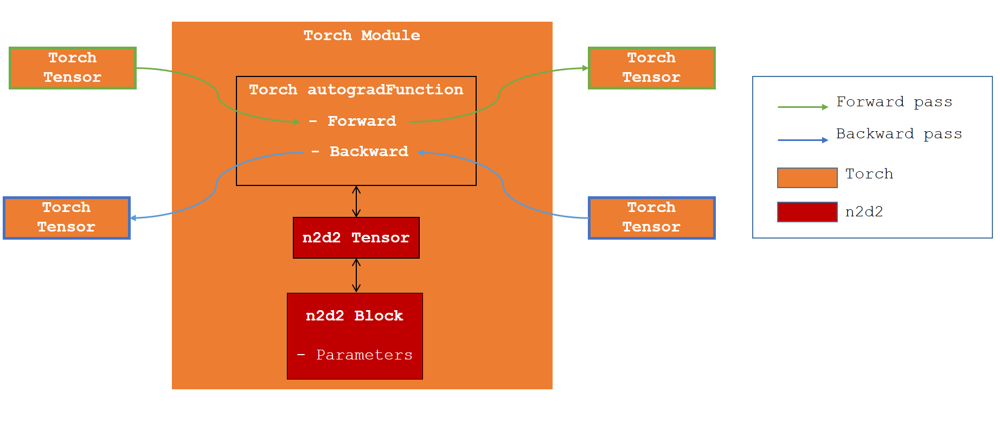

Interoperability
================

In this section, we will present how you can use n2d2 with other python framework. 

PyTorch
-------

Presentation
~~~~~~~~~~~~

The PyTorch interoperability allow you to run an n2d2 model by using the Torch functions.

The interoperability consist of a wrapper around the N2D2 Network.
We created an autograd function which on ``Forward`` call the n2d2 ``Propagate`` and on ``Backward`` call the n2d2 ``Back Propagate`` and ``Update``.

.. warning::
        Due to the implementation n2d2 parameters are not visible to ``Torch`` and thus cannot be trained with a torch ``Optimizer``.

Tensor conversion
~~~~~~~~~~~~~~~~~ 

In order to achieve this interoperability, we need to convert Tensor from ``Torch`` to ``n2d2`` and vice versa.

:py:class:`n2d2.Tensor` require a contiguous memory space which is not the case for ``Torch``. Thus the conversion ``Torch`` to ``n2d2`` require a memory copy.
The opposite conversion is done with no memory copy.

If you work with ``CUDA`` tensor, the conversion ``Torch`` to ``n2d2`` is also done with no copy on the GPU (a copy on the host is however required).

Documentation
~~~~~~~~~~~~~
.. autoclass:: pytorch_interoperability.Block
        :members:

Example :
~~~~~~~~~

In this example, we will create with Torch a ``LeNet`` and export it with ``ONNX``.
We will then use the n2d2 API to import the model using a :py:class:`n2d2.cells.DeepNetCell`.
Finally we will run the newly created model with torch by using :py:class:`pytorch_interoperability.Block`.

.. code-block:: python

        import n2d2
        import torch
        import pytorch_interoperability
        from os import remove
        class MNIST_CNN(torch.nn.Module):   
                def __init__(self):
                        super(MNIST_CNN, self).__init__()
                        # Defining the cnn layer that we will extract and export to ONNX
                        self.cnn_layers = torch.nn.Sequential(
                                torch.nn.Conv2d(1, 4, 3, 1),
                                torch.nn.ReLU(),
                                torch.nn.Conv2d(4, 4, 3),
                                torch.nn.ReLU(),
                        )
                        self.linear_layers = torch.nn.Sequential(
                                torch.nn.MaxPool2d(2),
                                torch.nn.Flatten(), 
                                torch.nn.Linear(576, 128),
                                torch.nn.ReLU(), 
                                torch.nn.Linear(128, 10),
                                torch.nn.Softmax(),   
                        )

                # Defining the forward pass    
                def forward(self, x):
                        x = self.cnn_layers(x)
                        x = self.linear_layers(x)
                        return x

        model = MNIST_CNN()
        model_path = './tmp.onnx'
        batch_size = 10
        
        # Exporting to ONNX
        dummy_in = torch.ones(batch_size, 1, 28, 28)
        torch.onnx.export(model, dummy_in, model_path, verbose=True)

        # Importing ONNX 
        db = n2d2.database.Database()
        provider = n2d2.provider.DataProvider(db,[28, 28, 1], batch_size=batch_size)
        deepNetCell = n2d2.cells.DeepNetCell.load_from_ONNX(provider, "./tmp.onnx")
        remove(model_path) # Cleaning temporary onnx file

        # Setting SoftMax layer with_loss=False
        deepNetCell[-1].with_loss = False

        n2d2_deepNet = pytorch_interoperability.Block(deepNetCell)

        # Dummy imput and label for the example
        input_tensor = torch.ones(batch_size, 1, 28, 28)
        label = torch.ones(batch_size, 10)

        output = n2d2_deepNet(input_tensor)
        output=output.squeeze() # Squeezing the output to remove useless dims
        opt = torch.optim.SGD(n2d2_deepNet.parameters(), lr=0.01)
        criterion = torch.nn.MSELoss()

        loss = criterion(output, label)
        loss.backward()
        opt.step() # Not necessary here because we don't have torch parameters to update.

Known issues :
~~~~~~~~~~~~~~

Gradient is badly computed when using import from ONNX
^^^^^^^^^^^^^^^^^^^^^^^^^^^^^^^^^^^^^^^^^^^^^^^^^^^^^^

When you import a network from ONNX, if the last layer imported is a :py:class:`n2d2.cells.Softmax`
then there is a risk the loss is badly computed if you don't use a ``CrossEntropy`` loss.

By default when imported the :py:class:`n2d2.cells.Softmax` set the argument ``with_loss=True``. 
This argument skip the computation of the gradient for this cell.

Output shape must be rigorously the same as the label shape
^^^^^^^^^^^^^^^^^^^^^^^^^^^^^^^^^^^^^^^^^^^^^^^^^^^^^^^^^^^ 

If you use a classification network, the output shape for N2D2 will be ``[nb_batch, nb_features, 1, 1]``. 
Whereas Torch would wait for a shape like ``[nb_batch, nb_features]``.

This represent the same data but the difference in shape can cause computation issues.
This is why if you are in this case we recommend you to flatten the unit dimensions by using the Torch method ``squeeze``.

.. Note::

        If you don't have the same shape for your output and your label you will get a warning from Torch.

