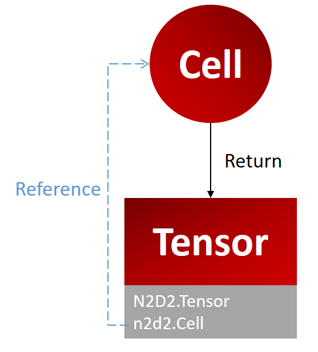

Tensor
======

Introduction :
--------------
The n2d2 library propose a tensor implementation with the :py:class:`n2d2.Tensor` class.

:py:class:`n2d2.Tensor` is a wrapper of the ``Tensor`` object available in N2D2 (see :ref:`Tensor<dev-tensor-t>`).

The class :py:class:`n2d2.Tensor` also contain a reference to the element that produce it. (It is ``None`` if you create it manually)

  :py:class:`n2d2.Tensor` implementation.

Manipulating tensors :
----------------------

For setting and getting value we will be using the following tensor as an example :

.. testcode::

    tensor = n2d2.Tensor([2, 3])

.. testoutput::

    0 0 0
    0 0 0

You can set and get values using :

Coordinates :
~~~~~~~~~~~~~

.. testcode::

    tensor[1,0] = 1 # Using coordinates
    value = tensor[1,0]

If you print the tensor you will see :

.. testoutput::

    0 0 0
    1 0 0

Index :
~~~~~~~

You can use an index to get or set elements of a tensor. 
The index correspond to the flatten representation of your tensor.

.. testcode::

    tensor[0] = 2
    value = tensor[0]

If you print the tensor you will see :

.. testoutput::

    2 0 0
    0 0 0

Slice :
~~~~~~~

.. note::

    Slice are supported only for assignment !

.. testcode::

    tensor[1:3] = 3 

If you print the tensor you will see :

.. testoutput::

    0 3 3
    0 0 0

Set values method :
~~~~~~~~~~~~~~~~~~~

If you want to set multiple values easily, you can use the method :py:meth:`n2d2.Tensor.set_values` 

.. testcode::

    tensor.set_values([[1,2,3], [4,5,6]])
    
If you print the tensor you will see :

.. testoutput::

    1 2 3
    4 5 6

Numpy :
-------

To Numpy :
~~~~~~~~~~

You can create a ``numpy.array`` using a :py:class:`n2d2.Tensor` with the class method : :py:meth:`n2d2.Tensor.to_numpy` 

.. code-block:: python

    tensor = n2d2.Tensor([2, 3])
    np_array = tensor.to_numpy()

This will create the following tensor :

.. testoutput::

    0 0 0
    0 0 0

By default the ``numpy.array`` doesn't create a memory copy meaning that if you want to manipulate a :py:class:`n2d2.Tensor` you can use the numpy library.

.. code-block:: python

    np_array[0] = 1
    print(tensor)

.. testoutput::

    1 1 1
    0 0 0

.. note::
    If you do not want to create a memory copy, you should set the parameter ``copy=True``.
    
    .. code-block:: python

        np_array = tensor.to_numpy(copy=True)

From Numpy :
~~~~~~~~~~~~

You can create a :py:class:`n2d2.Tensor` using a ``numpy.array`` with the class method : :py:meth:`n2d2.Tensor.from_numpy` 

.. testcode::

    np_array = numpy.array([[1,2,3], [4,5,6]])
    tensor = n2d2.Tensor.from_numpy(np_array)

This will create the following tensor :

.. testoutput::

    1 2 3
    4 5 6

.. note::
    You cannot create a :py:class:`n2d2.Tensor` from a ``numpy.array`` without a memory copy because Tensor require a contiguous memory space which is not required for an array. 

CUDA Tensor 
-----------

You can store your tensor with CPU or GPU (using CUDA). By default, n2d2 creates a CPU tensor.

If you want to create a CUDA Tensor you can do so by setting the parameter ``cuda`` to True in the constructor

.. testcode::

    tensor = n2d2.Tensor([2,3], cuda=True)

You can switch from CPU to GPU at anytime : 

.. testcode::

    tensor.cpu()  # Converting to a CPU tensor
    tensor.cuda() # Converting to a CUDA tensor

When working on a CUDA tensor you have to understand that they are stored in two different places.
The host and the device. The device is the GPU. The host correspond to your interface with the tensor that exists in the GPU. 
You cannot access the device directly, the GPU don't have input/output functions.

This is why you have two methods to synchronized these two versions.

Synchronization example :
~~~~~~~~~~~~~~~~~~~~~~~~~

Let's consider the following CUDA Tensor :

.. testcode::

    t = n2d2.Tensor([2, 2], cuda=True)

.. testoutput::

    0 0
    0 0

We will set the following values :

.. testcode::

    t.set_values([[1, 2], [3, 4]])

.. testoutput::

    1 2
    3 4

Then we will synchronized the device with the host

.. testcode::

    t.htod()

.. testoutput::

    1 2
    3 4

As you can see nothing change when you print the tensor.
Now let's change the values stored in the tensor :

.. testcode::

    t.set_values([[2, 3], [4, 5]])

.. testoutput::

    2 3
    4 5

Synchronizing the device with the host :

.. testcode::

    t.dtoh()

.. testoutput::

    1 2
    3 4

Tensor 
------

.. autoclass:: n2d2.Tensor
   :members:

