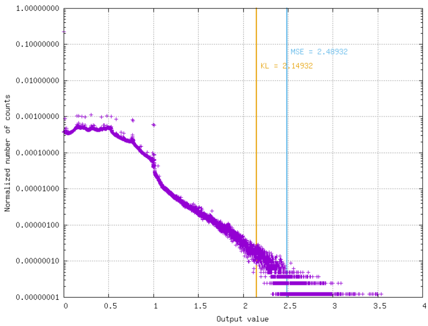

Post-training quantization
==========================

Principle
---------

The post-training quantization algorithm is done in 3 steps:

1) Weights normalization
~~~~~~~~~~~~~~~~~~~~~~~~

All weights are rescaled in the range :math:`[-1.0, 1.0]`.

Per layer normalization
 There is a single weights scaling factor, global to the layer.

Per layer and per output channel normalization
 There is a different weights scaling factor for each output channel. This allows
 a finer grain quantization, with a better usage of the quantized range for some
 output channels, at the expense of more factors to be saved in memory.

2) Activations normalization
~~~~~~~~~~~~~~~~~~~~~~~~~~~~

Activations at each layer are rescaled in the range :math:`[-1.0, 1.0]` for signed 
outputs and :math:`[0.0, 1.0]` for unsigned outputs.

The **optimal quantization threshold value** of the activation output of each 
layer is determined using the validation dataset (or test dataset if no 
validation dataset is available).

This is an iterative process: need to take into account previous layers 
normalizing factors.

Finding the optimal quantization threshold value of the activation output of 
each layer is done the following:

1) Compute histogram of activation values;

2) Find threshold that minimizes distance between original distribution and 
   clipped quantized distribution. Two distance algorithms can be used:

   - Mean Squared Error (MSE);

   - Kullback–Leibler divergence metric (KL-divergence).

The obtained threshold value is therefore the activation scaling factor to be 
taken into account during quantization.

3) Quantization
~~~~~~~~~~~~~~~

Inputs, weights, biases and activations are quantized to the desired 
:math:`nbbits` precision.

Convert ranges from :math:`[-1.0, 1.0]` and :math:`[0.0, 1.0]` to 
:math:`[-2^{nbbits-1}-1, 2^{nbbits-1}-1]` and :math:`[0, 2^{nbbits}-1]` taking 
into account all dependencies.

Additional optimization strategies
~~~~~~~~~~~~~~~~~~~~~~~~~~~~~~~~~~

Weights clipping (optional)
^^^^^^^^^^^^^^^^^^^^^^^^^^^

Weights can be clipped using the same strategy than for the activations (
finding the optimal quantization threshold using the weights histogram).
However, this usually leads to worse results than no clipping.

Activation scaling factor approximation
^^^^^^^^^^^^^^^^^^^^^^^^^^^^^^^^^^^^^^^

The activation scaling factor :math:`\alpha` can be approximated the following 
ways:

- Fixed-point: :math:`\alpha` is approximated by :math:`x 2^{-p}`;

- Single-shift: :math:`\alpha` is approximated by :math:`2^{x}`;

- Double-shift: :math:`\alpha` is approximated by :math:`2^{n} + 2^{m}`.

Usage in N2D2
-------------

All the post-training strategies described above are available in N2D2 for any
export type. To apply post-training quantization during export, simply use the
``-calib`` command line argument.

The following parameters are available in command line:

+--------------------------------------------+--------------------------------------------------------------------------------------------------------------------------+
| Argument [default value]                   | Description                                                                                                              |
+============================================+==========================================================================================================================+
| ``-calib``                                 | Number of stimuli used for the calibration (``-1`` = use the full validation dataset)                                    |
+--------------------------------------------+--------------------------------------------------------------------------------------------------------------------------+
| ``-calib-reload``                          | Reload and reuse the data of a previous calibration                                                                      |
+--------------------------------------------+--------------------------------------------------------------------------------------------------------------------------+
| ``-wt-clipping-mode`` [``None``]           | Weights clipping mode on export, can be ``None``, ``MSE`` or ``KL-Divergence``                                           |
+--------------------------------------------+--------------------------------------------------------------------------------------------------------------------------+
| ``-act-clipping-mode`` [``MSE``]           | Activations clipping mode on export, can be ``None``, ``MSE`` or ``KL-Divergence``                                       |
+--------------------------------------------+--------------------------------------------------------------------------------------------------------------------------+
| ``-act-rescaling-mode`` [``Single-shift``] | Activations scaling mode on export, can be ``Floating-point``, ``Fixed-point16``, ``Fixed-point32``, ``Single-shift``    |
|                                            | or ``Double-shift``                                                                                                      |
+--------------------------------------------+--------------------------------------------------------------------------------------------------------------------------+
| ``-act-rescale-per-output`` [0]            | If true (1), rescale activation per output instead of per layer                                                          |
+--------------------------------------------+--------------------------------------------------------------------------------------------------------------------------+

``-act-rescaling-mode``
~~~~~~~~~~~~~~~~~~~~~~~

The ``-act-rescaling-mode`` specifies how the activation scaling must be approximated,
for values other than ``Floating-point``. This allows to avoid floating-point
operation altogether in the generated code, even for complex, multi-branches networks.
This is particularly useful on architectures without FPU or on FPGA.

For fixed-point scaling approximation (:math:`x 2^{-p}`), two modes are available:
``Fixed-point16`` and ``Fixed-point32``. ``Fixed-point16`` specifies that :math:`x`
must hold in at most 16-bits, whereas ``Fixed-point32`` allows 32-bits :math:`x`.
In the later case, beware that overflow can occur on 32-bits only architectures
when computing the scaling multiplication before the right shift (:math:`p`).

For the ``Single-shift`` and ``Double-shift`` modes, only right shifts are allowed
(scaling factor < 1.0). In case of layers with scaling factor above 1.0, ``Fixed-point16``
is used as fallback for these layers.

Command line example
~~~~~~~~~~~~~~~~~~~~

Command line example to run the C++ Export on a INI file containing an ONNX
model:

::

    n2d2 MobileNet_ONNX.ini -seed 1 -w /dev/null -export CPP -fuse -calib -1 -act-clipping-mode KL-Divergence

Examples and results
--------------------

Post-training quantization accuracy obtained with some models from the ONNX 
Model Zoo are reported in the table below, using ``-calib 1000``:

+-------------------------------------------------------+-----------+-------------------+-------------+
| *ONNX Model Zoo* model (specificities)                | FP acc.   | Fake 8 bits acc.  | 8 bits acc. |
+=======================================================+===========+===================+=============+
| resnet18v1.onnx                                       | 69.83%    | 68.82%            | 68.78%      |
| (``-no-unsigned -act-rescaling-mode Fixed-point``)    |           |                   |             |
+-------------------------------------------------------+-----------+-------------------+-------------+
| mobilenetv2-1.0.onnx                                  | 70.95%    | 65.40%            | 65.40%      |
| (``mobilenetv20_output_flatten0_reshape0`` ignored)   |           |                   |             |
+-------------------------------------------------------+-----------+-------------------+-------------+
| mobilenetv2-1.0.onnx                                  |           | 66.67%            | 66.70%      |
| (``mobilenetv20_output_flatten0_reshape0`` ignored    |           |                   |             |
| ``-act-rescaling-mode Fixed-point``)                  |           |                   |             |
+-------------------------------------------------------+-----------+-------------------+-------------+
| squeezenet/model.onnx                                 | 57.58%    | 57.11%            | 54.98%      |
| (``-no-unsigned -act-rescaling-mode Floating-point``) |           |                   |             |
+-------------------------------------------------------+-----------+-------------------+-------------+

- *FP acc.* is the floating point accuracy obtained before post-training
  quantization on the model imported in ONNX;
- *Fake 8 bits acc.* is the accuracy obtained after post-training quantization
  in N2D2, in fake-quantized mode (the numbers are quantized but the
  representation is still floating point);
- *8 bits acc.* is the accuracy obtained after post-training quantization in the
  N2D2 reference C++ export, in actual 8 bits representation.

