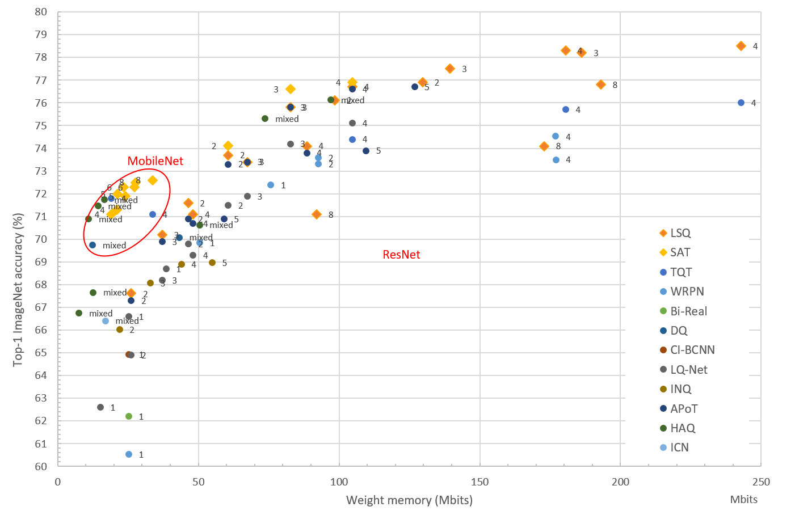

Quantization aware training
===========================

**N2D2-IP only: available upon request.**

Currently, two quantization aware training (QAT) methods are implemented:

- SAT :cite:`jin2019efficient`;
- LSQ :cite:`bhalgat2020lsq`.

These two methods are currently at the top of the state-of-the-art, summarized
in the figure below. Each dot represents one DNN (from the MobileNet or ResNet 
family), quantized with the number of bits indicated beside.

Scale-adjusted training
~~~~~~~~~~~~~~~~~~~~~~~~~~~~

Example
################################

One can apply the SAT quantization methodology on the chosen deep neural network by adding the right parameters to the 
*.ini* file. Here we show how to configure the *.ini* file to correctly apply the SAT quantization.

In a naive case, all convolutions and/or fully-connected layers are quantized. The quantization parameters are defined at the top of the configuration file :

.. code-block:: ini

  ;;SAT Quantization Parameters
  $QuantMode=1 ; 1 is for quantization, 0 for weights clamping
  $ScaleModeConv=0
  $ScaleModeFc=1
  $WeightsRange=255;->15 for 4-bits range (2^4 - 1)
  $ActivationsRange=255;->15 for 4-bits range (2^4 - 1)

A base block common to all convolution layers can be defined in the *.ini* file. This base block is used to set quantization parameters, like weights bits range, the scaling mode and the quantization mode, and also solver configuration.

.. code-block:: ini

  [Conv_def]
  Type=Conv
  DataType=Float32
  ActivationFunction=Linear
  QWeight=SAT
  QWeight.ApplyScaling=${ScaleModeConv}
  QWeight.ApplyQuantization=${QuantMode}
  QWeight.Range=${WeightsRange}
  ConfigSection=common.config

.. code-block:: ini

  [common.config]
  NoBias=1
  Solvers.LearningRate=${LR}
  Solvers.LearningRatePolicy=${Policy}
  Solvers.Momentum=${MOMENTUM}
  Solvers.Decay=${WD}

The quantization of the fully-connected layer can be configured as :

.. code-block:: ini

  [Fc_def]
  Type=Fc
  ActivationFunction=Linear
  QWeight=SAT
  QWeight.ApplyScaling=${ScaleModeFc}
  QWeight.ApplyQuantization=${QuantMode}
  QWeight.Range=${WeightsRange}
  ConfigSection=common.config

The activations can be configured using another common block, where one can set activations bits range, Alpha 
initialization value and its solver configuration, the scaling mode and the quantization mode. For example, the common definition for batch normalization layers:

.. code-block:: ini

  [Bn_def]
  Type=BatchNorm
  DataType=Float32
  QAct=SAT
  QAct.Alpha=6.0
  QAct.Range=${ActivationsRange}
  QActSolver=${SolverType}
  QActSolver.LearningRate=${LR}
  QActSolver.LearningRatePolicy=${Policy}
  QActSolver.Momentum=${MOMENTUM}
  QActSolver.Decay=${WD}
  ActivationFunction=Linear
  ConfigSection=bn.config

.. code-block:: ini

  [bn.config]
  Solvers.LearningRate=${LR}
  Solvers.LearningRatePolicy=${Policy}
  Solvers.Momentum=${MOMENTUM}
  Solvers.Decay=${WD}
    
An illustration of a hand-made neural network in an *.ini* file is provided with the LeNet topology.
This model is located at *models/Quantization/SAT/LeNet_bn_SAT_v2.ini* and is pre-configured to apply SAT 
fine-tunning on the weights.

As a first step, you have to run the learning phase to clamp the weights with the command:

::

./n2d2 models/Quantization/SAT/LeNet_bn_SAT_clamp.ini -learn-epoch 100

where *LeNet_bn_SAT_clamp.ini* contains only the necessary information for weights clamping, and no activations are quantized. 

This command will run the learning phase over 100 epochs with the MNIST dataset. 
The final test accuracy must reach at least 98.9\%:

::

    Final recognition rate: 98.95%    (error rate: 1.05%)
    Sensitivity: 98.94% / Specificity: 99.88% / Precision: 98.94%
    Accuracy: 99.79% / F1-score: 98.94% / Informedness: 98.82%

Next, it is recommended to save parameters of the weights folder to the other location,
for example *weights_clamped* folder.

You can now use the *LeNet_bn_SAT_v2.ini* file to activate the quantization phase.
It consists to run a learning phase with the same hyperparameters by 
using transfer learning method from the previously clamped weights
with this command:

::

./n2d2 models/Quantization/SAT/LeNet_bn_SAT_v2.ini -learn-epoch 100 -w weights_clamped

The final test accuracy should be around 99.2\%:

::

    Final recognition rate: 99.25%    (error rate: 0.75%)
    Sensitivity: 99.24% / Specificity: 99.92% / Precision: 99.25%
    Accuracy: 99.85% / F1-score: 99.24% / Informedness: 99.15%

For example to quantize weights and activations in a 4 bits range, these parameters
must be modified in that way:

.. code-block:: ini

  ;;SAT Quantization Parameters
  $QuantMode=1
  $ScaleModeConv=0
  $ScaleModeFc=1
  $WeightsRange=15;->15 for 4-bits range (2^4 - 1)
  $ActivationsRange=15;->15 for 4-bits range (2^4 - 1)

If one wants to  keep the first convolutional layer weights in 8 bits precision, while the following layers - in 4 bits, this can be configured as :

.. code-block:: ini

  [conv1] Conv_def
  Input=env
  KernelWidth=5
  KernelHeight=5
  NbOutputs=6
  QWeight.Range=255 ;first conv layer is in 8 bits

The final test accuracy should be around 99.1\%:

::

    Final recognition rate: 99.14%    (error rate: 0.86%)
    Sensitivity: 99.13% / Specificity: 99.9% / Precision: 99.14%
    Accuracy: 99.83% / F1-score: 99.13% / Informedness: 99.03%

Results
################################

The validation precision with SAT quantization, for MobileNet-v1 and MobileNet-v2 architectures are shown below.

.. list-table:: SAT quantization results for MobileNet-v1 architecture
   :widths: 25 25 25 25
   :header-rows: 1

   * - Conv1x1 #bits
     - Conv3x3 #bits
     - Activation #bits
     - Precision
   * - 8
     - 8
     - 8
     - 72.5 %
   * - 4
     - 4
     - 4
     - 70.92 %
   * - 4
     - 4
     - 3
     - 68.61 %
   * - 2
     - 2
     - 8
     - 64.95 %
   * - 4
     - 4
     - 2
     - 64.81 %
   * - 3
     - 3
     - 3
     - 64.56 %
   * - 1
     - 4
     - 3
     - 62.69 %
   * - 1
     - 4
     - 2
     - 57.76 %
   * - 1
     - 1
     - 8
     - 60.10%

.. list-table:: SAT quantization results for MobileNet-v2 architecture
   :widths: 25 25 50
   :header-rows: 1

   * - Conv #bits
     - Activation #bits
     - Precision
   * - 4
     - 4
     - 70.93%
   * - 1
     - 8
     - 58.59%
